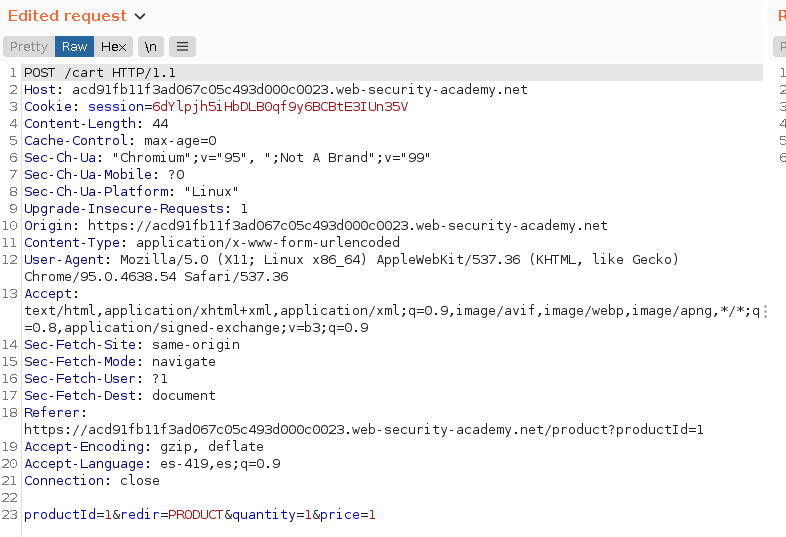
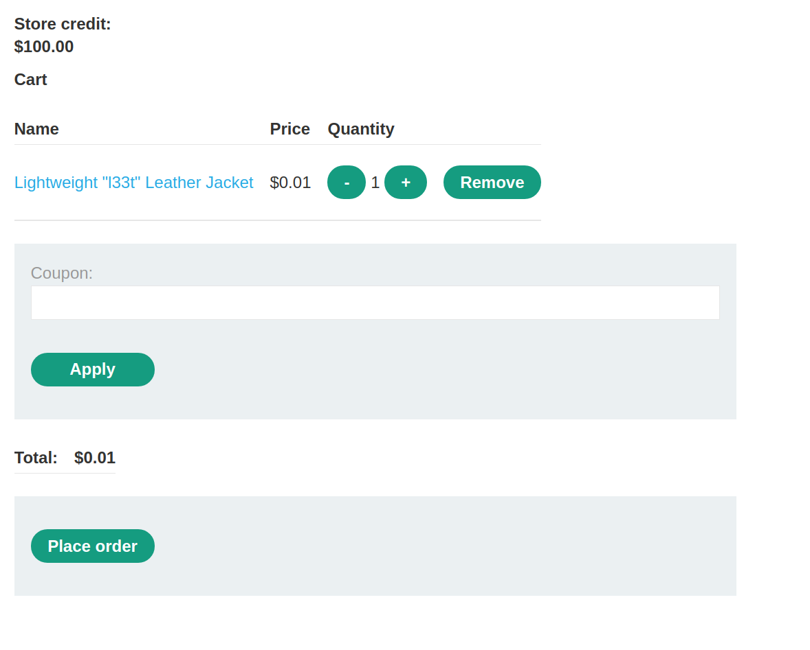
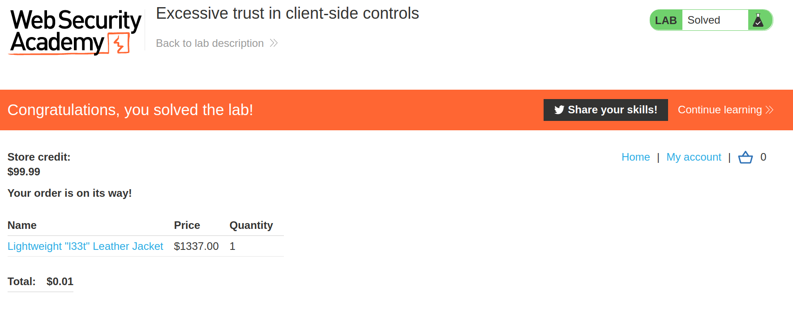

+++
author = "Alux"
title = "Pentesting Active Directory"
date = "2021-12-11"
description = "Reconocimiento "
tags = [
    "business logic",
    "portswigger",
    "academy",
    "burpsuite",
]
categories = [
    "pentest web",
]
series = ["Portswigger Labs"]
image = "head.png"
+++

# Lab: Excessive trust in client-side controls

En este <cite>laboratorio[^1]</cite>la finalidad es poder explotar una vulnerabilidad de business logic la cual ocurre cuando el sistema no valida lo que puede hacer el usuario creyendo que todo seguira el workflow correcto.

En este caso lo que deberiamos de poder hacer es comprar un `Lightweight l33t leather jacket` para resolver el lab.


```bash
 ~/AD  crackmapexec smb 172.16.252.0/24                                                                                                                        ok  took 7s  at 13:22:09 
SMB         172.16.252.146  445    PC2              [*] Windows 10 Pro 10240 x64 (name:PC2) (domain:s4vicorp.local) (signing:False) (SMBv1:True)
SMB         172.16.252.200  445    DC-COMPANY       [*] Windows Server 2016 Standard Evaluation 14393 x64 (name:DC-COMPANY) (domain:s4vicorp.local) (signing:True) (SMBv1:True)
```

```bash
nmap -Pn -sV --top-ports 50 --open 172.16.252.0/24                                                                                                      ok  took 3s  at 14:00:26 
Starting Nmap 7.92 ( https://nmap.org ) at 2021-12-04 14:00 EST
RTTVAR has grown to over 2.3 seconds, decreasing to 2.0
RTTVAR has grown to over 2.3 seconds, decreasing to 2.0
RTTVAR has grown to over 2.3 seconds, decreasing to 2.0
RTTVAR has grown to over 2.3 seconds, decreasing to 2.0
RTTVAR has grown to over 2.3 seconds, decreasing to 2.0
RTTVAR has grown to over 2.3 seconds, decreasing to 2.0
RTTVAR has grown to over 2.3 seconds, decreasing to 2.0
RTTVAR has grown to over 2.3 seconds, decreasing to 2.0
RTTVAR has grown to over 2.3 seconds, decreasing to 2.0
RTTVAR has grown to over 2.3 seconds, decreasing to 2.0
RTTVAR has grown to over 2.3 seconds, decreasing to 2.0
RTTVAR has grown to over 2.3 seconds, decreasing to 2.0
RTTVAR has grown to over 2.3 seconds, decreasing to 2.0
RTTVAR has grown to over 2.3 seconds, decreasing to 2.0
RTTVAR has grown to over 2.3 seconds, decreasing to 2.0
Nmap scan report for 172.16.252.146
Host is up (0.0017s latency).
Not shown: 47 filtered tcp ports (no-response)
Some closed ports may be reported as filtered due to --defeat-rst-ratelimit
PORT    STATE SERVICE      VERSION
135/tcp open  msrpc        Microsoft Windows RPC
139/tcp open  netbios-ssn  Microsoft Windows netbios-ssn
445/tcp open  microsoft-ds Microsoft Windows 7 - 10 microsoft-ds (workgroup: s4vicorp)
Service Info: Host: PC2; OS: Windows; CPE: cpe:/o:microsoft:windows

RTTVAR has grown to over 2.3 seconds, decreasing to 2.0
RTTVAR has grown to over 2.3 seconds, decreasing to 2.0
RTTVAR has grown to over 2.3 seconds, decreasing to 2.0
RTTVAR has grown to over 2.3 seconds, decreasing to 2.0
RTTVAR has grown to over 2.3 seconds, decreasing to 2.0
RTTVAR has grown to over 2.3 seconds, decreasing to 2.0
RTTVAR has grown to over 2.3 seconds, decreasing to 2.0
RTTVAR has grown to over 2.3 seconds, decreasing to 2.0
RTTVAR has grown to over 2.3 seconds, decreasing to 2.0
Nmap scan report for 172.16.252.200
Host is up (0.0013s latency).
Not shown: 46 filtered tcp ports (no-response)
Some closed ports may be reported as filtered due to --defeat-rst-ratelimit
PORT    STATE SERVICE      VERSION
53/tcp  open  domain       Simple DNS Plus
135/tcp open  msrpc        Microsoft Windows RPC
139/tcp open  netbios-ssn  Microsoft Windows netbios-ssn
445/tcp open  microsoft-ds Microsoft Windows Server 2008 R2 - 2012 microsoft-ds (workgroup: s4vicorp)
Service Info: Host: DC-COMPANY; OS: Windows; CPE: cpe:/o:microsoft:windows

Service detection performed. Please report any incorrect results at https://nmap.org/submit/ .
Nmap done: 256 IP addresses (256 hosts up) scanned in 156.70 seconds
```


## Reconocimiento

Lo que podemos notar es que la web envia una peticion con el producto para agregar a la carretilla


## Explotacion

En este caso seguimos el proceso y al enviar el producto a la carretilla es enviado el id del producto, y su precio, primero es 1337 pero lo cambiamos a 1337

> Podemos cambiar el precio de 1337 a 1 en la solicitud



Luego si vemos la aplicacion no valida y acepta el nuevo precio de la aplicacion y como tenemos credito de 100 podemos realizar la compra sin problemas.



Y con esto damos a `place order` y realizamos la compra sin problemas y nos devuelve que hemos resuelto el lab.




[^1]: [Laboratorio](https://portswigger.net/web-security/logic-flaws/examples/lab-logic-flaws-excessive-trust-in-client-side-controls)