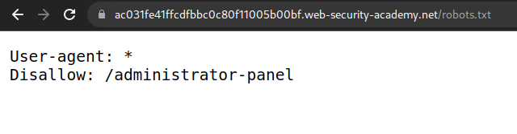
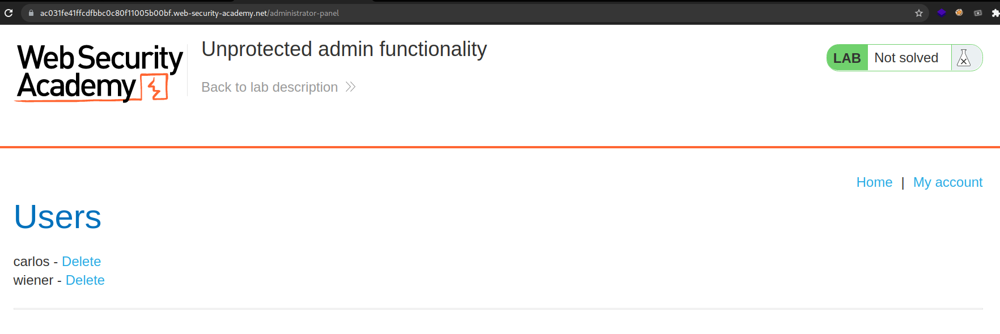
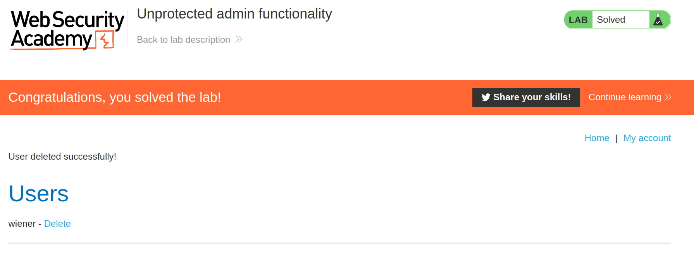

+++
author = "Alux"
title = "Portswigger Academy Learning Path: Access Control Lab 1"
date = "2021-12-16"
description = "Lab: Unprotected admin functionality"
tags = [
    "access control",
    "portswigger",
    "academy",
    "burpsuite",
]
categories = [
    "pentest web",
]
series = ["Portswigger Labs"]
image = "head.png"
+++

# Lab: Unprotected admin functionality

En este <cite>laboratorio[^1]</cite>la finalidad es poder realizar un bypass al control de seguridad que tienen los accesos de los usuarios.

## Reconocimiento

Cuando entramos tenemos la siguiente web.

Debemos de buscar el modulo de administracion para poder acceder en el y ver si la aplicacion no valida los permisos necesarios.

## Explotacion

Ahora sabemos que exista esta pagina accedemos y vemos si podemos entrar sin los permisos necesarios.

Y eliminamos al usuario carlos y resolvemos el lab:

[^1]: [Laboratorio](https://portswigger.net/web-security/access-control/lab-unprotected-admin-functionality)