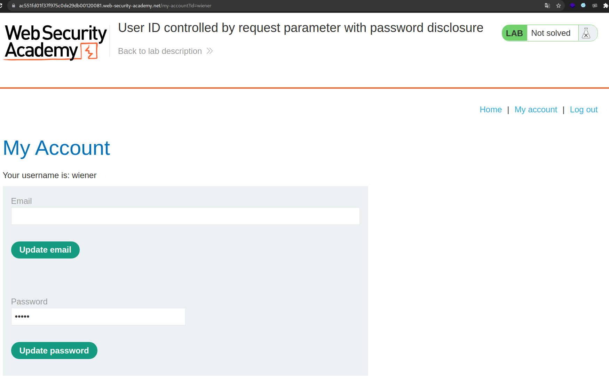
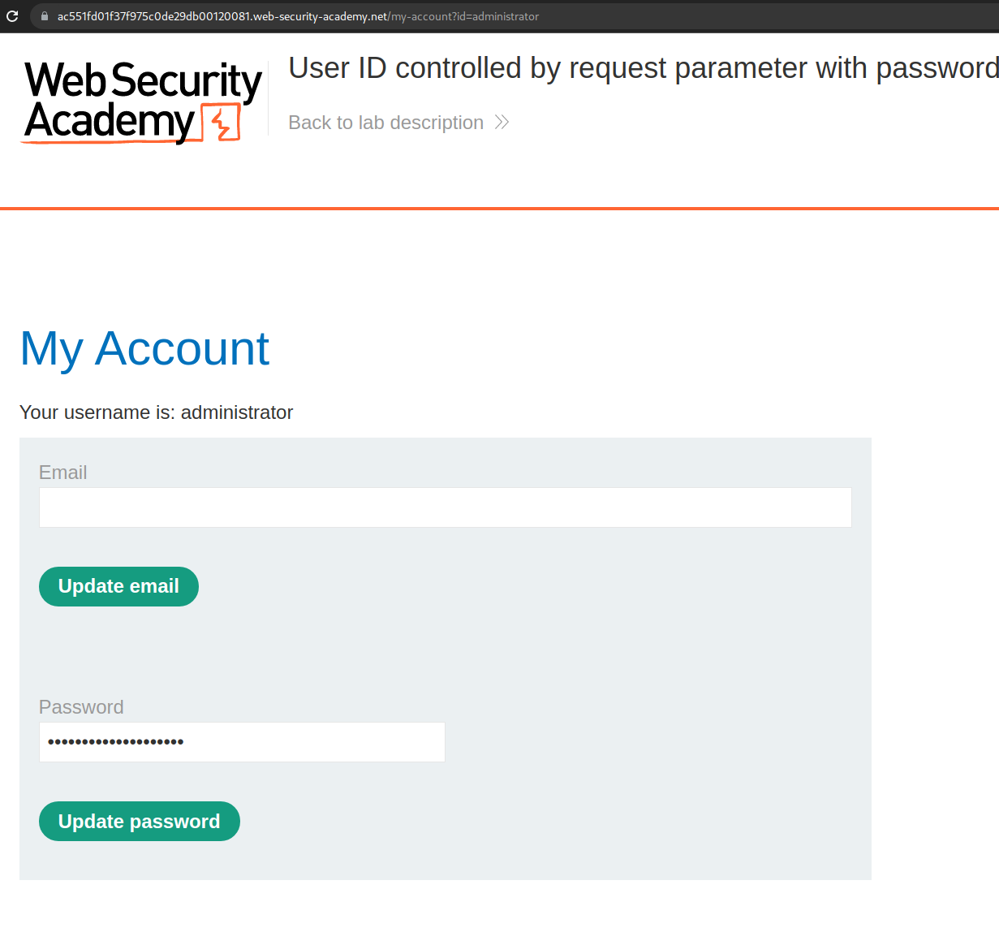
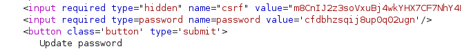
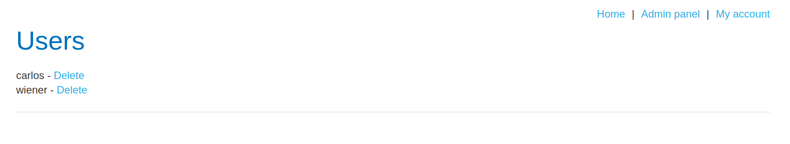
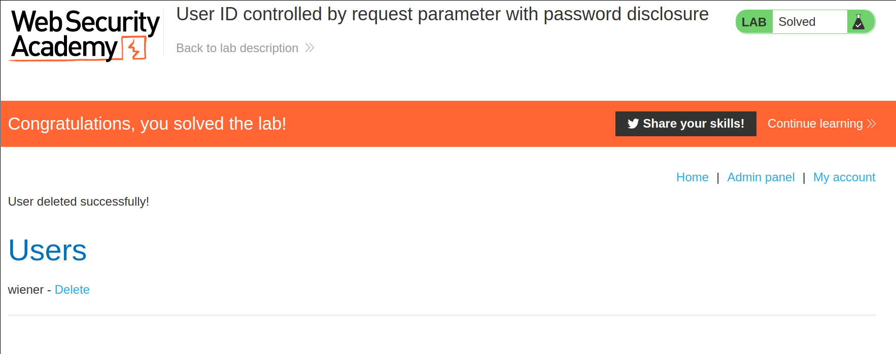

+++
author = "Alux"
title = "Portswigger Academy Learning Path: Access Control Lab 10"
date = "2021-12-24"
description = "Lab: User ID controlled by request parameter with password disclosure"
tags = [
    "access control",
    "portswigger",
    "academy",
    "burpsuite",
]
categories = [
    "pentest web",
]
series = ["Portswigger Labs"]
image = "head.png"
+++

# Lab: User ID controlled by request parameter with password disclosure

En este <cite>laboratorio[^1]</cite>lqa finalidad es poder realizar un bypass al control de seguridad que tienen los accesos de los usuarios.

## Reconocimiento

En este caso la aplicacion debemos de encontrar la contrasena del usuario `administrator` y acceder con sus credenciales. Para eso contamos con el perfil de wiener

## Explotacion

Cuando ingresamos al usuario de administrator cambiando el valor del id, podemos acceder a su perfil y ver que tiene una contrasena mostrada.

Aunque notamos que la contrasena ahi esta pero estando con el `input type password` pero si vemos directamente el codigo fuente notamos que se puede ver su contrasena

Con esto ya podemos acceder al admin panel y poder ver sus funciones para poder eliminar usuarios para

Y con eso ya eliminamos al usuario carlos y resolvemos el lab.

[^1]: [Laboratorio](https://portswigger.net/web-security/access-control/lab-user-id-controlled-by-request-parameter-with-password-disclosure)