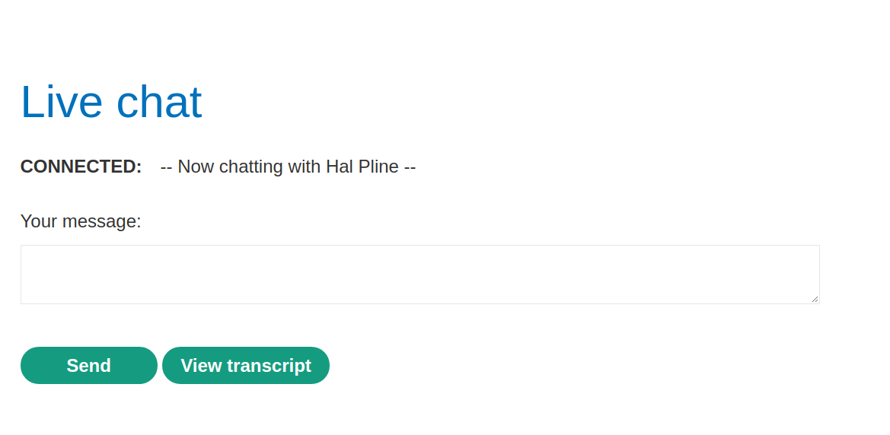
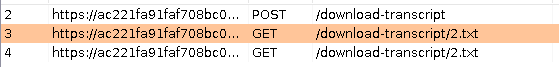
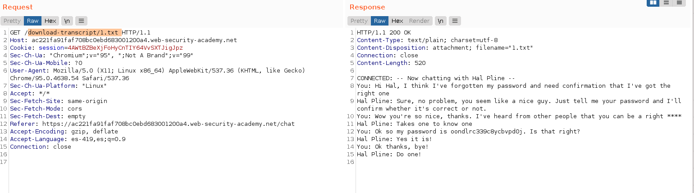

+++
author = "Alux"
title = "Portswigger Academy Learning Path: Access Control Lab 11"
date = "2021-12-25"
description = "Lab: Insecure direct object references"
tags = [
    "access control",
    "portswigger",
    "academy",
    "burpsuite",
]
categories = [
    "pentest web",
]
series = ["Portswigger Labs"]
image = "head.png"
+++

# Lab: Insecure direct object references

En este <cite>laboratorio[^1]</cite>lqa finalidad es poder explotar un IDOR para encontrar datos interesantes a los cuales no deberiamos tener acceso segun los permisos, pero si se nos permite acceder a un objeto.

## Reconocimiento

En este caso podemos enviar chat al sistema con otros a traves de la aplicacion pero tambien podemos descargar una archivo .txt de la conversacion, dando en `View Transcript`

## Explotacion

Cuando vemos las peticiones realizadas vemos como se hace la peticion `GET` para obtener el archivo `2.txt` de la conversacion, por lo que seguramente el nombre del archivo se lo asigna la aplicacion automaticamente de manera secuencial.

Ahora lo que haremos es traer el archivo `1.txt` y ver si el sistema nos lo devuelve sin problema.

Y como vemos en la conversacion esta almacenada la contrasena del usuario carlos. Y con eso ya ingresamos con el usuario carlos y resolvemos el lab.

[^1]: [Laboratorio](https://portswigger.net/web-security/access-control/lab-insecure-direct-object-references)