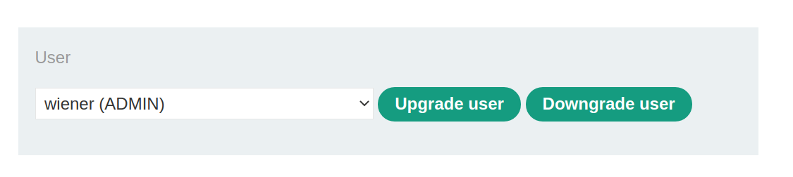
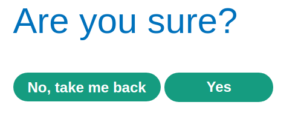
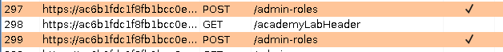
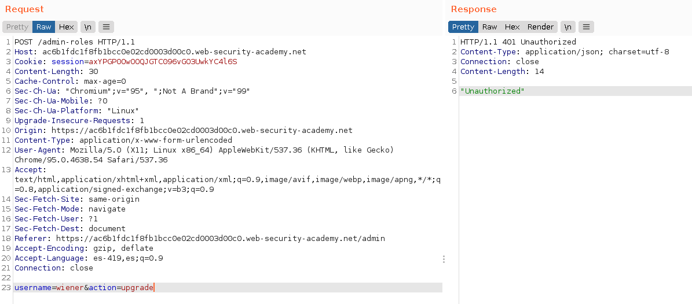
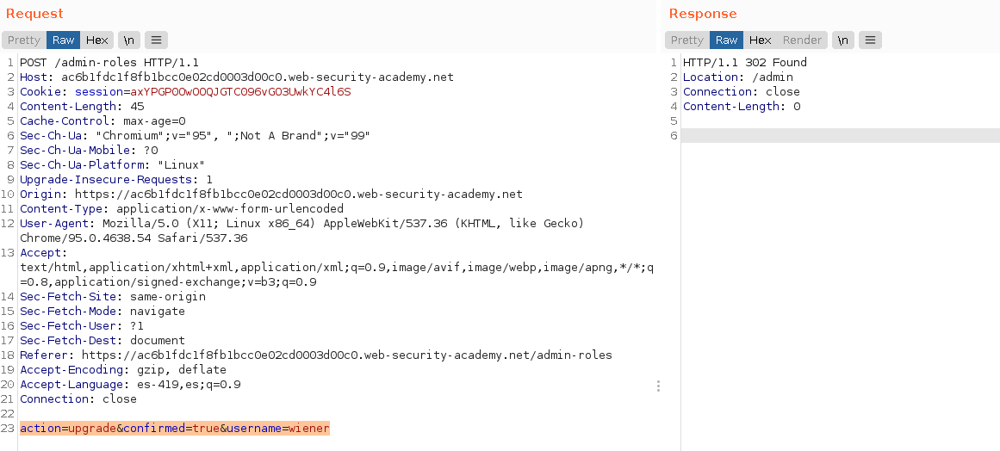
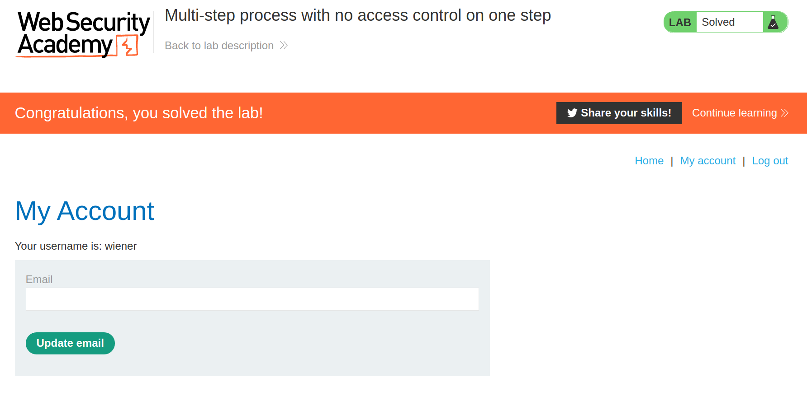

+++
author = "Alux"
title = "Portswigger Academy Learning Path: Access Control Lab 12"
date = "2021-12-25"
description = "Lab: Multi-step process with no access control on one step"
tags = [
    "access control",
    "portswigger",
    "academy",
    "burpsuite",
]
categories = [
    "pentest web",
]
series = ["Portswigger Labs"]
image = "head.png"
+++

# Lab: Multi-step process with no access control on one step

En este <cite>laboratorio[^1]</cite>lqa finalidad es poder elevar los privilegios de nuestro usuario que es `wiener` para eso se nos dan las credenciales y tambien se nos da un usuario `administrator` para poder ver el proceso en el cual se elevan los privilegios.

## Reconocimiento

La manera de elevar privilegios es replicar lo anterior, pero no es necesario el primer paso, solamente el segundo para poder elevar los privilegios del usuario, ya que el primero dira que no esta autorizado para hacerlo.

## Explotacion

Ahora cuando intentamos realizar lo mismo del usuario `wiener` nos salta la siguiente error:

Pero hay un problema y es que el sistema solo valida la primera peticion y la segunda ya no por lo que si ahora enviamos la siguiente peticion que le seguiria el sistema no valida y la toma como si el usuario tuviera los permisos necesarios para elevar los privilegios.

Y asi es como ya tenemos al usuario `wiener` con permisos de `administrator` y hemos resuelto el lab.

[^1]: [Laboratorio](https://portswigger.net/web-security/access-control/lab-multi-step-process-with-no-access-control-on-one-step)