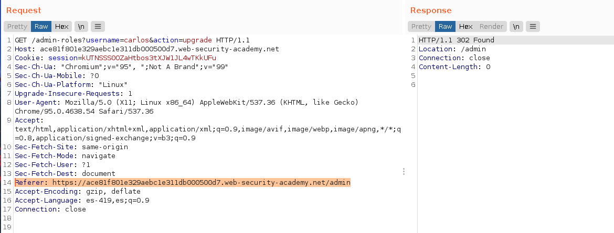
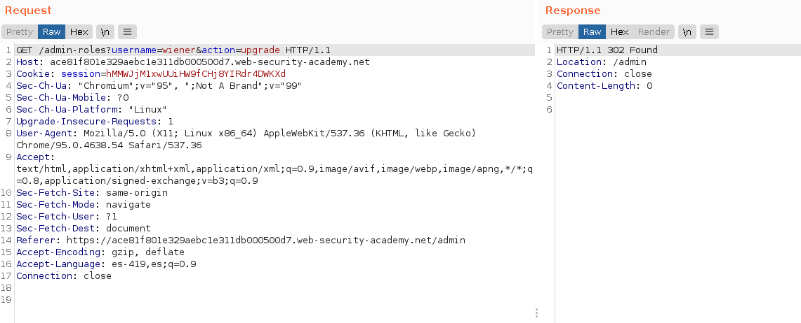
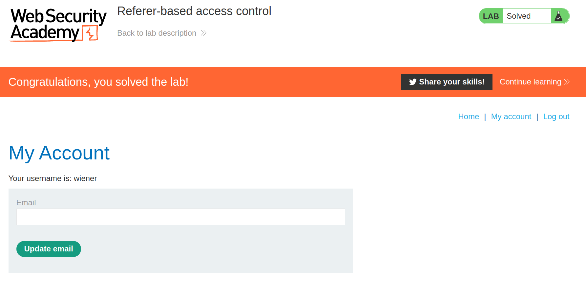

+++
author = "Alux"
title = "Portswigger Academy Learning Path: Access Control Lab 13"
date = "2021-12-25"
description = "Lab: Referer-based access control"
tags = [
    "access control",
    "portswigger",
    "academy",
    "burpsuite",
]
categories = [
    "pentest web",
]
series = ["Portswigger Labs"]
image = "head.png"
+++

# Lab: Referer-based access control

En este <cite>laboratorio[^1]</cite>lqa finalidad es poder elevar los privilegios de nuestro usuario que es `wiener` para eso se nos dan las credenciales y tambien se nos da un usuario `administrator` para poder ver el proceso en el cual se elevan los privilegios.

## Reconocimiento

La manera de elevar privilegios es replicar lo anterior, para poder elevar nuestros privilegios como usuario `wiener`

## Explotacion

Ahora intentaremos replicar la misma peticion desde nuestro usuario wiener ya que la anterior fue con el usuario administrator, tomando en cuenta en que la aplicacion hace uso del header `Referer` para validar la solicitud.

Y asi es como ya tenemos al usuario `wiener` con permisos de `administrator` y hemos resuelto el lab.

[^1]: [Laboratorio](https://portswigger.net/web-security/access-control/lab-referer-based-access-control)