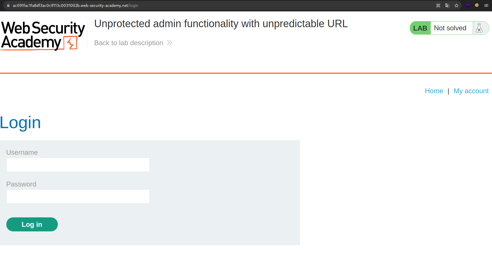
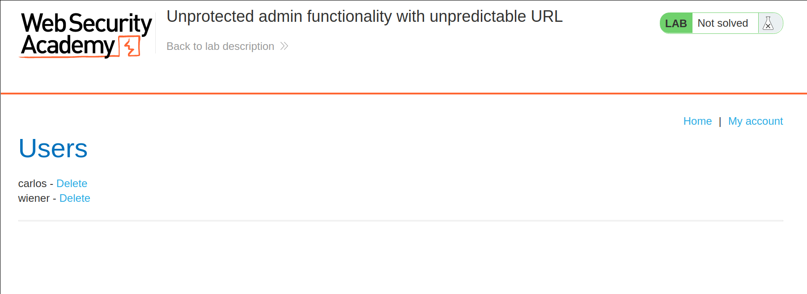
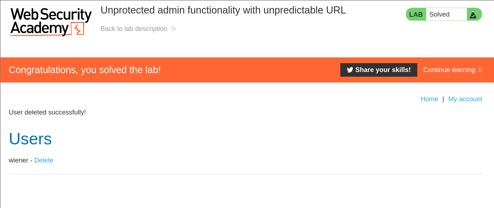

+++
author = "Alux"
title = "Portswigger Academy Learning Path: Access Control Lab 2"
date = "2021-12-16"
description = "Lab: Unprotected admin functionality with unpredictable URL"
tags = [
    "access control",
    "portswigger",
    "academy",
    "burpsuite",
]
categories = [
    "pentest web",
]
series = ["Portswigger Labs"]
image = "head.png"
+++

# Lab: Unprotected admin functionality with unpredictable URL

En este <cite>laboratorio[^1]</cite>la finalidad es poder realizar un bypass al control de seguridad que tienen los accesos de los usuarios.

## Reconocimiento

Cuando entramos tenemos la siguiente web.


## Explotacion

Ahora sabemos que exista una pagina para poder acceder a la funcionalidad de admin y que no esta protegida correctamente. Nos vamos a la web de login para



Cuando queremos mostrar el codigo, normalmente con `Ctrl + U` se puede visualizar encontramos el siguiente codigo que nos da el path de la funcionalidad de admin.

```javascript
<script>
var isAdmin = false;
if (isAdmin) {
   var topLinksTag = document.getElementsByClassName("top-links")[0];
   var adminPanelTag = document.createElement('a');
   adminPanelTag.setAttribute('href', '/admin-wmo7iz');
   adminPanelTag.innerText = 'Admin panel';
   topLinksTag.append(adminPanelTag);
   var pTag = document.createElement('p');
   pTag.innerText = '|';
   topLinksTag.appendChild(pTag);
}
</script>
```

Ahora podemos ver la funcionalidad y realizar acciones sin problema.



Y eliminamos al usuario carlos y resolvemos el lab:




[^1]: [Laboratorio](https://portswigger.net/web-security/access-control/lab-unprotected-admin-functionality-with-unpredictable-url)