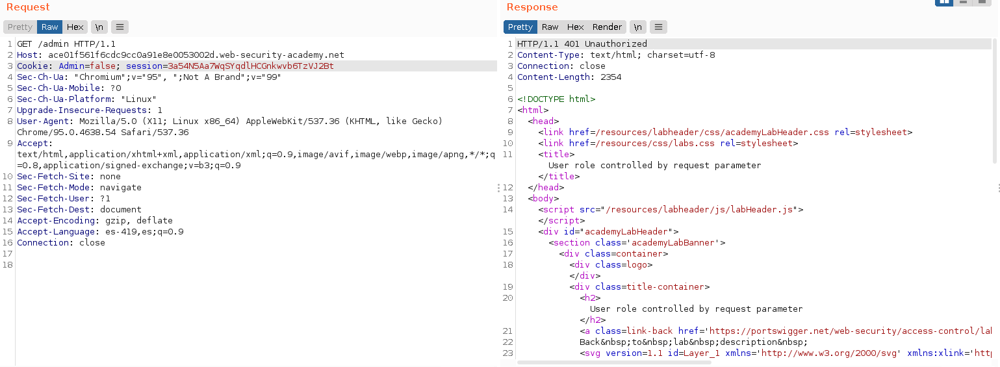
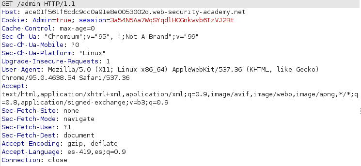
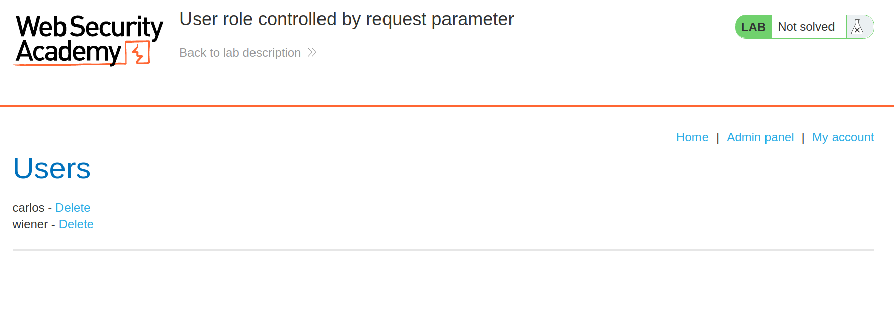
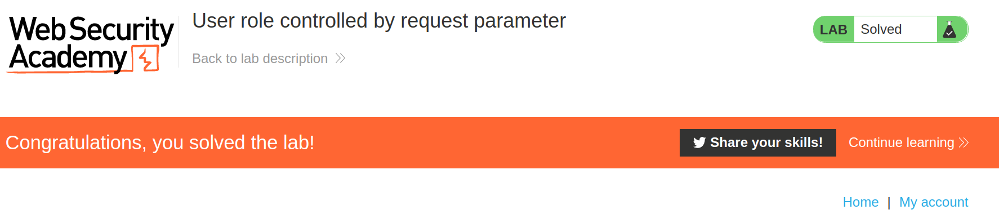

+++
author = "Alux"
title = "Portswigger Academy Learning Path: Access Control Lab 3"
date = "2021-12-16"
description = "Lab: User role controlled by request parameter"
tags = [
    "access control",
    "portswigger",
    "academy",
    "burpsuite",
]
categories = [
    "pentest web",
]
series = ["Portswigger Labs"]
image = "head.png"
+++

# Lab: User role controlled by request parameter

En este <cite>laboratorio[^1]</cite>la finalidad es poder realizar un bypass al control de seguridad que tienen los accesos de los usuarios.

## Reconocimiento

Cuando entramos tenemos la siguiente web.

## Explotacion

Existe una funcionalidad de administracion en la cual podemos entrar con el usuario `wiener:peter` pero si entramos a esa ruta no podemos acceder nos sale la siguiente alerta:

> Admin interface only available if logged in as an administrator

Cuando vemos la solicitud que hace se ve una cookie que nos indica que la validacion la hace el backend por medio de esta cookie su valor es `Admin: false`

Ahora cambiamos el valor de la cookie por true y veremos que cambia

Ahora podemos ver la funcionalidad y realizar acciones sin problema.

Y eliminamos al usuario carlos cambiando siempre el valor de la cookie y resolvemos el lab:

[^1]: [Laboratorio](https://portswigger.net/web-security/access-control/lab-unprotected-admin-functionality-with-unpredictable-url)