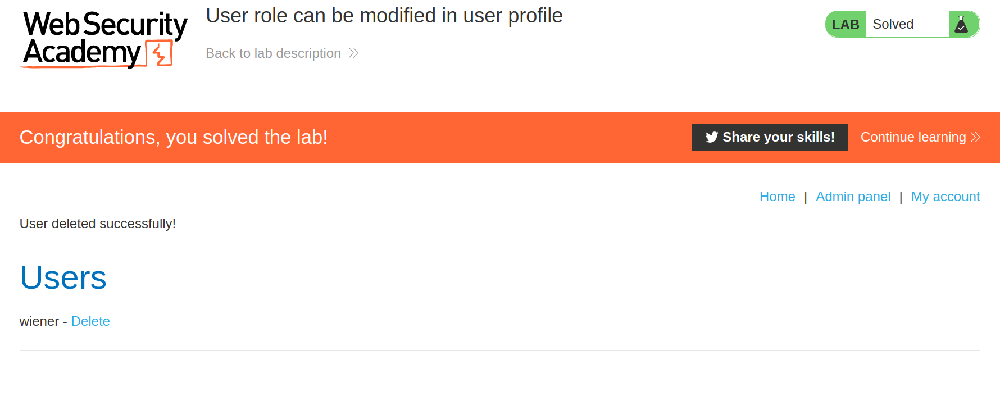

+++
author = "Alux"
title = "Portswigger Academy Learning Path: Access Control Lab 4"
date = "2021-12-17"
description = "Lab: User role can be modified in user profile"
tags = [
    "access control",
    "portswigger",
    "academy",
    "burpsuite",
]
categories = [
    "pentest web",
]
series = ["Portswigger Labs"]
image = "head.png"
+++

# Lab: User role can be modified in user profile

En este <cite>laboratorio[^1]</cite>la finalidad es poder realizar un bypass al control de seguridad que tienen los accesos de los usuarios.

## Reconocimiento

Cuando entramos tenemos la siguiente web.

## Explotacion

Existe una funcionalidad de administracion en la cual podemos entrar con el usuario `wiener:peter` pero si entramos a esa ruta no podemos acceder nos sale la siguiente alerta:

> Admin interface only available if logged in as an administrator

Notamos que en la respuesta existe un parametro llamado `roleid` y que tiene el valor 1 y con el nuevo correo que  tenemos, eso quiere decir que podriamos intentar modificar el valor del `roleid` a `2` y ver que pasa.

Ahora que lo hemos cambiado no se ha denegado y nos muestra el nuevo role que contamos e intentamos acceder a la funcionalidad de admin sin problemas

Y eliminamos al usuario carlos y resolvemos el lab:

[^1]: [Laboratorio](https://portswigger.net/web-security/access-control/lab-user-role-can-be-modified-in-user-profile)