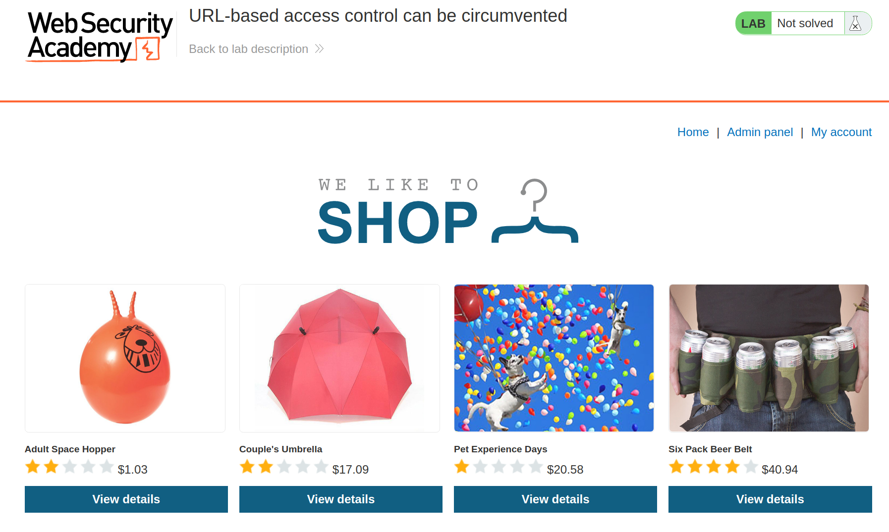
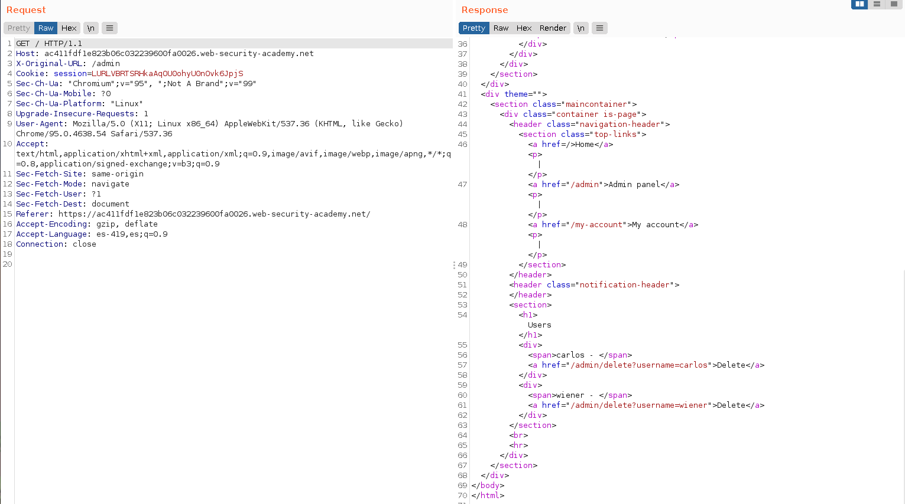
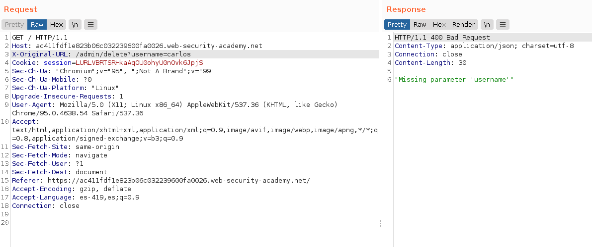
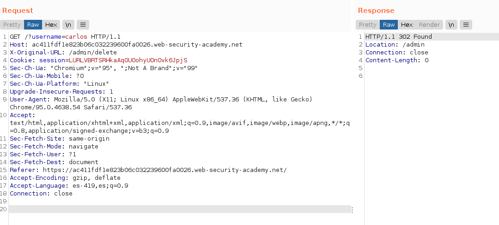
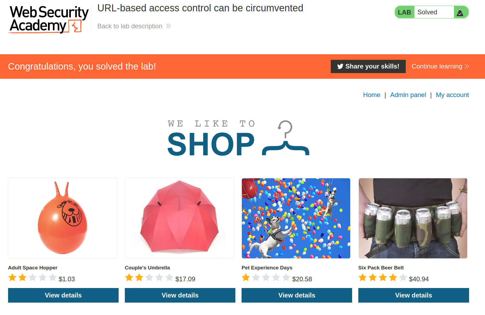

+++
author = "Alux"
title = "Portswigger Academy Learning Path: Access Control Lab 5"
date = "2021-12-17"
description = "Lab: URL-based access control can be circumvented"
tags = [
    "access control",
    "portswigger",
    "academy",
    "burpsuite",
]
categories = [
    "pentest web",
]
series = ["Portswigger Labs"]
image = "head.png"
+++

# Lab: URL-based access control can be circumvented

En este <cite>laboratorio[^1]</cite>la finalidad es poder realizar un bypass al control de seguridad que tienen los accesos de los usuarios.

## Reconocimiento

Cuando entramos tenemos la siguiente web.



En este caso la aplicacion cuando intentamos entrar a la opcion de administracion nos deniega el acceso definitivamente.

## Explotacion

Pero podemos bypassear esto por medio de headers como

```
X-Original-URL
X-Rewrite-URL
```

Si los agregamos a la solicitud podemos notar como podemos acceder a la funcionalidad de admin aunque anteriormente saliera un error de `acceso denegado`.



Ahora notamos que podemos eliminar al usuario carlos haciendo una peticion `GET` a `/admin/delete?username=carlos` pero cuando lo intentamos sale el siguiente error:



La correcta manera es la siguiente es enviar en la peticion `GET` los parametros para eliminar y en el header agregado solamente el path de la pagina al que se le hace el delete y la respuesta no nos da ningun error por lo que se ejecuto correctamente.



Y con eso ya nos salta la alerta de que hemos eliminado al usuario y resuelto el lab.




[^1]: [Laboratorio](https://portswigger.net/web-security/access-control/lab-url-based-access-control-can-be-circumvented)