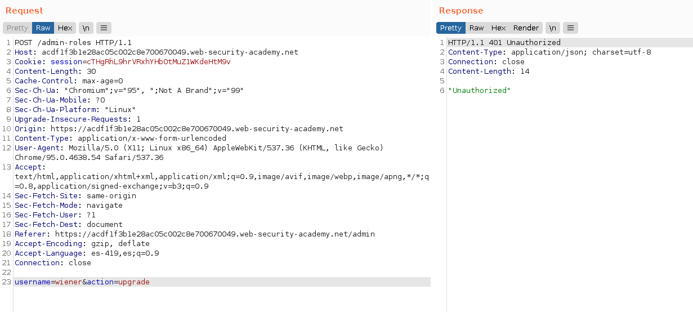

+++
author = "Alux"
title = "Portswigger Academy Learning Path: Access Control Lab 6"
date = "2021-12-22"
description = "Lab: Method-based access control can be circumvented"
tags = [
    "access control",
    "portswigger",
    "academy",
    "burpsuite",
]
categories = [
    "pentest web",
]
series = ["Portswigger Labs"]
image = "head.png"
+++

# Lab: Method-based access control can be circumvented

En este <cite>laboratorio[^1]</cite>lqa finalidad es poder realizar un bypass al control de seguridad que tienen los accesos de los usuarios.

## Reconocimiento

En este caso la aplicacion cuando intentamos entrar a la opcion de administracion nos deniega el acceso definitivamente. Se nos da una cuenta `administrator:admin` en la cual vemos las funciones que tenemos

Si vemos la peticion que se hace es la siguiente la cual hace una peticion post para la actualizacion a admin

## Explotacion

Cuando ingresamos a la pagina de `/admin` no tenemos permisos para acceder, asi que directamente pasamos a replicar la peticion que hemos hecho con el usuario de prueba admin, que nos dara que no estamos autorizados para realizar la peticion.

> Usuario no autorizado para realizar la peticion

Ahora cambiamos la peticion a post con `change request method` y vemos como ahora si la peticion es aceptada por el servidor.

Y con eso ya nos salta la alerta de que hemos resuelto el lab por actualizar nuestro usuario a admin.

[^1]: [Laboratorio](https://portswigger.net/web-security/access-control/lab-method-based-access-control-can-be-circumvented)