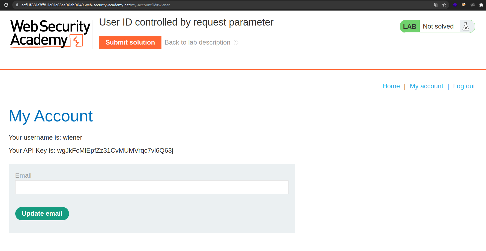

+++
author = "Alux"
title = "Portswigger Academy Learning Path: Access Control Lab 7"
date = "2021-12-23"
description = "Lab: User ID controlled by request parameter"
tags = [
    "access control",
    "portswigger",
    "academy",
    "burpsuite",
]
categories = [
    "pentest web",
]
series = ["Portswigger Labs"]
image = "head.png"
+++

# Lab: User ID controlled by request parameter

En este <cite>laboratorio[^1]</cite>lqa finalidad es poder realizar un bypass al control de seguridad que tienen los accesos de los usuarios.

## Reconocimiento

En este caso la aplicacion debemos de recuperar la api key del usuario carlos, cuando 
entramos al usuario automaticamente nos dirige a la url siguiente y lo que nos muestra:

```
https://acf11f881e7ff811c01c63ee00ab0049.web-security-academy.net/my-account?id=wiener
```




## Explotacion

La solucion aca es muy simple ya que notamos algo interesante, enviando en una peticion `GET` esta enviada el id del usuario que es `wiener` si intentamos cambiarla por `carlos` ya obtenemos la api key del usuario carlos.

```
https://acf11f881e7ff811c01c63ee00ab0049.web-security-academy.net/my-account?id=carlos
```


Y con eso ya obtenemos la api del usuario carlos y la subimos para resolver el lab.


[^1]: [Laboratorio](https://portswigger.net/web-security/access-control/lab-user-id-controlled-by-request-parameter)