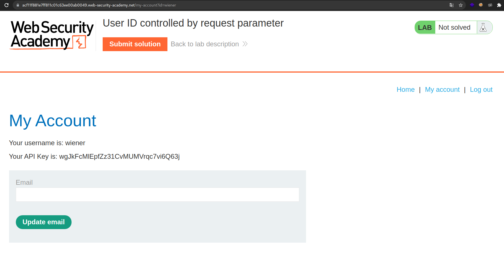
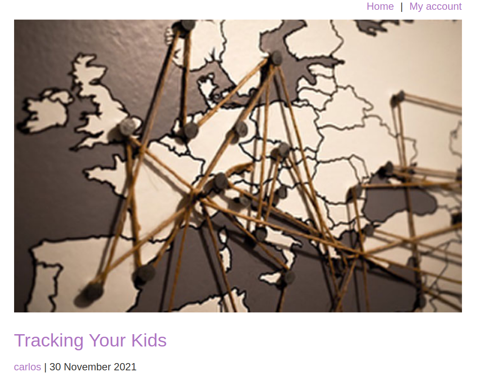
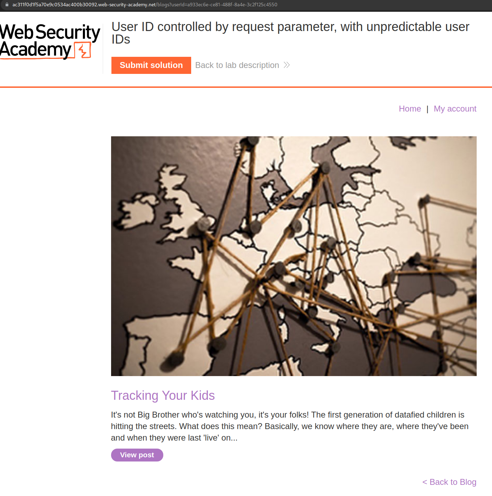
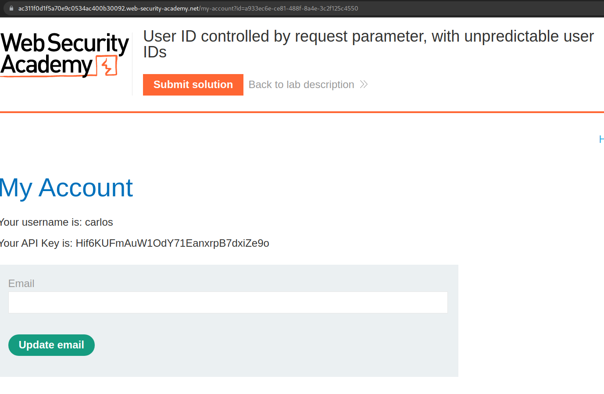
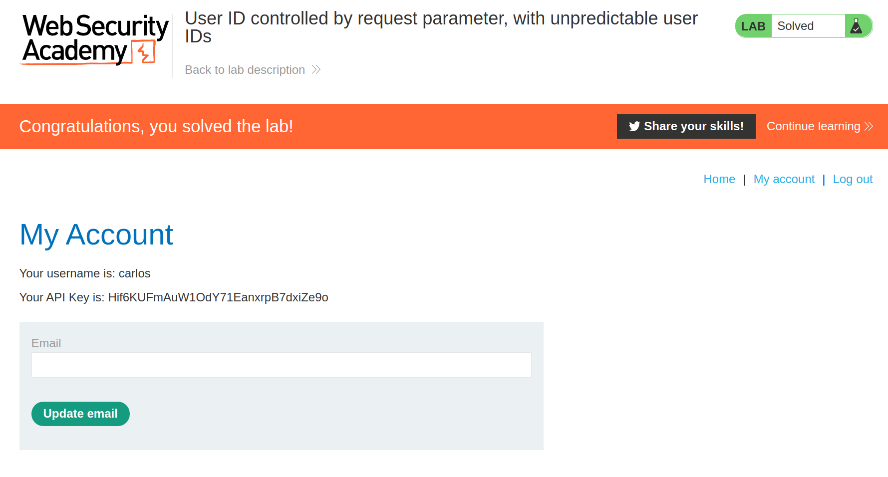

+++
author = "Alux"
title = "Portswigger Academy Learning Path: Access Control Lab 8"
date = "2021-12-24"
description = "Lab: User ID controlled by request parameter, with unpredictable user IDs"
tags = [
    "access control",
    "portswigger",
    "academy",
    "burpsuite",
]
categories = [
    "pentest web",
]
series = ["Portswigger Labs"]
image = "head.png"
+++

# Lab: User ID controlled by request parameter, with unpredictable user IDs

En este <cite>laboratorio[^1]</cite>lqa finalidad es poder realizar un bypass al control de seguridad que tienen los accesos de los usuarios.

## Reconocimiento

En este caso la aplicacion debemos de recuperar la api key del usuario carlos, cuando 
entramos al usuario automaticamente nos dirige a la url siguiente y lo que nos muestra:



Pero el id enviado es enviado aparte en una peticion con un id aleatorio que no podriamos explotar, por lo que deberiamos de buscar el id del usuario carlos

## Explotacion

Encontramos un post en el cual esta escrito por el usuario `carlos`, como se puede ver:



Y al entrar al link directo del usuario carlos se nos muestra el id aleatorio asignado al usuario carlos:



```
https://ac311f0d1f5a70e9c0534ac400b30092.web-security-academy.net/blogs?userId=a933ec6e-ce81-488f-8a4e-3c2f125c4550
```

Ahora teniendo en cuenta que ya tenemos el id del usuario carlos enviaremos la peticion `GET` con el id del usuario carlos



Y con eso ya obtenemos la api del usuario carlos y la subimos para resolver el lab.




[^1]: [Laboratorio](https://portswigger.net/web-security/access-control/lab-user-id-controlled-by-request-parameter-with-unpredictable-user-ids)