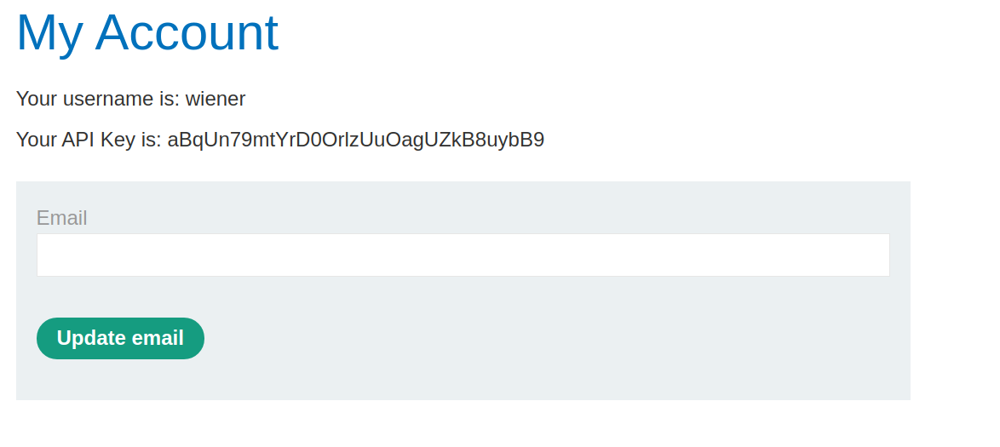
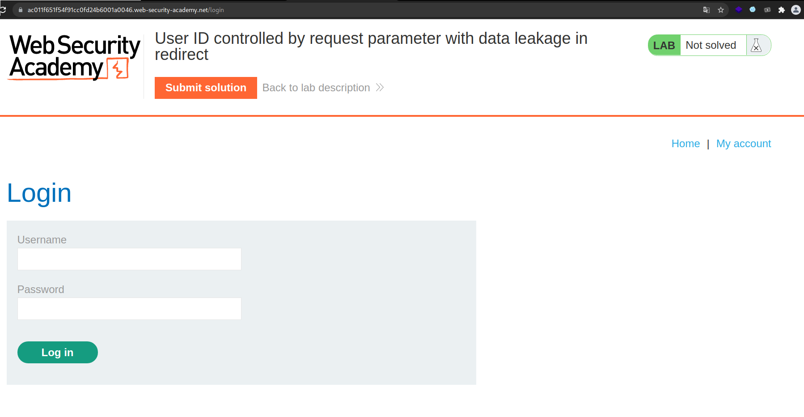
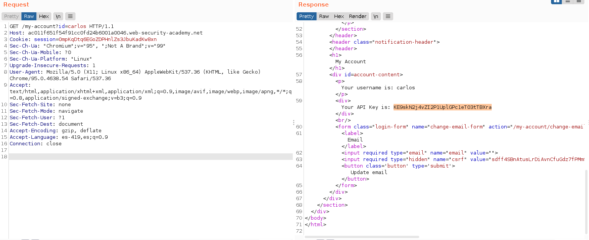
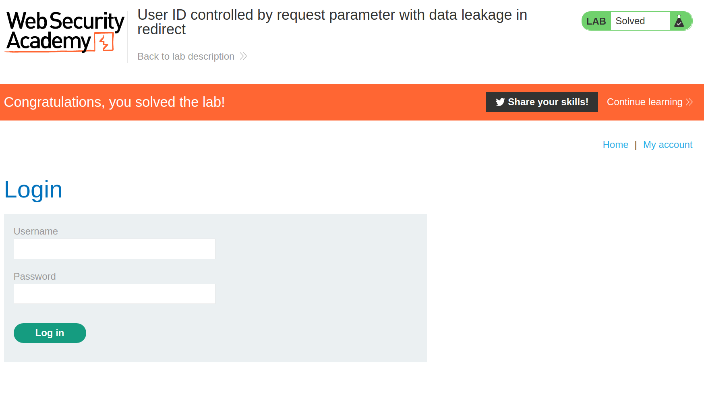

+++
author = "Alux"
title = "Portswigger Academy Learning Path: Access Control Lab 9"
date = "2021-12-24"
description = "Lab: User ID controlled by request parameter with data leakage in redirect"
tags = [
    "access control",
    "portswigger",
    "academy",
    "burpsuite",
]
categories = [
    "pentest web",
]
series = ["Portswigger Labs"]
image = "head.png"
+++

# Lab: User ID controlled by request parameter with data leakage in redirect

En este <cite>laboratorio[^1]</cite>lqa finalidad es poder realizar un bypass al control de seguridad que tienen los accesos de los usuarios.

## Reconocimiento

En este caso la aplicacion debemos de recuperar la api key del usuario carlos, cuando 
entramos al usuario automaticamente nos dirige a la url siguiente y lo que nos muestra:

## Explotacion

Aca podemos ver que cambiando el parametro el id de wiener podemos acceder para ver los datos pero si directamente cambiamos el valor del id por `carlos` se nos redirige a la opcion de login por lo que no podemos ver la api de carlos.

Pero si se hace una redireccion lo mejor es ir a ver como se hace la redireccion en burp y al ver la peticion que se hace al usuario carlos, podemos ver que si nos muestra los datos y luego se redirige por lo que no existe una proteccion y se revela la api key

Y con eso ya obtenemos la api del usuario carlos y la subimos para resolver el lab.

[^1]: [Laboratorio](https://portswigger.net/web-security/access-control/lab-user-id-controlled-by-request-parameter-with-data-leakage-in-redirect)