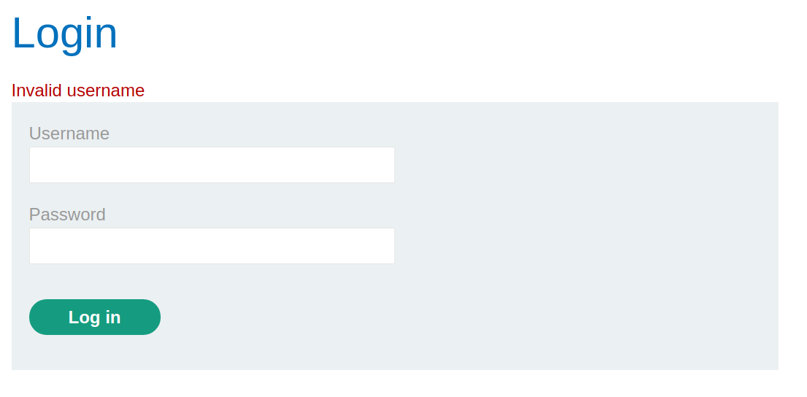
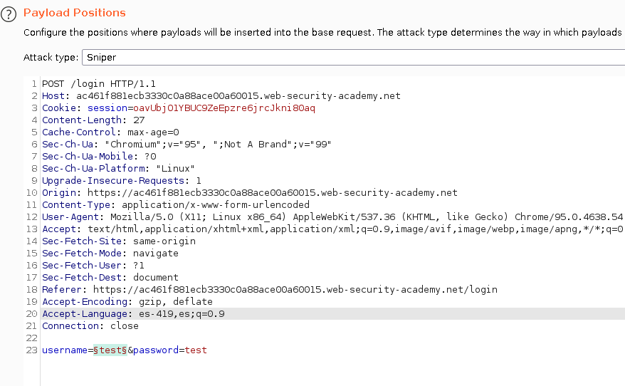
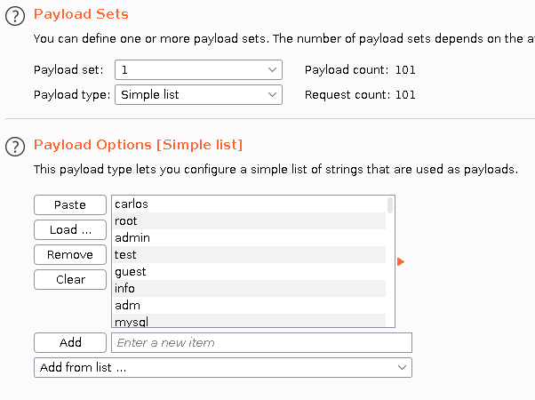
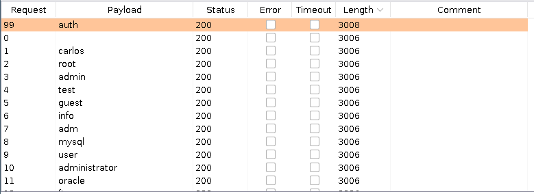
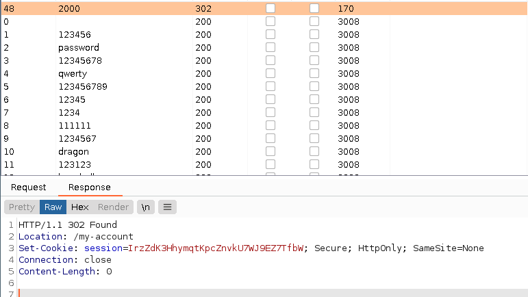
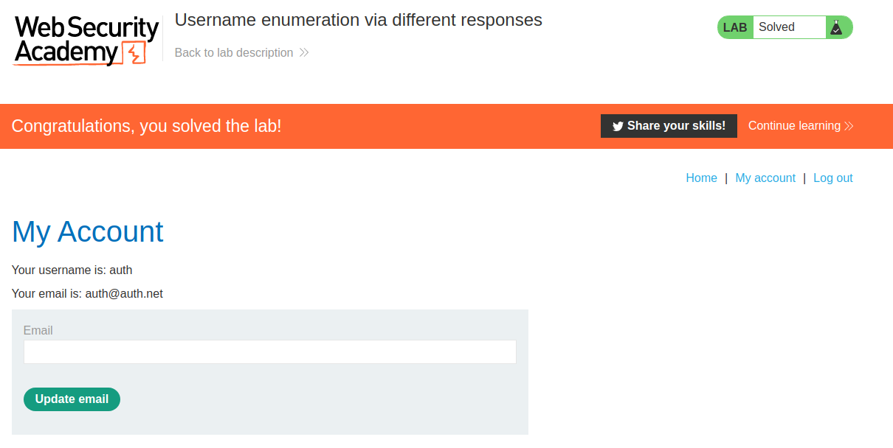

+++
author = "Alux"
title = "Portswigger Academy Learning Path: Authentication Lab 1"
date = "2021-11-13"
description = "Lab: Username enumeration via different responses"
tags = [
    "broken authentication",
    "portswigger",
    "academy",
    "burpsuite",
]
categories = [
    "pentest web",
]
series = ["Portswigger Labs"]
image = "head.png"
+++

# Lab: Username enumeration via different responses

En este <cite>laboratorio[^1]</cite>la finalidad es enumerar usuarios en el inicio de sesion y dependiendo de la respuesta sabremos si el usuario esta registrado o no.

## Reconocimiento

Para resolver el ejercicio se nos da el siguiente listado de <cite>usuarios[^2] y contrasenas[^3]</cite> para realizar las pruebas, al intentar iniciar sesion podemos notar la respuesta del inicio de sesion:

## Explotacion

Basandonos en la respuesta sabremos identificar usuarios en el sistema, solo toca enviar los multiples usuarios y saber cual esta registrado, utilizando la lista de usuarios antes mencionados. Para eso lanzamos el ataque:

Y al lanzar el ataque obtuvimos la respuesta, y aunque la respuesta es muy parecida, en un usuario da una respuesta diferente con el `length 3008` y es la donde ya nos dice que es `Incorrect password` lo cual ya hemos enumerado al usuario.

Ya ahora solo queda lanzar el mismo ataque pero con el listado de contrasenas al usuario `auth`. 

Y con esto hemos resulto el lab:

Con esto ya muestra que se ha resuelto el lab.

[^1]: [Laboratorio](https://portswigger.net/web-security/authentication/password-based/lab-username-enumeration-via-different-responses)
[^2]: [Listado de Usuarios](usernames.txt)
[^3]: [Listado de Contrasenas](passwords.txt)