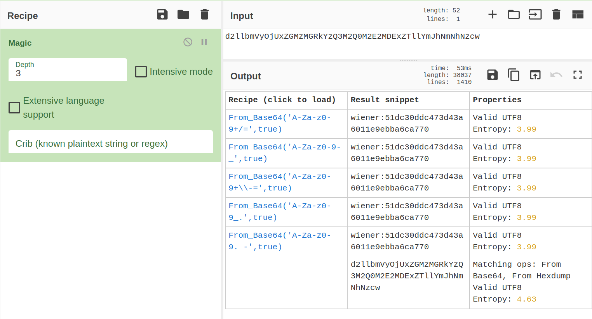
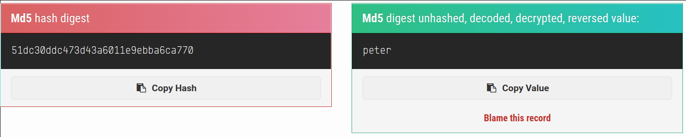
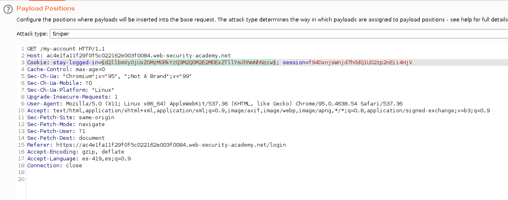
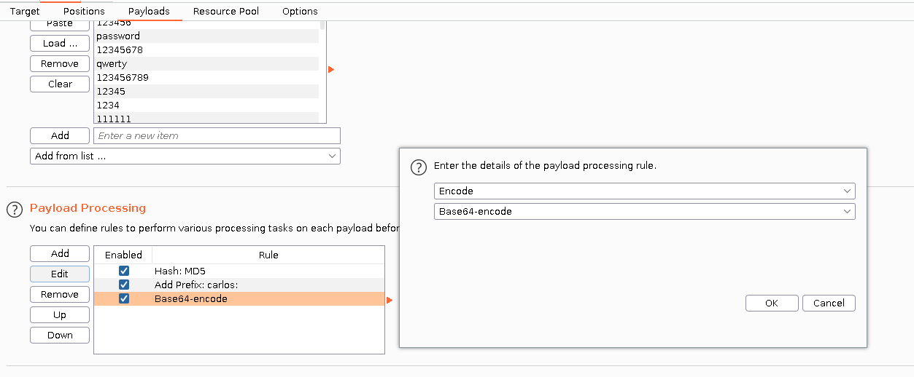
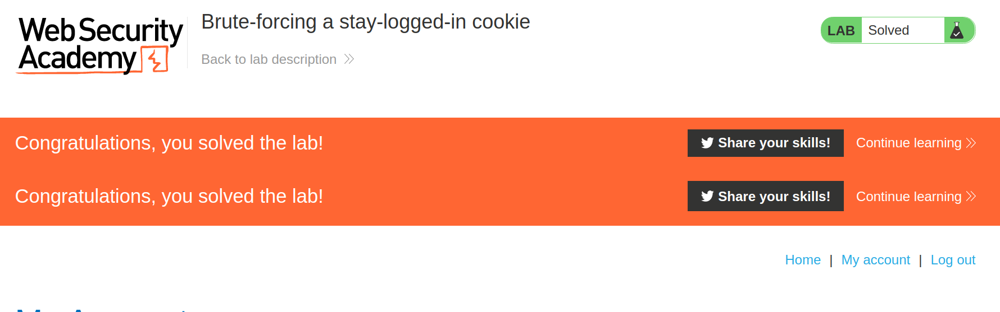

+++
author = "Alux"
title = "Portswigger Academy Learning Path: Authentication Lab 10"
date = "2021-11-24"
description = "Lab: Brute-forcing a stay-logged-in cookie"
tags = [
    "broken authentication",
    "portswigger",
    "academy",
    "burpsuite",
]
categories = [
    "pentest web",
]
series = ["Portswigger Labs"]
image = "head.png"
+++

# Lab: Brute-forcing a stay-logged-in cookie

En este <cite>laboratorio[^1]</cite>la finalidad es ingresar con el usuario `carlos` el cual contiene una vulnerabilidad en el inicio de sesion

## Reconocimiento

Para resolver el ejercicio se nos da el listado de contrasenas con el que nos podemos autenticar con el usuario carlos para realizar las pruebas, pero al iniciar sesion notamos que tiene una opcion de mantener el inicio de sesion, el cual contiene una vulnerabilidad ya que pareciera que es una cookie random pero no.

## Explotacion

Al iniciar sesion con la opcion habilitada, se crea una cookie distinta que no parece random, en este caso cuando intentamos descifrar la cookie nos damos cuenta que esta codificada el usuario y su contrasena. 

Al querer descifrar la contrasena, nos encontramos con que esta en formato MD5, por lo cual hemos encontrado el proceso para codificar la cookie

Ahora debemos crear una cookie nueva inyectado las contrasenas y el usuario carlos. Todo esto a traves del intruder de burpsuite.

Con esto ya muestra que se ha resuelto el lab.

[^1]: [Laboratorio](https://portswigger.net/web-security/authentication/other-mechanisms/lab-brute-forcing-a-stay-logged-in-cookie)