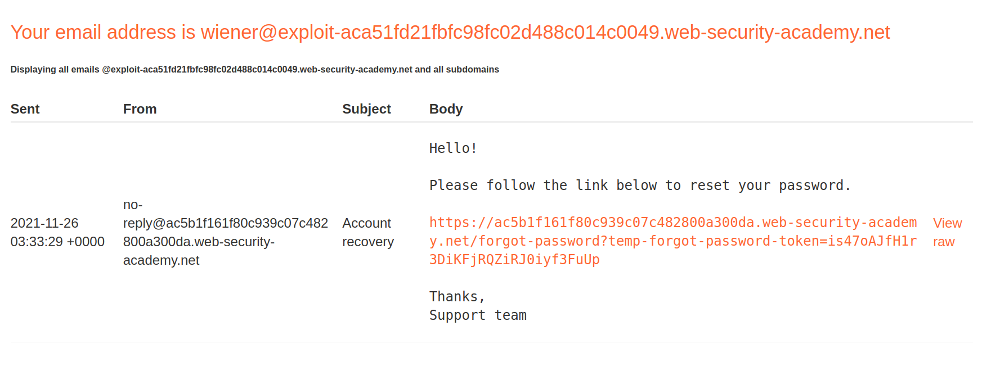
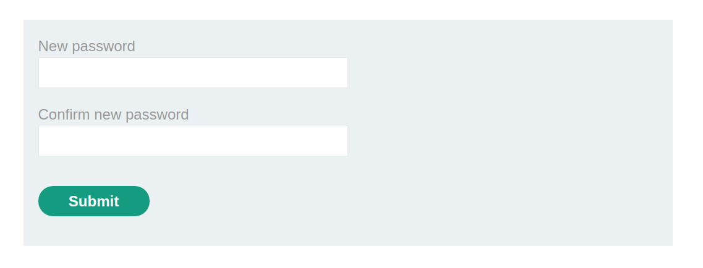
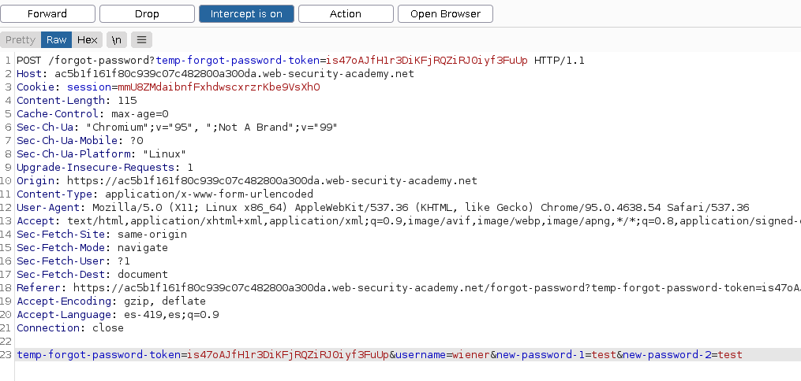
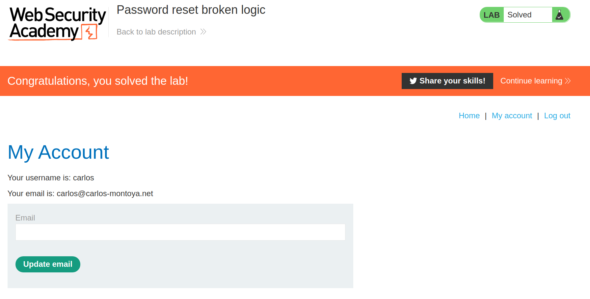

+++
author = "Alux"
title = "Portswigger Academy Learning Path: Authentication Lab 12"
date = "2021-11-25"
description = "Lab: Password reset broken logic"
tags = [
    "broken authentication",
    "portswigger",
    "academy",
    "burpsuite",
]
categories = [
    "pentest web",
]
series = ["Portswigger Labs"]
image = "head.png"
+++

# Lab: Password reset broken logic

En este <cite>laboratorio[^1]</cite>la finalidad es aprovecharse de una vulnerabilidad en la recuperacion de contrasena, la cual permite que un usuario pueda hacerse con otra cuenta por la mala implementacion de esta funcion.

## Reconocimiento

La pagina consta de un inicio de sesion el cual, tiene una parte de recuperacion de contrasena, y si colocamos el usuario de `wiener` recibimos un correo con el link para recuperar la contrasena. Si

Si abrimos el link nos enviara a ingresar la nueva contrasena del usuario

## Explotacion

En este caso todo normal, pero es cuando empezamos a proxear y ver las peticiones que se envian al servidor con burp, y como es el caso al ingresar los datos y enviar la peticion va el valor del usuario al que se le va a cambiar la contrasena que es wiener

> Es enviada en la peticion el nombre de usuario al que se le cambia la contrasena

Aca aprovechamos y podemos hacer el cambio por el usuario `wiener a carlos`, lo cual aprovechando del link anterior pero que la cookie o el codigo no esta asignado al propio usuario nos permite cambiarle la contrasena al usuario carlos, para posteriormente ingresar con ese usuario.

Al finalizar esta solicitud ya podriamos ingresar con el usuario carlos y la nueva contrasena que hemos colocado y resuelto el lab.

[^1]: [Laboratorio](https://portswigger.net/web-security/authentication/other-mechanisms/lab-password-reset-broken-logic)