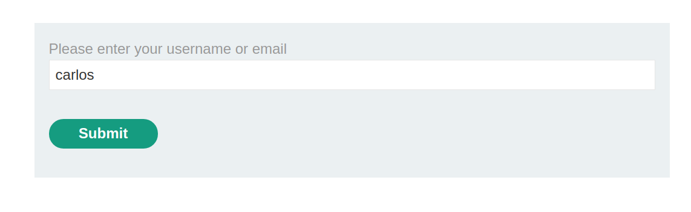
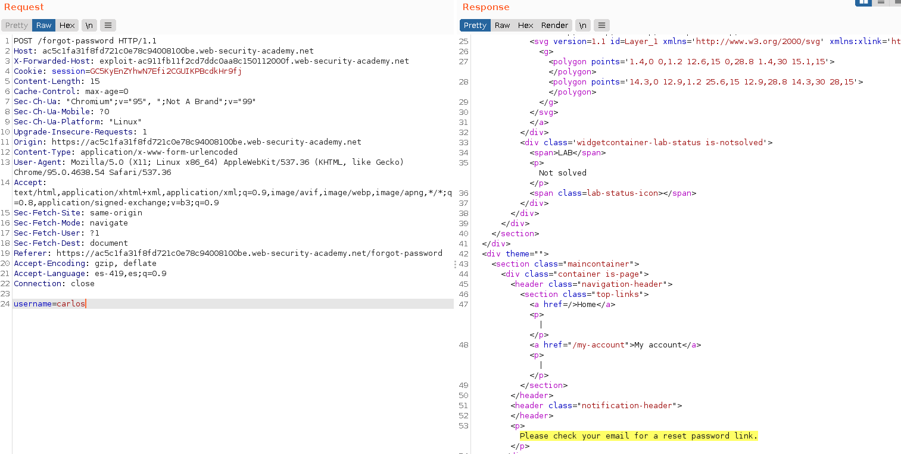
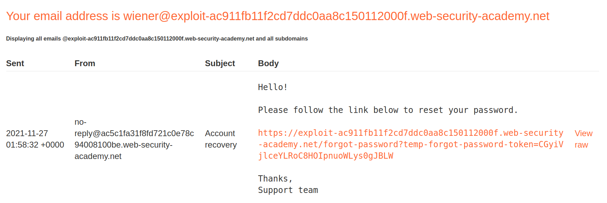
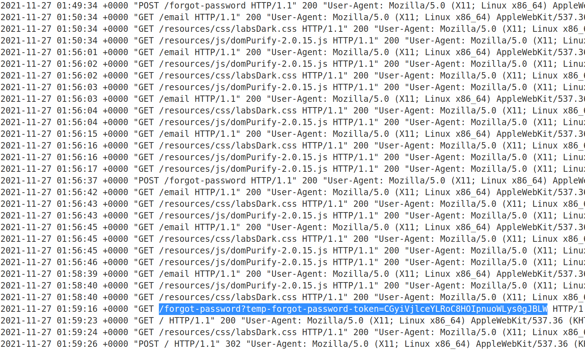
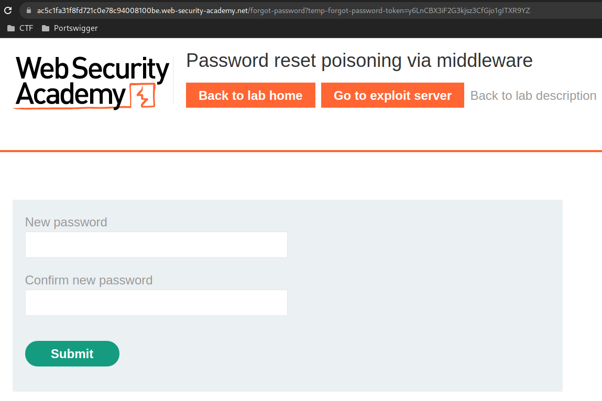
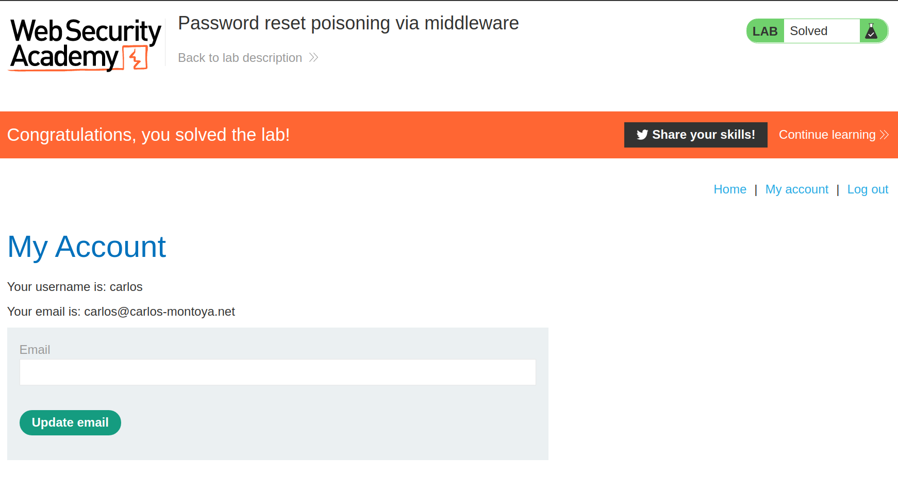

+++
author = "Alux"
title = "Portswigger Academy Learning Path: Authentication Lab 13"
date = "2021-11-26"
description = "Lab: Password reset poisoning via middleware"
tags = [
    "broken authentication",
    "portswigger",
    "academy",
    "burpsuite",
]
categories = [
    "pentest web",
]
series = ["Portswigger Labs"]
image = "head.png"
+++

# Lab: Password reset poisoning via middleware

En este <cite>laboratorio[^1]</cite>la finalidad es aprovecharse de una vulnerabilidad en la recuperacion de contrasena, la cual permite que un usuario pueda hacerse con otra cuenta por la mala implementacion de esta funcion.

## Reconocimiento

La pagina consta de un inicio de sesion el cual, tiene una parte de recuperacion de contrasena, y si colocamos el usuario de `wiener` recibimos un correo con el link para recuperar la contrasena. Todo funciona bien al parecer.

Luego recibiremos el siguiente correo:

Si abrimos el link nos enviara a ingresar la nueva contrasena del usuario.

## Explotacion

Ahora como se podria explotar algo asi ya que todo funciona muy bien, pero hay un error, a la hora de la creacion del link que se le envia al usuario victima se puede craftear para que tome un host del atacante y nosotros posteriormente cuando el usuario abra el link poder capturar el token. El diagrama de ataque seria el siguiente:

Ahora realizamos todo el proceso de recuperacion de la contrasena y capturamos cuando se envia el usuario al que se piensa recuperar la contrasena, que es cuando se toma el host para enviar el correo. En este caso lo que queremos es que tome otro host y no el que es enviado en `Host:` para eso existen maneras de modificarlo, si se agrega otro Host da error pero si se agrega `X-Forwarded-Host` si lo toma y envia el correo hacia la victima con el host que se le indica en el header.

> The `X-Forwarded-Host` (XFH) header is a de-facto standard header for identifying the original host requested by the client in the Host HTTP request header.

Este seria el link que recibiria la victima con la url del atacante que se le indico en el header `X-Forwarded-Host`:

Y cuando llega a la victima este lo abrira pero vera la pagina falsa y nosotros capturaremos el token para posteriormente nosotros ingresarlo manual a la pagina verdadera:

Ahora abrimos la pagina web y nos pide las credenciales nuevas para el usuario carlos:

Al finalizar esta solicitud ya podriamos ingresar con el usuario carlos y la nueva contrasena que hemos colocado y resuelto el lab.

[^1]: [Laboratorio](https://portswigger.net/web-security/authentication/other-mechanisms/lab-password-reset-poisoning-via-middleware)