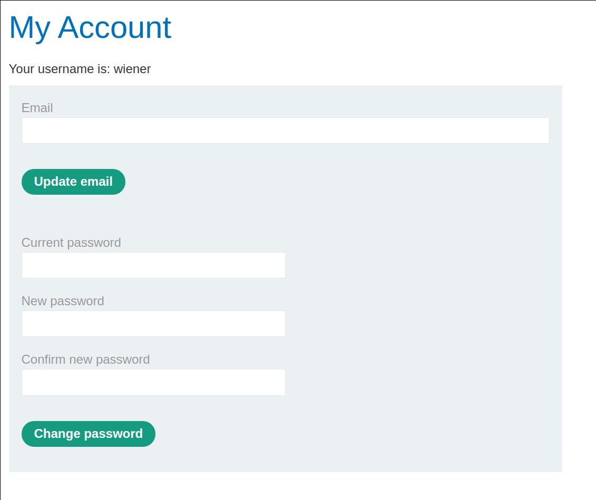
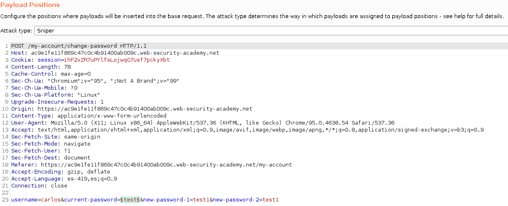
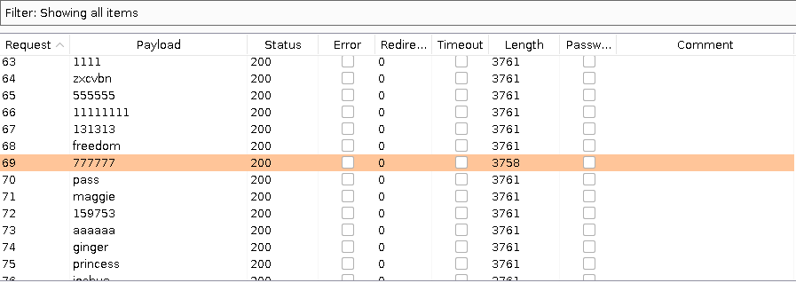
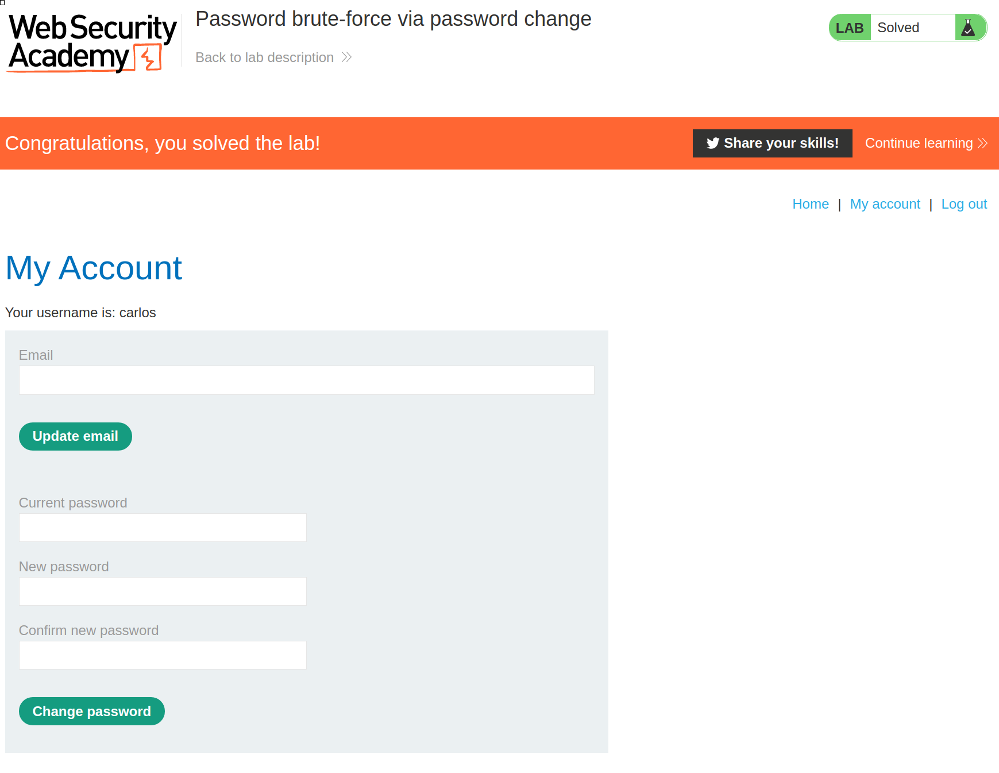

+++
author = "Alux"
title = "Portswigger Academy Learning Path: Authentication Lab 14"
date = "2021-11-26"
description = "Lab: Password brute-force via password change"
tags = [
    "broken authentication",
    "portswigger",
    "academy",
    "burpsuite",
]
categories = [
    "pentest web",
]
series = ["Portswigger Labs"]
image = "head.png"
+++

# Lab: Password brute-force via password change

En este <cite>laboratorio[^1]</cite>la finalidad es aprovecharse de una vulnerabilidad en la funcion de cambio de contrasena.

## Reconocimiento

La pagina consta de un inicio de sesion el cual se puede ingresar con el usuario `wiener` y cuando vemos podemos cambiar la contrasena de nuestro usuario.

## Explotacion

Ahora si probamos la funcionalidad, enviamos la peticion para cambiarla y notamos que se envia el usuario al que se quiere cambiar la contrasena

Asi que teniendo esto lo que haremos es enviar la la `current-password` realizando fuerza bruta al usuario carlos para cambiar la contrasena, pero hay un detalle que al enviar esto, las respuestas no nos arrojan si se cambio la contrasena, por esta razon lo que hice fue `colocar contrasenas diferentes en new password` lo que hara que se nos muestre un error de match y la respuesta sea diferente al resto.png

> Colocar contrasenas diferentes en new password para no hacer match y generar error

Ahora nos muestra que la contrasena es `77777` porque la contrasenas no hacen match porque si valida que la contrasena sea la correcta. Y ya podriamos ingresar con el usuario `carlos:777777`

[^1]: [Laboratorio](https://portswigger.net/web-security/authentication/other-mechanisms/lab-password-brute-force-via-password-change)