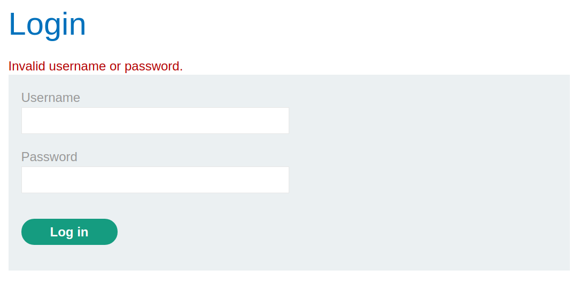
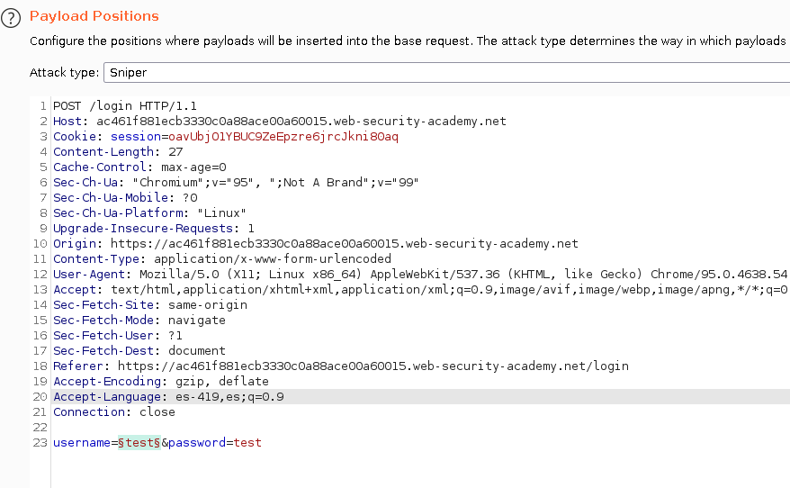
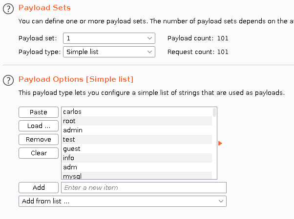
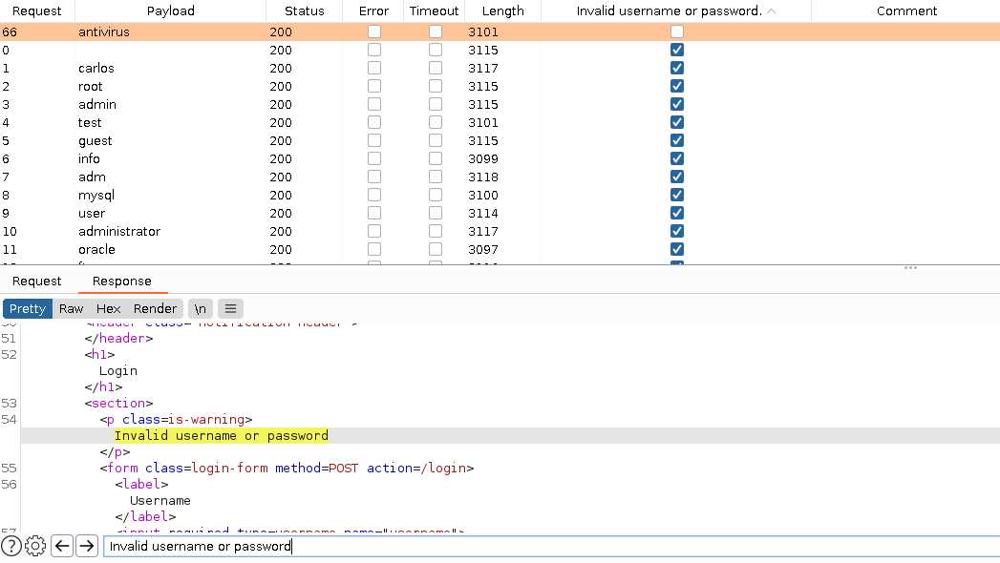
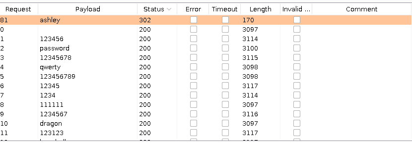
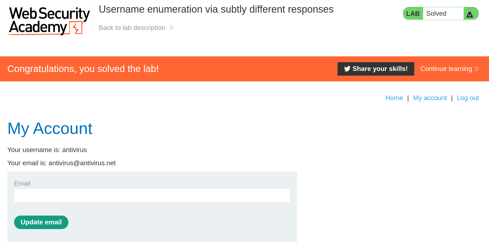

+++
author = "Alux"
title = "Portswigger Academy Learning Path: Authentication Lab 2"
date = "2021-11-13"
description = "Lab: Username enumeration via different responses"
tags = [
    "broken authentication",
    "portswigger",
    "academy",
    "burpsuite",
]
categories = [
    "pentest web",
]
series = ["Portswigger Labs"]
image = "head.png"
+++

# Lab: Username enumeration via different responses

En este <cite>laboratorio[^1]</cite>la finalidad es enumerar usuarios en el inicio de sesion y dependiendo de la respuesta sabremos si el usuario esta registrado o no, pero aca hay una sutil diferencia y es que la respuesta aunque pareciera ser igual, no es igual y esos son los pequenos cambios a notar.

## Reconocimiento

Para resolver el ejercicio se nos da un listado de usuarios y contrasenas para realizar las pruebas, al intentar iniciar sesion podemos notar la respuesta del inicio de sesion, que ya no dice que el usuario es incorrecto, sino que es mas generico.

## Explotacion

Basandonos en la respuesta sabremos identificar usuarios en el sistema, solo toca enviar los multiples usuarios y saber cual esta registrado, utilizando la lista de usuarios antes mencionados. Para eso lanzamos el ataque:

Y al lanzar el ataque obtuvimos muchas respuestas, todas muy similares, para eso haremos de la funcion de burp `Grep - Match` con el valor `Invalid username or password.` y veremos si alguna respuesta cambia a esta.

Como vemos esta esa respuesta sutil, ya que la respuesta que es la correcta hace falta un `.` y eso puede hacer la diferencia al enumerar usuarios. Ya ahora solo queda lanzar el mismo ataque pero con el listado de contrasenas al usuario `auth`. Ahora probaremos el listado de contrasenas, y encontramos basandonos en la respuesta basandonos en la respuesta `302` que es diferente al resto ya que nos redirige.

Y con esto hemos resulto el lab:

Con esto ya muestra que se ha resuelto el lab.

[^1]: [Laboratorio](https://portswigger.net/web-security/authentication/password-based/lab-username-enumeration-via-different-responses)