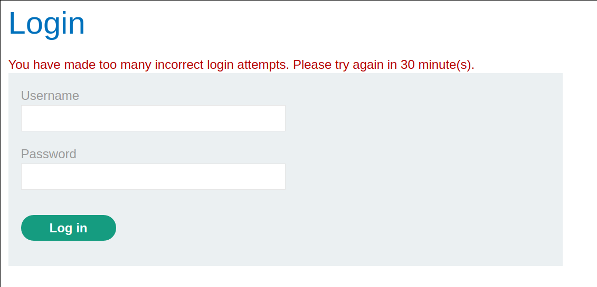
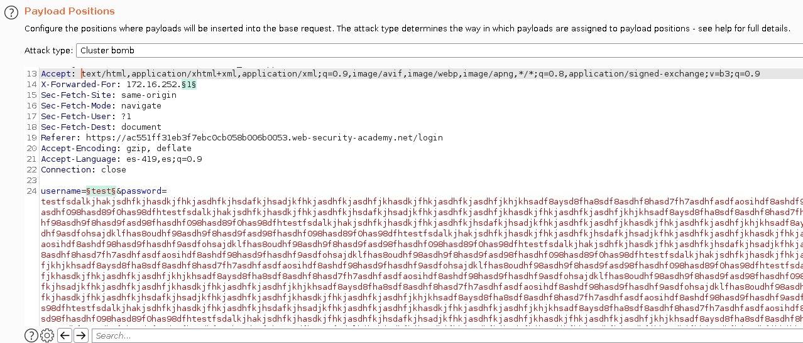
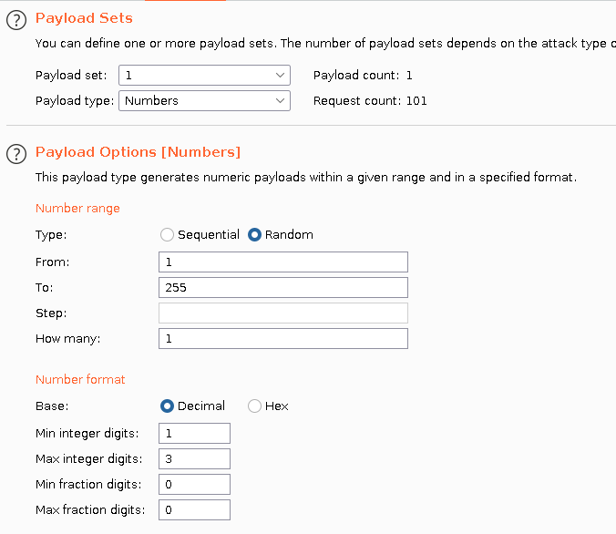
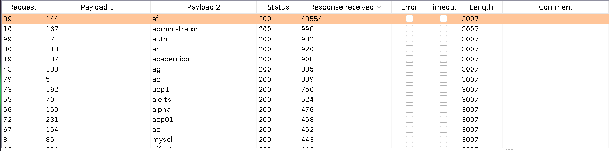
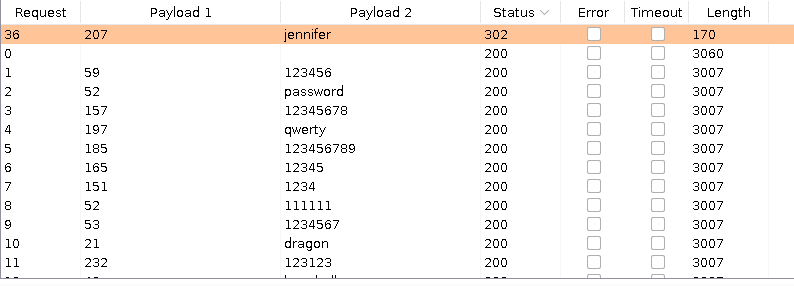
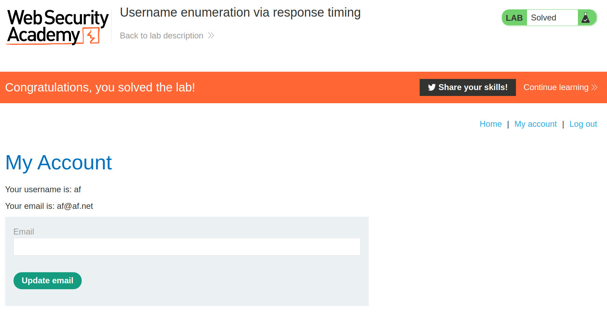

+++
author = "Alux"
title = "Portswigger Academy Learning Path: Authentication Lab 3"
date = "2021-11-13"
description = "Lab: Username enumeration via response timing"
tags = [
    "broken authentication",
    "portswigger",
    "academy",
    "burpsuite",
]
categories = [
    "pentest web",
]
series = ["Portswigger Labs"]
image = "head.png"
+++

# Lab: Username enumeration via different responses

En este <cite>laboratorio[^1]</cite>la finalidad es enumerar usuarios en el inicio de sesion y dependiendo de la respuesta sabremos si el usuario esta registrado o no, pero el sistema cuenta con una proteccion que no permite mas de 3 intentos para realizar brute forcing por lo que tiene `rate limit`, por lo que antes de tratar de enumerar usuarios hay que encontrar la manera de hacer un bypass a esto.

## Reconocimiento

Para resolver el ejercicio se nos da un listado de usuarios y contrasenas para realizar las pruebas, al intentar iniciar sesion podemos notar la respuesta del inicio de sesion, que ya no dice que el usuario es incorrecto, sino que es mas generico.



Lo primero para saltarse esto existen maneras, una de las cuales puede ser se lista:

```
X-Originating-IP: 127.0.0.1
X-Forwarded-For: 127.0.0.1
X-Remote-IP: 127.0.0.1
X-Remote-Addr: 127.0.0.1
X-Client-IP: 127.0.0.1
X-Host: 127.0.0.1
X-Forwared-Host: 127.0.0.1


#or use double X-Forwared-For header
X-Forwarded-For:
X-Forwarded-For: 127.0.0.1
```
Las listas se pueden encontrar en la <cite>lista de seclists[^2]</cite>.

## Explotacion

Ahora que podemos saltar este bloqueo ya podemos seguir con el ataque. Basandonos en la respuesta sabremos identificar usuarios en el sistema, solo toca enviar los multiples usuarios y saber cual esta registrado, utilizando la lista de usuarios antes mencionados. Para eso lanzamos el ataque y cambiando la posicion 1 con numeros y valores aleatorios para generar el cambio de ip aleatorio y que no se bloquee la solicitud. Algo a notar es que ya que esta solicitud hace una validacion de usuario y contrasena por lo que si enviamos una contrasena muy larga el sistema tardara mucho mas en enviarnos la respuesta.




Al realizar el ataque ya tenemos resultados y nos fijaremos en el tiempo de la respuesta recibida, en este caso el usuario es `af`.



Como vemos esta la respuesta tarda en recibir, por lo que ahora haremos el mismo proceso, pero cambiando la posicion a la contrasena con el listado de contrasenas, y recibimos uno con codigo de respuesta `302` asi que la contrasena es `jennifer`.



Y con esto hemos resulto el lab:



Con esto ya muestra que se ha resuelto el lab.

[^1]: [Laboratorio](https://portswigger.net/web-security/authentication/password-based/lab-username-enumeration-via-response-timing)
[^2]: [Lista de seclists http-request-headers](https://github.com/danielmiessler/SecLists/tree/master/Miscellaneous/web/http-request-headers)