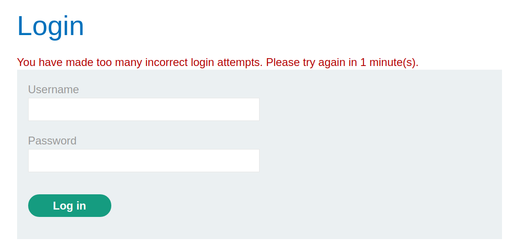
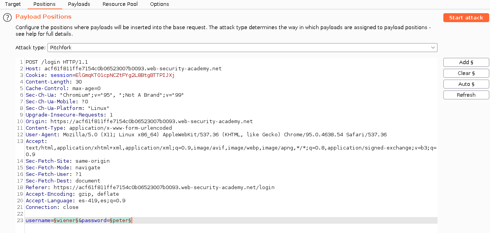
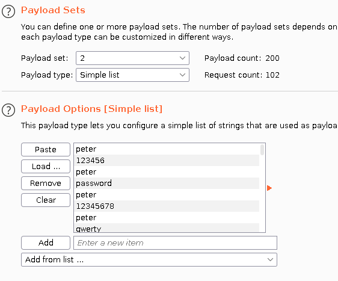
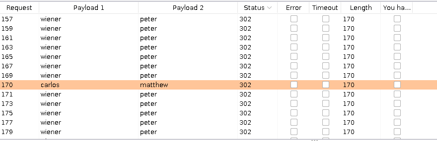
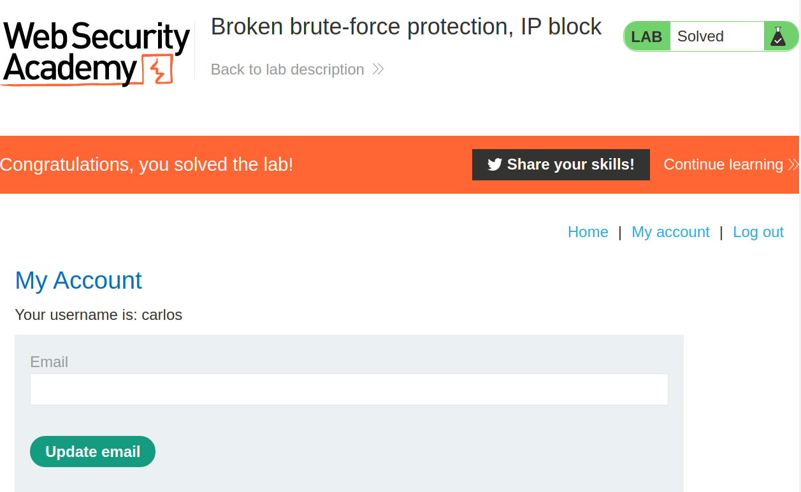

+++
author = "Alux"
title = "Portswigger Academy Learning Path: Authentication Lab 4"
date = "2021-11-20"
description = "Lab: Broken brute-force protection, IP block"
tags = [
    "broken authentication",
    "portswigger",
    "academy",
    "burpsuite",
]
categories = [
    "pentest web",
]
series = ["Portswigger Labs"]
image = "head.png"
+++

# Lab: Broken brute-force protection, IP block

En este <cite>laboratorio[^1]</cite>la finalidad es ingresar con la cuenta de carlos, pero tiene una funcionalidad que lo que hace es bloquear nuestra ip al maximo de intentos que son 3, despues de esos intentos sale una alerta que muestra que se estan realizando demasiados intentos.

## Reconocimiento

Para resolver el ejercicio se nos da un listado de usuarios y contrasenas para realizar las pruebas, al intentar iniciar sesion podemos notar la respuesta del inicio de sesion al realizar mas de 3 intentos en el usuario `carlos`.




## Explotacion

Ahora que sabemos esto, se nos da un usuario valido que es `wiener` con la contrasena `peter` y al tratar de ingresar vemos que accede, pero algo importante al notar es que al iniciar sesion y luego se vuelve a intentar con el usuario `carlos` si deja hacer un nuevo intento otra vez y a la tercera vez se bloquea. Por lo que se sabe que si iniciamos sesion con un usuario valido el contador vuelve a 0.

Ahora queda armar los payloads para realizar el ataque, que es intentar con el usuario valido y luego con la contrasena para carlos para que el contador siempre vuelva a 0 cada que se intenta. Para eso utilizamos `intruder` con el tipo de ataque `Pitchfork` que lo que hara es el payload de posicion 1 se intente con el 1 y el 2 con el posicion 2 y asi sucesivamente.

> Algo a notar es que los payloads set del 1 deben de ser igual en conteo al de payload set 2, es decir si el set 1 tiene 100 valores en su lista, debe tener los mismos en el set 2


### Creacion de lista usuarios

Para eso y crear una lista de 200 ya que las contrasenas a intentar son 100, y se van a intercalar wiener y carlos

```python
print(("wiener\ncarlos\n")*100)
```

### Creacion de lista contrasenas

Lo siguiente es intercalar entre las contrasenas que se probaran a carlos, por eso agregamos el valor `peter` antes de cada linea con un salto de linea los que nos crea una lista de payloads.

```bash
sed 's/^/peter\n/' passwords.txt
```

Ahora que tenemos los payloads hacemos lo siguiente de hacer el ataque de tipo `Pitchfork` y los set de payloads como los mostrados, donde primero se prueba el usuario `wiener:peter` luego `carlos:pass1,pass2,...`




Al realizar el ataque ya podemos ver que `wiener:peter` tiene respuesta de tipo `302` asi que si se ingresa una contrasena valida a carlos este tambien sera la contrasena correcta como se muestra.



Ya con esto tenemos la contrasena y podemos iniciar sesion. Y con esto hemos resulto el lab:



Con esto ya muestra que se ha resuelto el lab.

[^1]: [Laboratorio](https://portswigger.net/web-security/authentication/password-based/lab-broken-bruteforce-protection-ip-block)