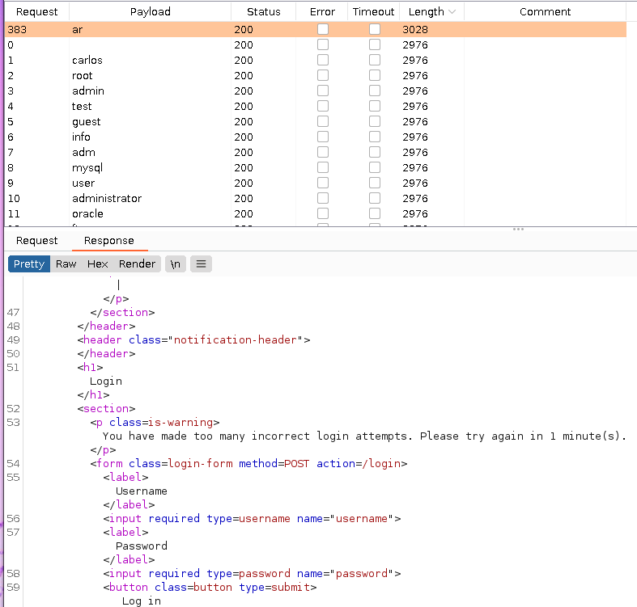
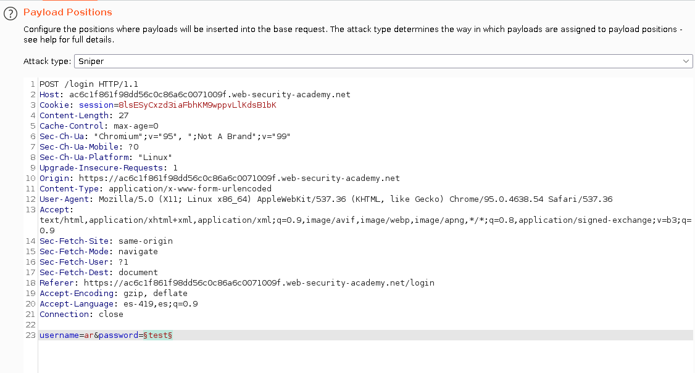
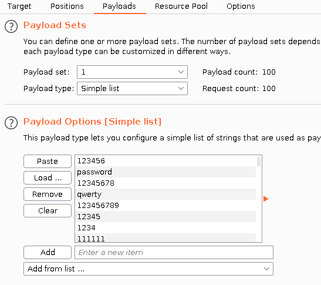
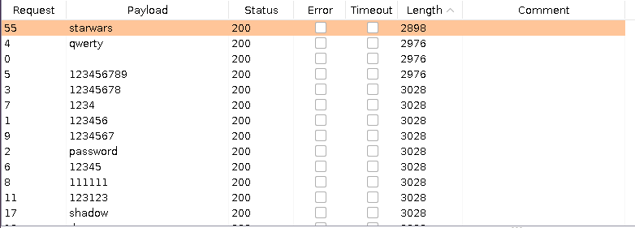
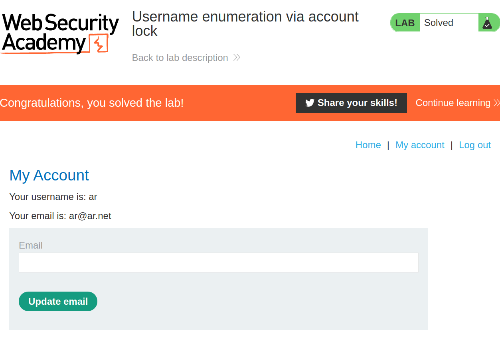

+++
author = "Alux"
title = "Portswigger Academy Learning Path: Authentication Lab 5"
date = "2021-11-20"
description = "Lab: Username enumeration via account lock"
tags = [
    "broken authentication",
    "portswigger",
    "academy",
    "burpsuite",
]
categories = [
    "pentest web",
]
series = ["Portswigger Labs"]
image = "head.png"
+++

# Lab: Username enumeration via account lock

En este <cite>laboratorio[^1]</cite>la finalidad es ingresar con un usuario valido, pero antes debemos hacer una enumeracion para saber que usuario existe o no en la aplicacion.

## Reconocimiento

Para resolver el ejercicio se nos da un listado de usuarios y contrasenas para realizar las pruebas, asi que con el uso de `intruder` copiamos 4 veces los usuarios para que se traten de ingresar 4 veces con una contrasena cualquiera. Y aca hay un usuario que si existe se bloqueara por un minuto, como se muestra que el usuario `ar` se bloquea.

## Explotacion

Ahora que sabemos esto, intentaremos entrar con el usuario `ar` pero hay que tener cuidado que no se nos bloquee la cuenta, en este caso si se bloquea, pero la propia aplicacion tiene una falla la cual aunque se bloquea la cuenta el mensaje es diferente para el usuario valido lo que permite reconocer que el usuario y contrasena si es valido porque muestra un error distinto al resto, y solo queda esperar que la aplicacion se desbloquee luego de un tiempo.

Los valores enviados son:

Al realizar el ataque ya podemos ver los resultados y el de contrasena `starwars` es el unico diferente al resto por lo que nos indica que es la contrasena correcta.

Y con eso ya hemos ingresado:

Con esto ya muestra que se ha resuelto el lab.

[^1]: [Laboratorio](https://portswigger.net/web-security/authentication/password-based/lab-username-enumeration-via-account-lock)