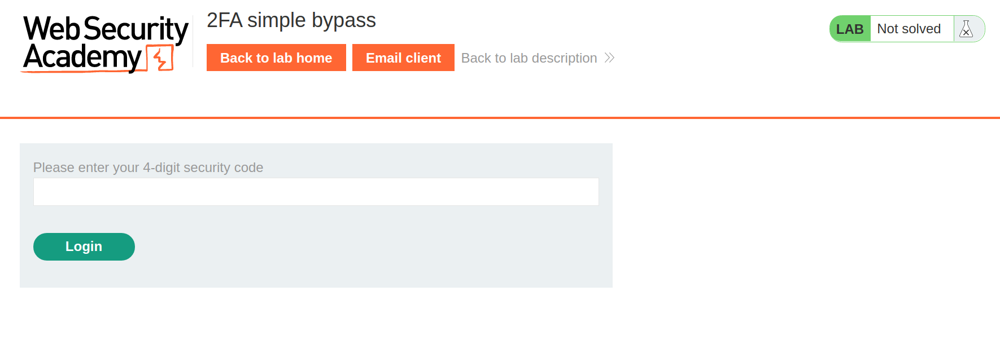
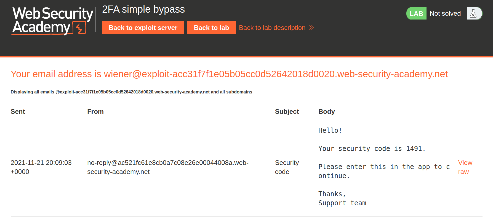
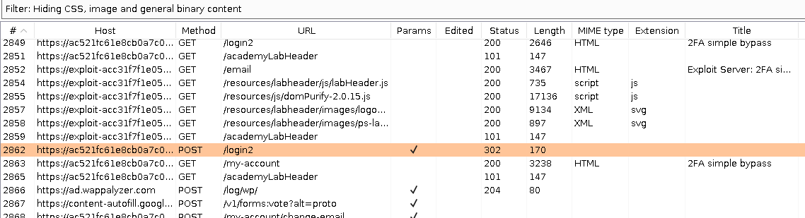
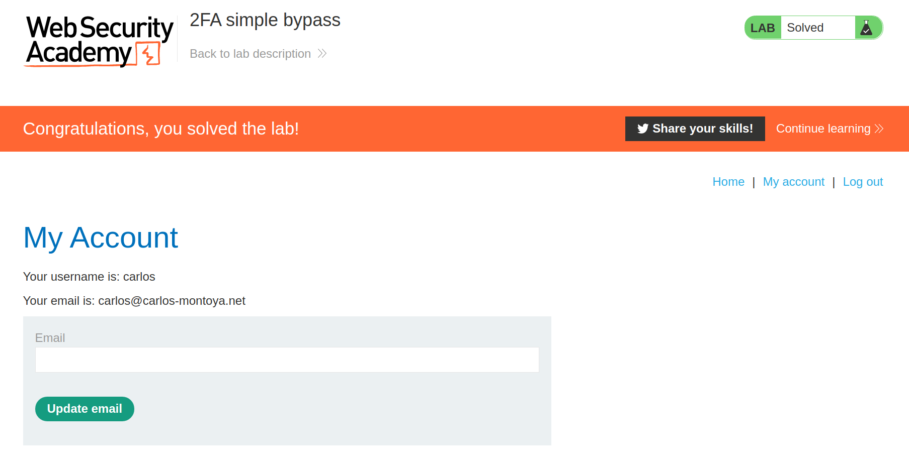

+++
author = "Alux"
title = "Portswigger Academy Learning Path: Authentication Lab 7"
date = "2021-11-21"
description = "Lab: 2FA simple bypass"
tags = [
    "broken authentication",
    "portswigger",
    "academy",
    "burpsuite",
]
categories = [
    "pentest web",
]
series = ["Portswigger Labs"]
image = "head.png"
+++

# Lab: 2FA simple bypass

En este <cite>laboratorio[^1]</cite>la finalidad es hacer un bypass al segundo factor de autenticacion, se nos da un email de cliente en el cual recibiremos el codigo y se nos da los usuarios `wiener` y `carlos` basandonos en estos haremos posible hacer el bypass para el usuario carlos.

## Reconocimiento

En el email de `wiener` sera en el que recibiremos el correo con el codigo de seguridad al intentar iniciar con la contrasena `peter`. Al iniciar sesion con las credenciales, luego se nos pide el codigo de seguridad.

Y si vamos a la pestana de email client recibimos el codigo de seguridad.

## Explotacion

En este caso la manera de hacer el bypass es muy facil, practicamente la aplicacion no valida el codigo, ya con ingresar usuario y contrasena ya se puede entrar al sistema.

Notamos que luego ingresar el codigo en `/login2` redirigira a la pagina `/my-account`. Si nos saltamos el enviar el codigo y vamos directamente a la pagina `/my-account` ya habremos resuelto el lab.

> El sistema no valida nunca el codigo 2FA ya que sin ingresarlo ya puede ingresar a ciertos modulos de la aplicacion

Y con eso ya hemos ingresado al usuario de carlos:

Con esto ya muestra que se ha resuelto el lab.

[^1]: [Laboratorio](https://portswigger.net/web-security/authentication/multi-factor/lab-2fa-simple-bypass)