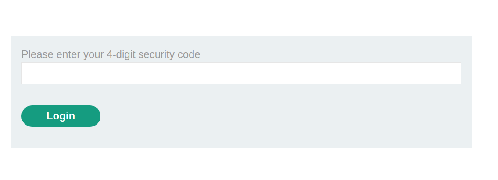
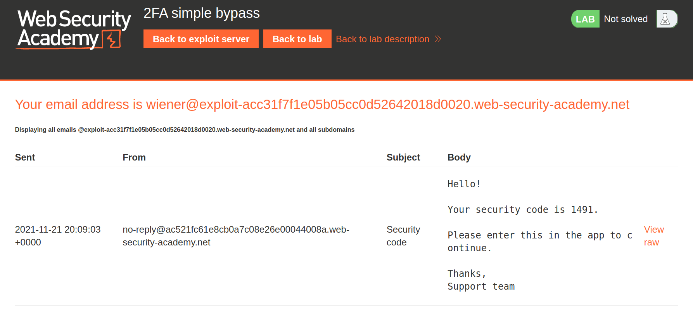
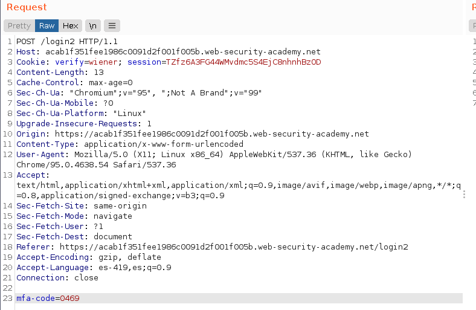
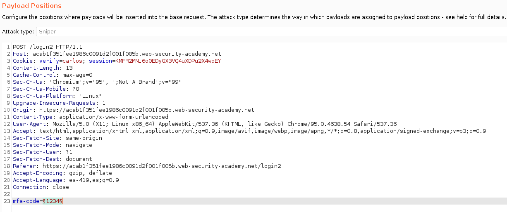
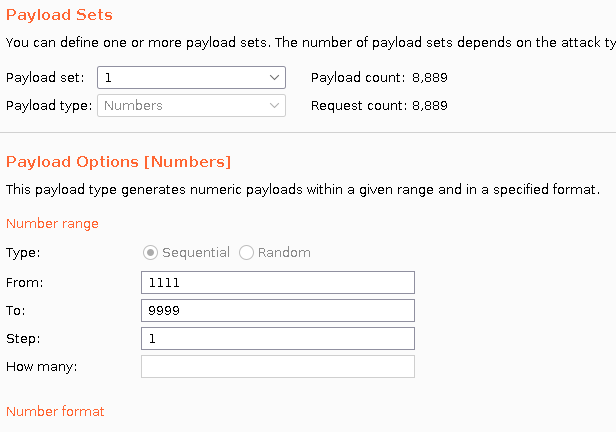
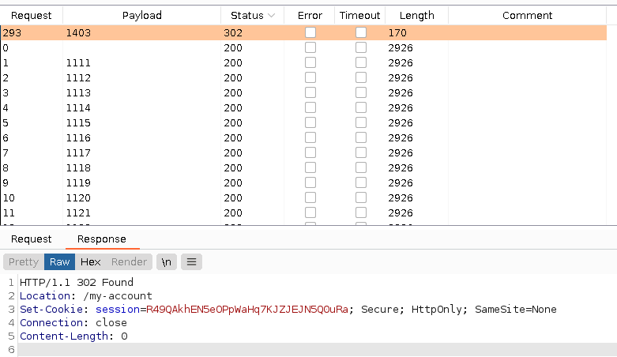
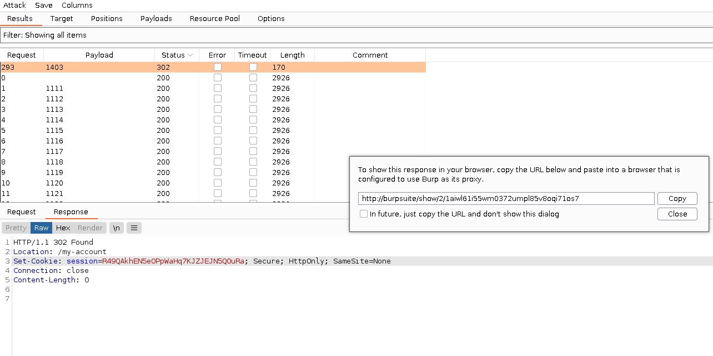
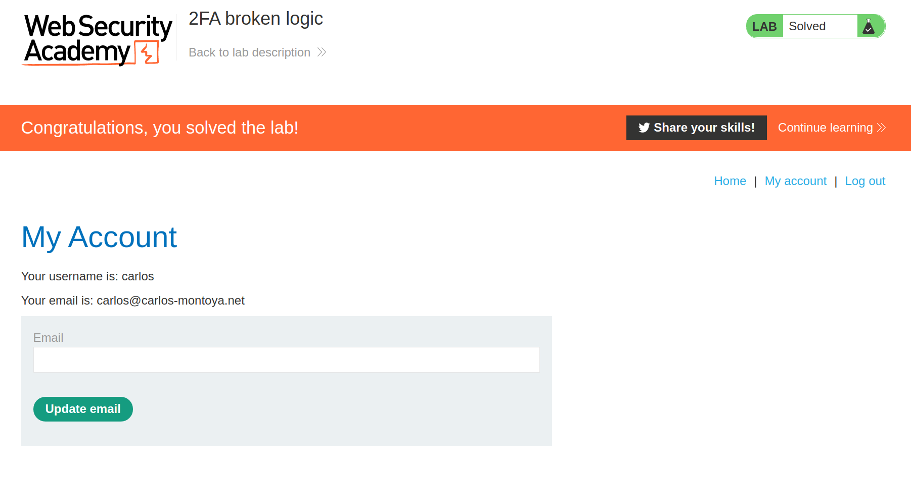

+++
author = "Alux"
title = "Portswigger Academy Learning Path: Authentication Lab 8"
date = "2021-11-22"
description = "Lab: 2FA broken logic"
tags = [
    "broken authentication",
    "portswigger",
    "academy",
    "burpsuite",
]
categories = [
    "pentest web",
]
series = ["Portswigger Labs"]
image = "head.png"
+++

# Lab: 2FA broken logic

En este <cite>laboratorio[^1]</cite>la finalidad es hacer un bypass al segundo factor de autenticacion, se nos da un email de cliente en el cual recibiremos el codigo y se nos da los usuarios `wiener` y `carlos` basandonos en estos haremos posible hacer el bypass para el usuario carlos.

## Reconocimiento

En el email de `wiener` sera en el que recibiremos el correo con el codigo de seguridad al intentar iniciar con la contrasena `peter`. Al iniciar sesion con las credenciales, luego se nos pide el codigo de seguridad.

Y si vamos a la pestana de email client recibimos el codigo de seguridad.

## Explotacion

En este caso ya que no contamos con la contrasena del usuario carlos haremos un account takeover y tambien pasando una configuracion de seguridad incorrecta en el 2FA que permite enviar multiples codigos de seguridad sin bloquearnos. 

Notamos que al iniciar con credenciales correctas de `wiener:peter` el sistema envia una cookie llamada `verify=wiener` lo que nos da a entender que esta validando al usuario `wiener` su segundo factor de autenticacion, y si es correcto lo redirigira con una cookie asignada a su perfil.

Si enviamos nuestro codigo que hemos recibido en el correo, ingresa automaticamente al perfil de wiener, y es aca donde esta la vulnerabilidad, ya que tenemos una cookie pero que aun no tiene asignado un perfil podremos utilizarla para acceder con el usuario `carlos` y con intruder generar un ataque de `sniper` el cual inyecte numeros del 1111 al 1999 hasta que encontremos el codigo que sea el correcto. En este caso vamos a repetir el proceso pero lo vamos a interceptar y al momento que se llegue a esta peticion lo enviaremos al intruder y le damos drop para que la cookie la podamos utilizar en intruder.

Ya que tenemos los resultados, notamos que existe una respuesta `302` que es la que nos redirige a nuestro perfil. Asi que ya tenemos una cookie valida para poder ingresar al perfil de carlos.

Luego de esto burpsuite cuenta con una funcion interesante que es ver la respuesta en el navegador dando clic derecho y `Show response in browser` por lo que copiamos el link y lo pegamos en el navegador

Al pegar esta direccion en el navegador ya nos redirige al perfil de `carlos` y hemos resuelto el lab.

[^1]: [Laboratorio](https://portswigger.net/web-security/authentication/multi-factor/lab-2fa-broken-logic)