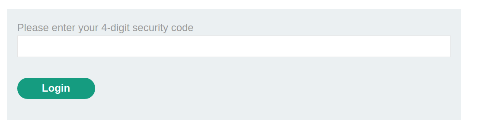
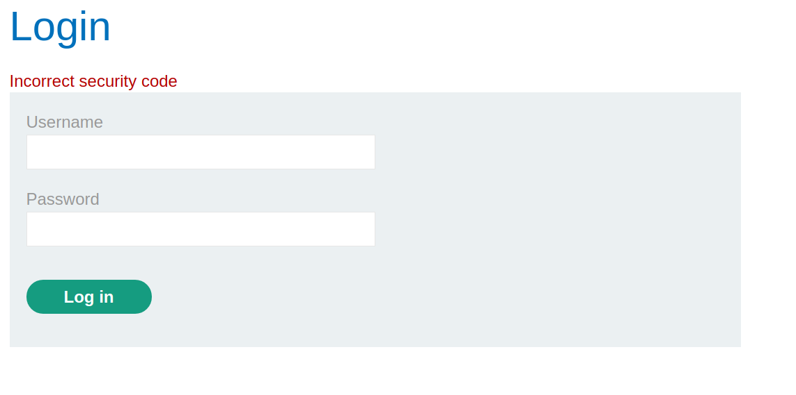
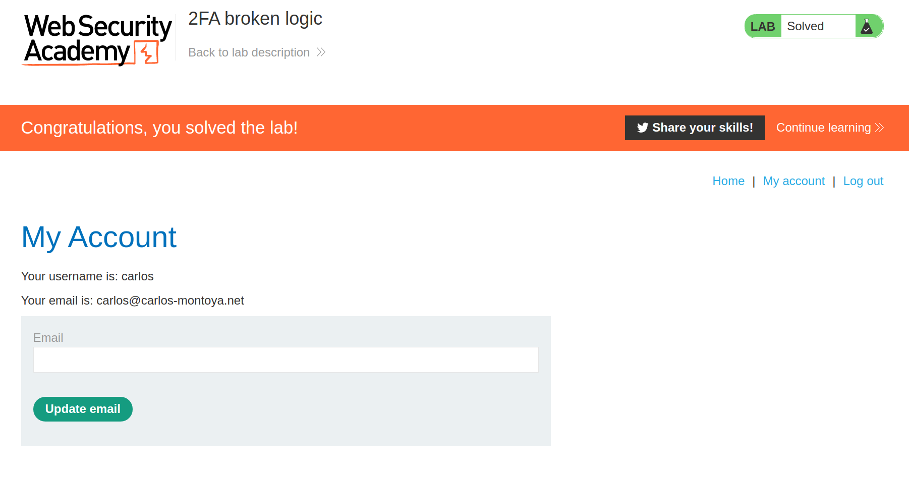

+++
author = "Alux"
title = "Portswigger Academy Learning Path: Authentication Lab 9"
date = "2021-11-22"
description = "Lab: 2FA bypass using a brute-force attack"
tags = [
    "broken authentication",
    "portswigger",
    "academy",
    "burpsuite",
]
categories = [
    "pentest web",
]
series = ["Portswigger Labs"]
image = "head.png"
+++

# Lab: 2FA bypass using a brute-force attack

En este <cite>laboratorio[^1]</cite>la finalidad es hacer un bypass al segundo factor de autenticacion, se nos da unas credenciales que son `carlos:montoya` y luego de esto se nos pide el segundo factor de autenticacion y la idea es saltarselo para poder ingresar.

## Reconocimiento

Al iniciar sesion con las credenciales, se puede notar que se pide el 2FA si las credenciales son correctas.

Pero notamos que al intentar mas de 2 codigos de 2FA el sistema vuelve a pedir las credenciales nuevamente.

Y si vamos a la pestana de email client recibimos el codigo de seguridad.

## Explotacion

Al pegar esta direccion en el navegador ya nos redirige al perfil de `carlos` y hemos resuelto el lab.

[^1]: [Laboratorio](https://portswigger.net/web-security/authentication/multi-factor/lab-2fa-bypass-using-a-brute-force-attack)