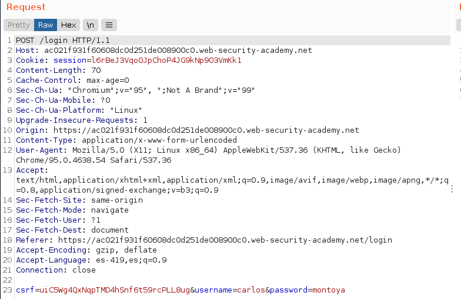
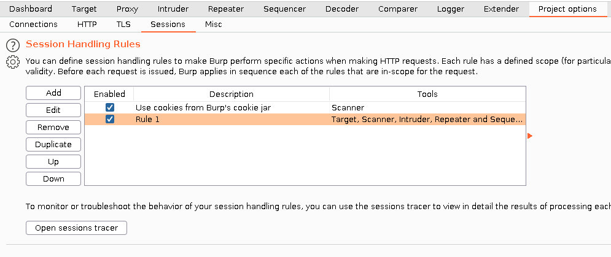
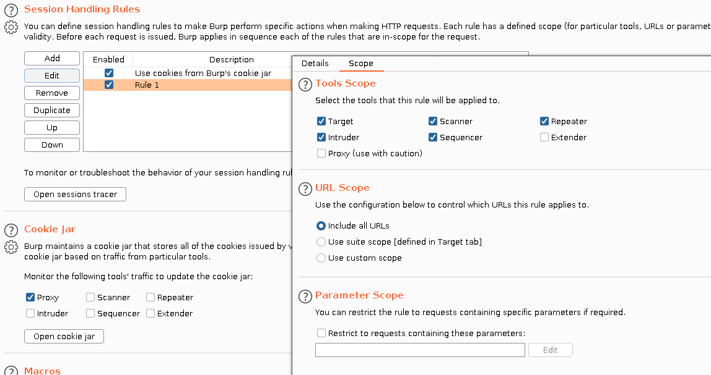
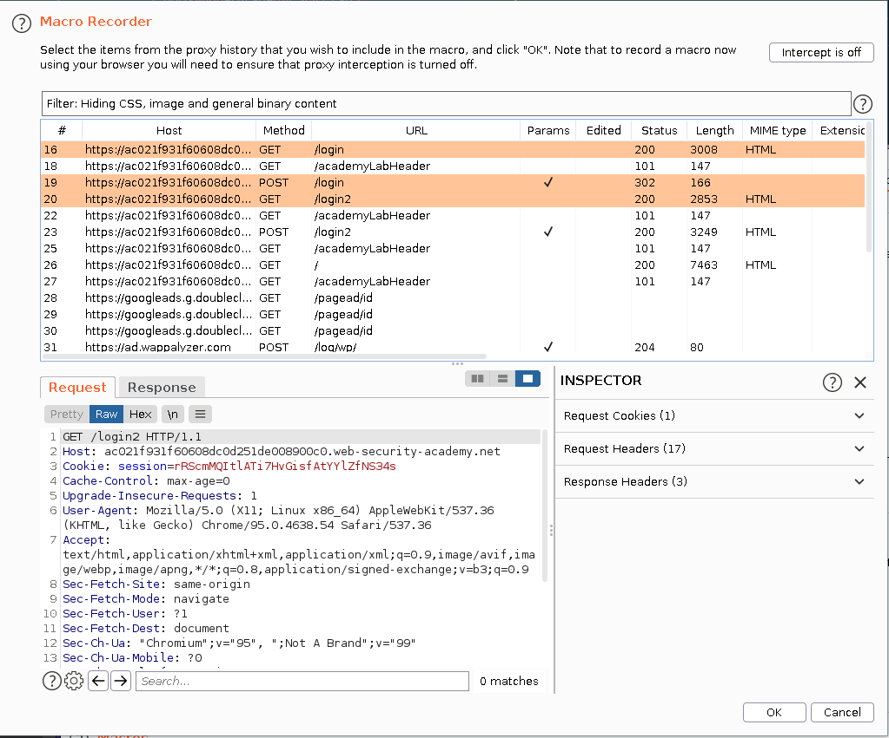
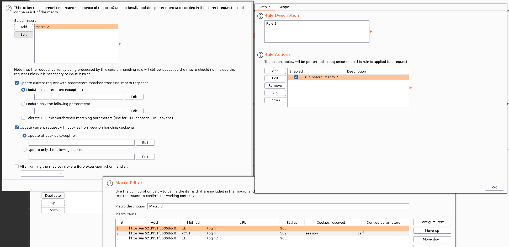
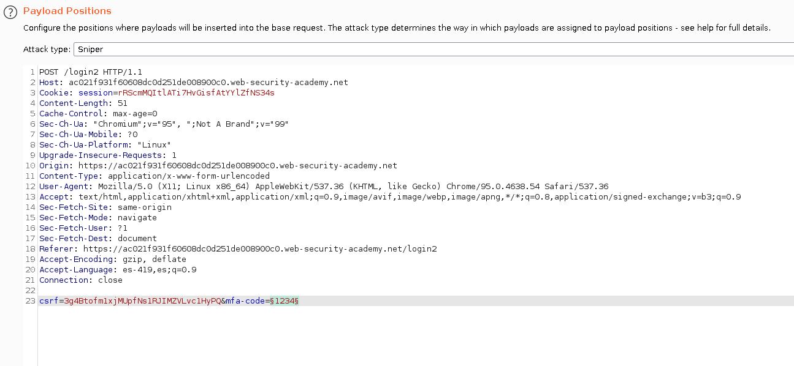
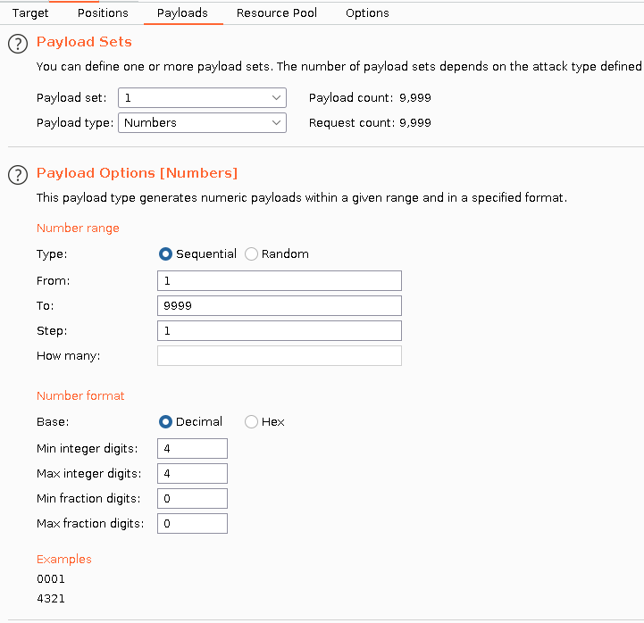
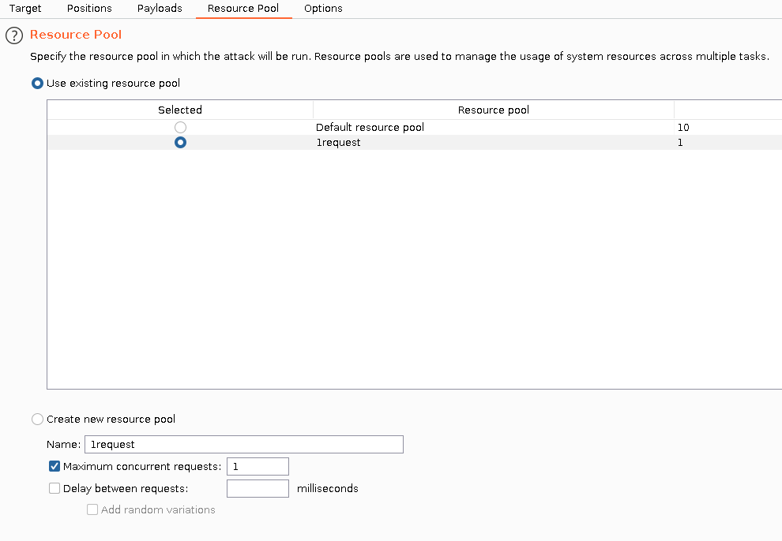
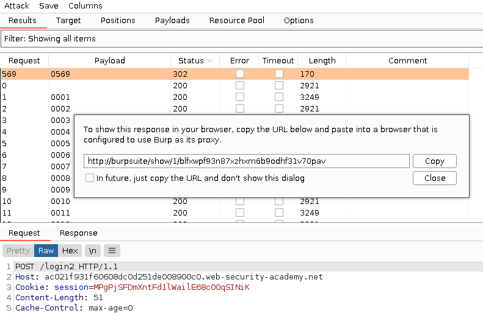

+++
author = "Alux"
title = "Portswigger Academy Learning Path: Authentication Lab 9"
date = "2021-11-22"
description = "Lab: 2FA bypass using a brute-force attack"
tags = [
    "broken authentication",
    "portswigger",
    "academy",
    "burpsuite",
]
categories = [
    "pentest web",
]
series = ["Portswigger Labs"]
image = "head.png"
+++

# Lab: 2FA bypass using a brute-force attack

En este <cite>laboratorio[^1]</cite>la finalidad es hacer un bypass al segundo factor de autenticacion, se nos da unas credenciales que son `carlos:montoya` y luego de esto se nos pide el segundo factor de autenticacion y la idea es saltarselo para poder ingresar.

## Reconocimiento

Al iniciar sesion con las credenciales, se puede notar que se pide el 2FA si las credenciales son correctas. Pero este hace uso de `csrf-token` y como todo token va cambiando y enviandose por lo que si usamos algo como repeater el codigo ya no funcionara mas.

El proceso de iniciio de sesion es el siguiente, luego de iniciar credenciales por lo que pide el codigo 2FA.

Pero notamos que al intentar mas de 2 codigos de 2FA el sistema vuelve a pedir las credenciales nuevamente.

Y si vamos a la pestana de email client recibimos el codigo de seguridad.

## Explotacion

Ya que se cuenta con un token csrf nos complica y que tambien despues de dos intentos se nos vuelven a pedir credenciales, por lo que automatizar el ataque se nos complica. Pero burpsuite cuenta con el uso de macros lo que nos permitira automatizar todo el proceso. Para eso se sigue el siguiente proceso:

Los pasos anteriores lo que hace, es crear una macro de todos los pasos que hace nuestra consulta para antes de poder enviar el codigo, toda esta macro nos realizara el proceso para poder aplicar fuerza bruta en el 2FA y resolverlo. Algo a recordar es siempre dar `test macro` para poder validad que la macro funcione correctamente.

Despues de todo este proceso ya podemos realizar el ataque con intruder ya que la macro anteriormente definida, para eso enviamos la peticion donde es enviada el codigo 2FA a intruder. 

Seteamos valores de 0001 hasta 9999, diciendo que tenga el tamano de 4 y sin decimales

Seteamos tambien que solo se envie una peticion y no se maneje por hilos ya que al ser token csrf no funcionaria el envio de demasiadas peticiones

Ahora lanzamos el ataque y esperar, se nos muestra una respuesta con codigo 302 que es la correcta. Asi que damos show response in browser, lo pegamos en el link y con eso ya tenemos acceso a la cuenta de carlos.

Al pegar esta direccion en el navegador ya nos redirige al perfil de `carlos` y hemos resuelto el lab.

[^1]: [Laboratorio](https://portswigger.net/web-security/authentication/multi-factor/lab-2fa-bypass-using-a-brute-force-attack)