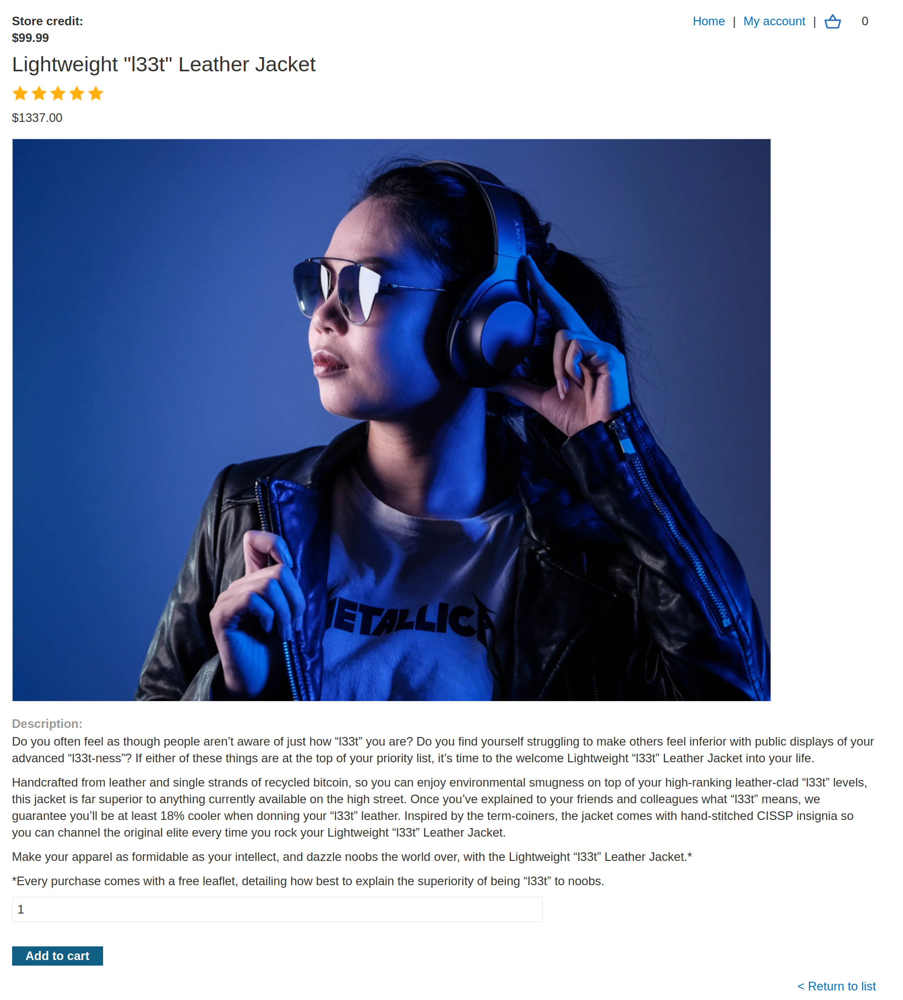
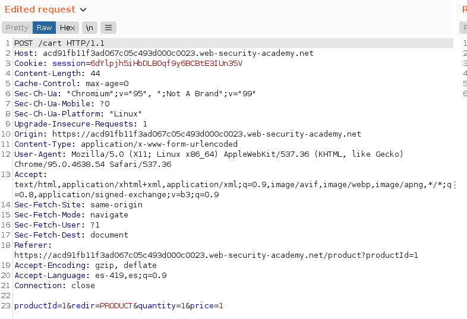
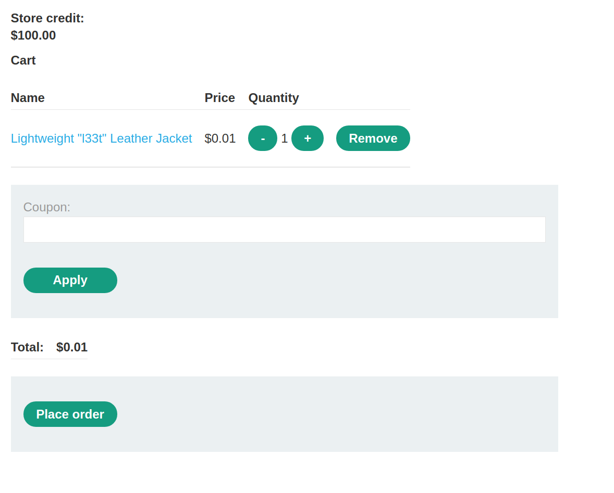

+++
author = "Alux"
title = "Portswigger Academy Learning Path: Business Logic Lab 1"
date = "2021-12-02"
description = "Lab: Excessive trust in client-side controls"
tags = [
    "business logic",
    "portswigger",
    "academy",
    "burpsuite",
]
categories = [
    "pentest web",
]
series = ["Portswigger Labs"]
image = "head.png"
+++

# Lab: Excessive trust in client-side controls

En este <cite>laboratorio[^1]</cite>la finalidad es poder explotar una vulnerabilidad de business logic la cual ocurre cuando el sistema no valida lo que puede hacer el usuario creyendo que todo seguira el workflow correcto.

En este caso lo que deberiamos de poder hacer es comprar un `Lightweight l33t leather jacket` para resolver el lab.

## Reconocimiento

Lo que podemos notar es que la web envia una peticion con el producto para agregar a la carretilla

## Explotacion

En este caso seguimos el proceso y al enviar el producto a la carretilla es enviado el id del producto, y su precio, primero es 1337 pero lo cambiamos a 1337

> Podemos cambiar el precio de 1337 a 1 en la solicitud

Luego si vemos la aplicacion no valida y acepta el nuevo precio de la aplicacion y como tenemos credito de 100 podemos realizar la compra sin problemas.

Y con esto damos a `place order` y realizamos la compra sin problemas y nos devuelve que hemos resuelto el lab.

[^1]: [Laboratorio](https://portswigger.net/web-security/logic-flaws/examples/lab-logic-flaws-excessive-trust-in-client-side-controls)