+++
author = "Alux"
title = "Portswigger Academy Learning Path: Business Logic Lab 10"
date = "2021-12-14"
description = "Lab: Infinite money logic flaw"
tags = [
    "business logic",
    "portswigger",
    "academy",
    "burpsuite",
]
categories = [
    "pentest web",
]
series = ["Portswigger Labs"]
image = "head.png"
+++

# Lab: Infinite money logic flaw

En este <cite>laboratorio[^1]</cite>la finalidad es poder explotar una vulnerabilidad de business logic la cual ocurre cuando el sistema no valida lo que puede hacer el usuario creyendo que todo seguira el workflow correcto.

## Reconocimiento

Lo que debemos poder hacer es comprar la chaqueta para resolver el lab. Pero no contamos con el credito suficiente para realizar la compra. Lo primero que notamos es que seguimos teniendo un codigo de descuento que es `SIGNUP30` que nos da el 30% de descuento en una compra. Y lo otro es que podemos comprar gift card

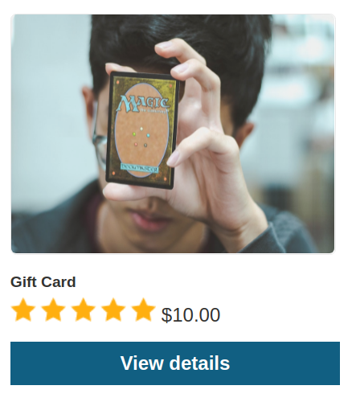

Cuando realizamos la compra pasa lo siguiente, se nos da un codigo el cual podemos hacer el cambio para obtener 10 dolares en nuetro credito eso significa que si compramos una gift card con el descuento del 30% nos saldra en 7 dolares y cuando la cambiemos tendremos en nuestro credito 3 dolares mas por haber gastado menos por el descuento.

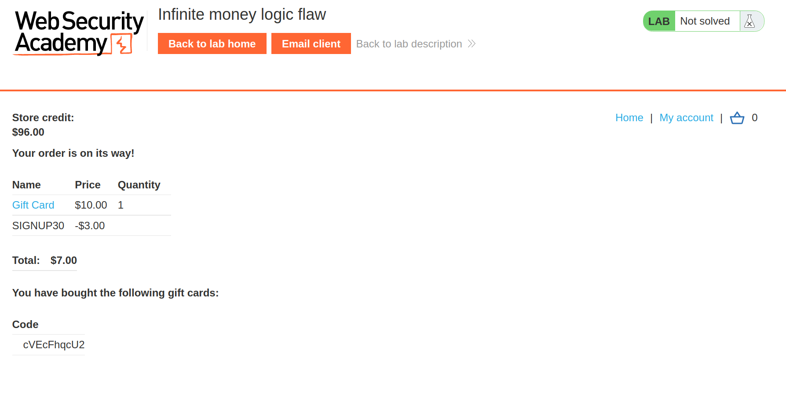

## Explotacion

Esto es imposible hacerlo manual sin la automatizacion, pero el sistema usa token csrf para las peticiones y toca realizar muchos pasos por eso lo mejor es preparar una macro para poder realizar el proceso de manera automatizada hasta que tengamos el credito suficiente para comprar la chaqueta.

### Creacion de macro

#### Crear sesion

Vamos a Project Options > Session Handling Rules y creamos  una nueva 

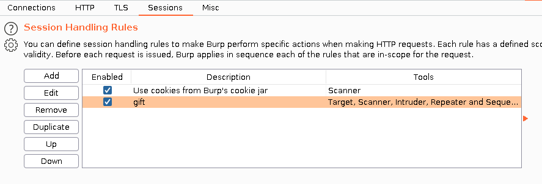

#### Crear Rule Actions

Agregamos una nueva regla

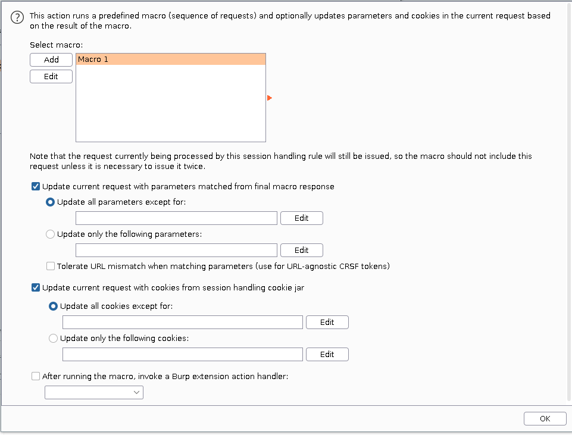

#### Crear macro

Elegimos las peticiones que participan en el proceso para la compra de la gift card y realizar y hacer uso de este. La forma en que procesan todo es:

1. Se envia a la carretilla la gift card para su compra
2. Se envia el cupon de 30% de descuento SIGNUP30
3. Se hace un check de lo que esta en carretilla 
4. Se hace la confirmacion del pedido y realiza la compra de la gift card (en este paso se extrae de la respuesta el cupon que se muestra al realizar la compra)
5. Se envia la peticion para canjear la gift card

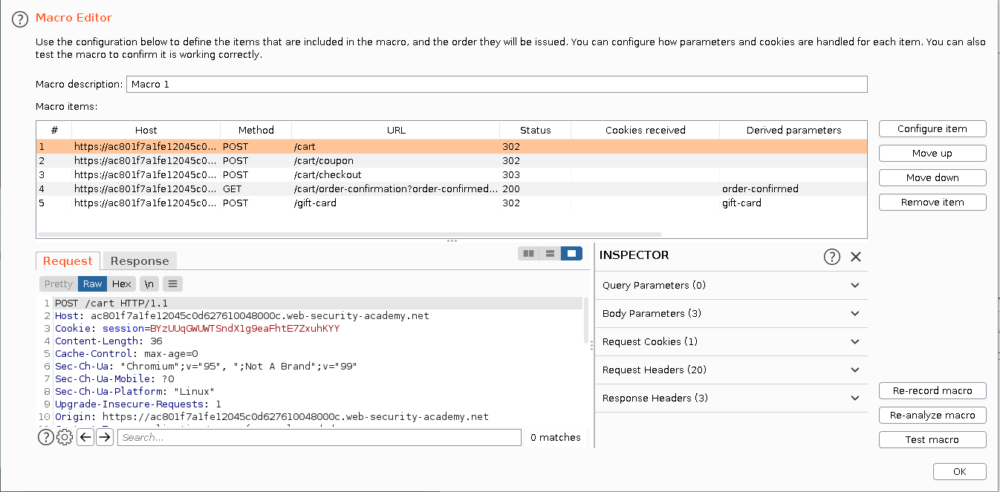

Luego solo nos queda enviar la peticion de `/my-account` al intruder ya que es la que hara que toda la macro corra.

> Esta se lanza con null payloads, que se ejecute indefinidamente y con solamente un hilo para que no genere error por los token csrf

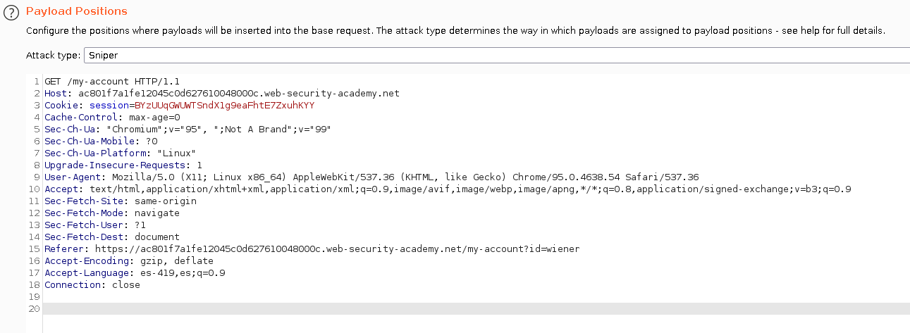

Cuando la lanzamos podemops ver como va cambiando el valor del credito y va sumando 3 dolares cada que se ejecuta correctamente. En total lance `438` peticiones para tener el valor necesario para comprar el jacket.

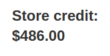
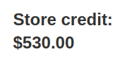
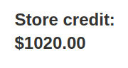

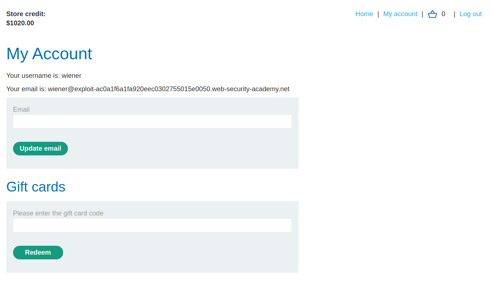

Ahora al tener la cantidad correcta ya podemos realizar la compra y se resuelve el lab

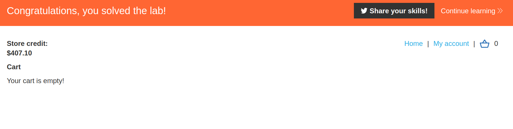

[^1]: [Laboratorio](https://portswigger.net/web-security/logic-flaws/examples/lab-logic-flaws-infinite-money)