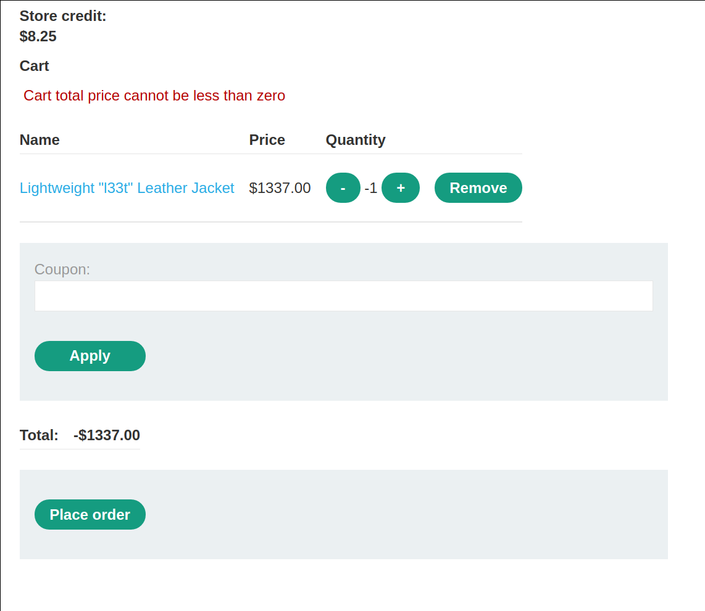
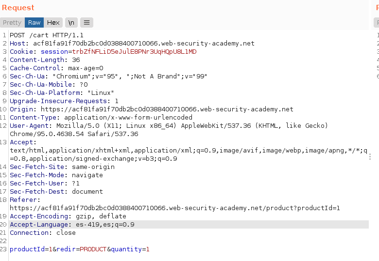
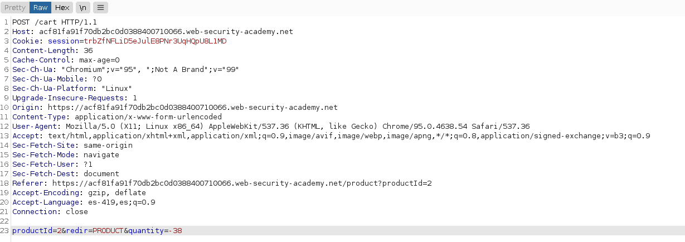
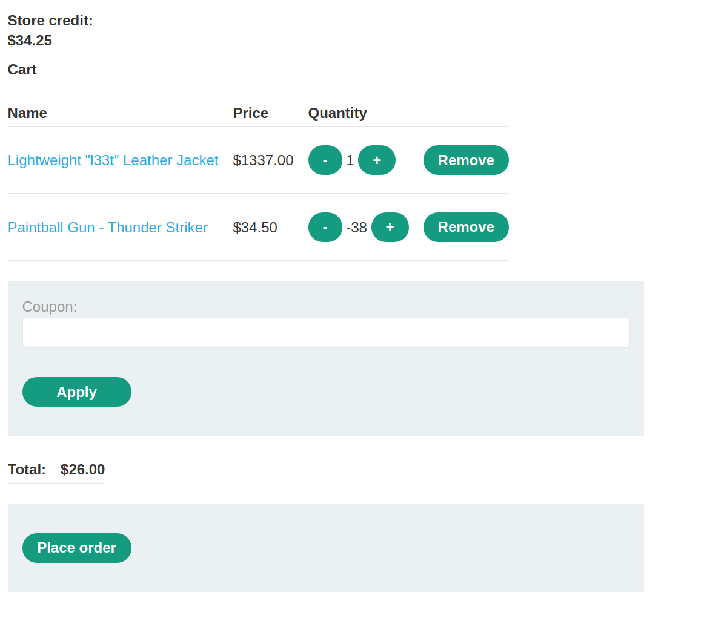
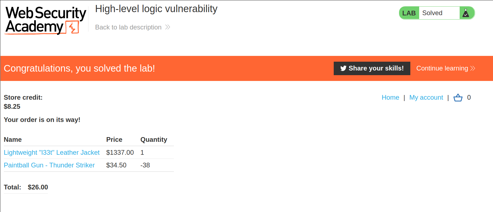

+++
author = "Alux"
title = "Portswigger Academy Learning Path: Business Logic Lab 2"
date = "2021-12-02"
description = "Lab: High-level logic vulnerability"
tags = [
    "business logic",
    "portswigger",
    "academy",
    "burpsuite",
]
categories = [
    "pentest web",
]
series = ["Portswigger Labs"]
image = "head.png"
+++

# Lab: High-level logic vulnerability

En este <cite>laboratorio[^1]</cite>la finalidad es poder explotar una vulnerabilidad de business logic la cual ocurre cuando el sistema no valida lo que puede hacer el usuario creyendo que todo seguira el workflow correcto.

En este caso lo que deberiamos de poder hacer es comprar un `Lightweight l33t leather jacket` para resolver el lab usando las credenciales de `wiener:peter`

## Reconocimiento

Lo que podemos notar es que la web envia una peticion con el producto para agregar a la carretilla

## Explotacion

En este caso seguimos el proceso y al enviar el producto a la carretilla es enviado el id del producto, y la cantidad del producto a enviar. Por lo que la enviamos. Pero si cambiamos el valor a un numero negativo lo acepta e intentar pagar de esa manera. Pero nos salta el error de `Cart total price cannot be less than zero`

> Podemos cambiar la cantidad a valor negativo

Ahora lo interesante ya que no permite pagar valores menores a 0 pero si elegir cantidades con valores negativos enviaremos la compra de `Lightweight` con cantidad 1 y otro producto con cantidades negativas para restar el total.

Luego si vemos la aplicacion vemos que nos da un total de $34.25 con el credito que si contamos. Para eso pagamos y nos lo aceptaria.

Y con esto damos a `place order` y realizamos la compra sin problemas y nos devuelve que hemos resuelto el lab.

[^1]: [Laboratorio](https://portswigger.net/web-security/logic-flaws/examples/lab-logic-flaws-high-level)