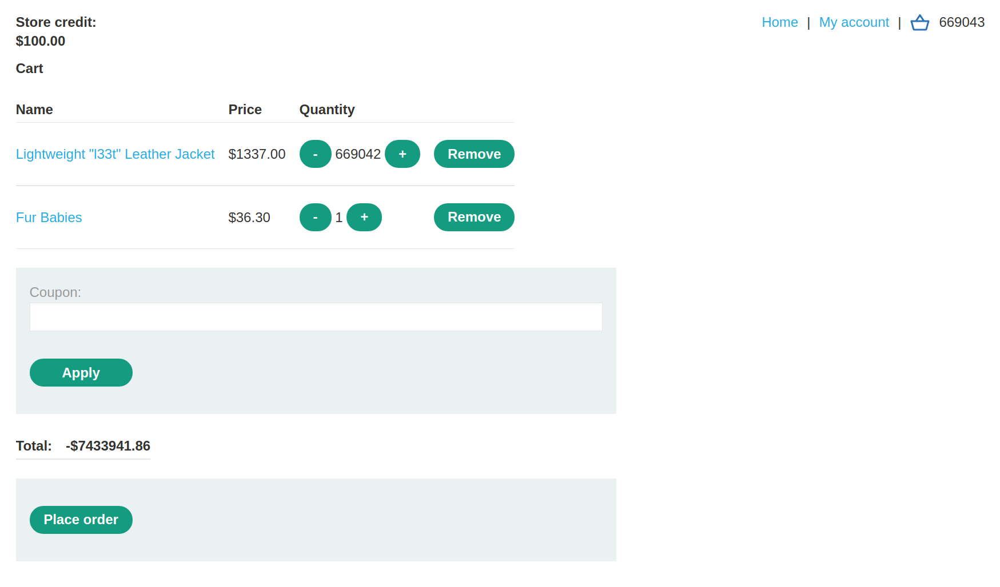
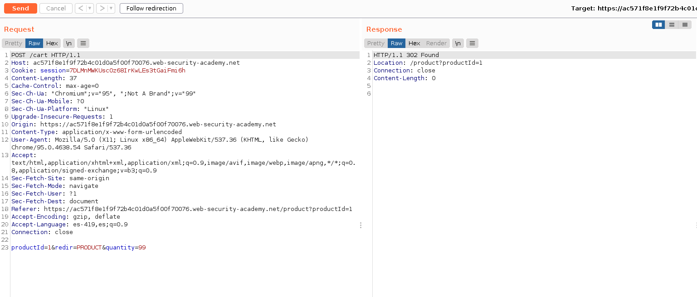
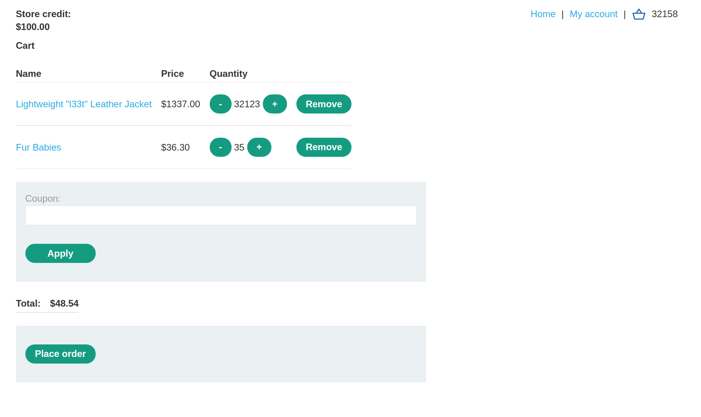
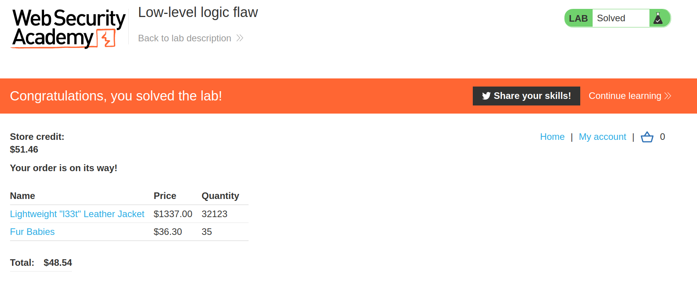

+++
author = "Alux"
title = "Portswigger Academy Learning Path: Business Logic Lab 3"
date = "2021-12-06"
description = "Lab: Low-level logic flaw"
tags = [
    "business logic",
    "portswigger",
    "academy",
    "burpsuite",
]
categories = [
    "pentest web",
]
series = ["Portswigger Labs"]
image = "head.png"
+++

# Lab: Low-level logic flaw

En este <cite>laboratorio[^1]</cite>la finalidad es poder explotar una vulnerabilidad de business logic la cual ocurre cuando el sistema no valida lo que puede hacer el usuario creyendo que todo seguira el workflow correcto.

En este caso lo que deberiamos de poder hacer es comprar un `Lightweight l33t leather jacket` para resolver el lab usando las credenciales de `wiener:peter`

## Reconocimiento

Lo que podemos notar es que la web envia una peticion con el producto para agregar a la carretilla en este va el productId y la cantidad

## Explotacion

En este caso seguimos el proceso y al enviar el producto a la carretilla es enviado el id del producto, y la cantidad del producto a enviar. Pero hay un problema aunque aca no podemos enviar valores negativos y solo permite enviar peticiones de una cantidad maxima de 99, podemos enviar muchas peticiones para que el sistema en el backend genere un error y que al llegar al limite se termina convirtiendo en negativo por la maxima cantidad que permite este tipo de datos

> Total en valores negativos

Ahora que sabemos esto lo que debemos hacer es calcular productos hasta que podamos pagar con los $100 de credito

Luego si vemos la aplicacion vemos que con 32123 del jacket y otros 35 de producto menores a $100 para hacer el calculo y que paguemos menos de 100 porque soo comprando jacket no se podria

Y con esto damos a `place order` y realizamos la compra sin problemas y nos devuelve que hemos resuelto el lab.

[^1]: [Laboratorio](https://portswigger.net/web-security/logic-flaws/examples/lab-logic-flaws-low-level)