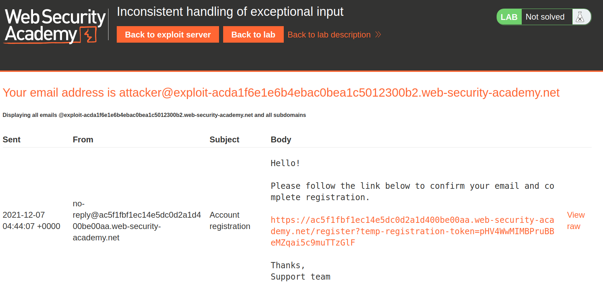
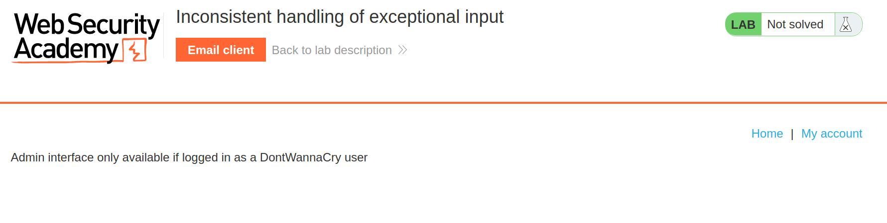
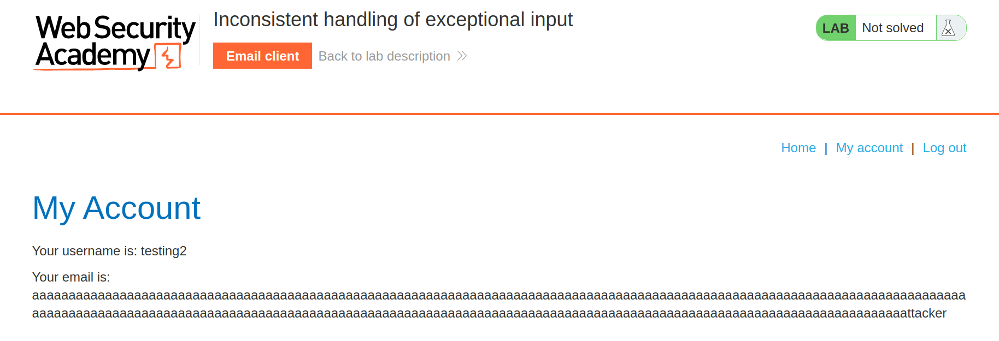
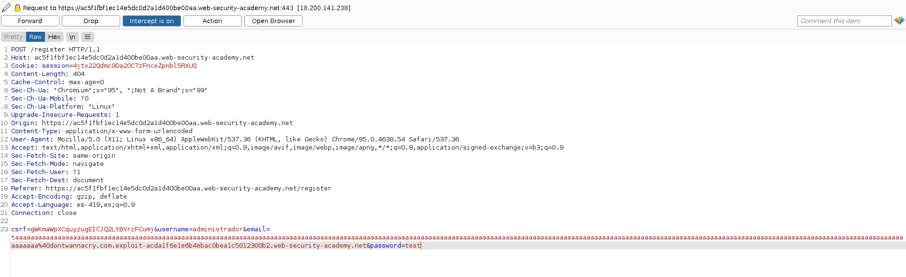
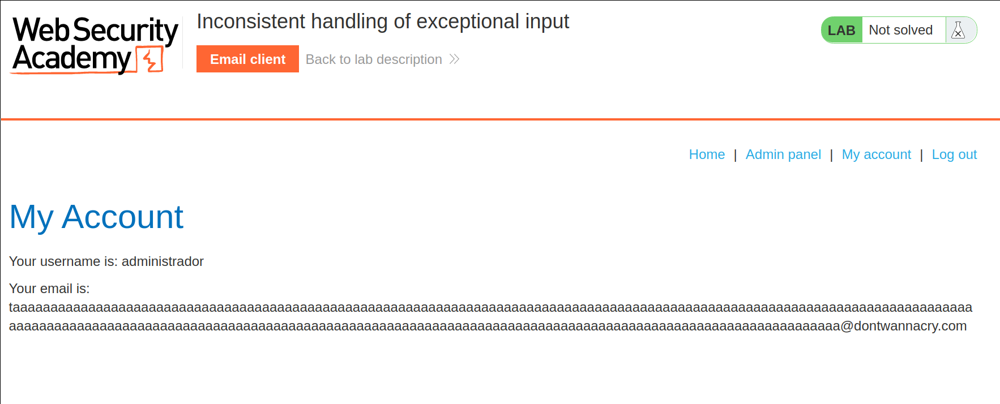
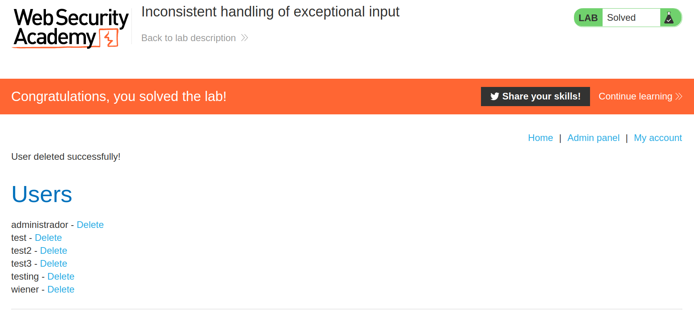

+++
author = "Alux"
title = "Portswigger Academy Learning Path: Business Logic Lab 4"
date = "2021-12-07"
description = "Lab: Inconsistent handling of exceptional input"
tags = [
    "business logic",
    "portswigger",
    "academy",
    "burpsuite",
]
categories = [
    "pentest web",
]
series = ["Portswigger Labs"]
image = "head.png"
+++

# Lab: Inconsistent handling of exceptional input

En este <cite>laboratorio[^1]</cite>la finalidad es poder explotar una vulnerabilidad de business logic la cual ocurre cuando el sistema no valida lo que puede hacer el usuario creyendo que todo seguira el workflow correcto.

En este caso lo que deberiamos de poder hacer es poder eliminar al usuario `Carlos` en el cual entonces deberiamos de ingresar con un usuario `@dontwannacry.com` .

## Reconocimiento

Nosotros contamos con un correo el cual va a recibir todos los correos que son enviados al dominio sin importar el usuario o un subdominio que indiquemos.

## Explotacion

Lo primero es registrarnos con un usuario normal, el cual no tiene mayores modulos, pero existe un path para usuarios administradores, este se puede hacer una busqueda a traves de herramientas como gobuster o intuir automaticamente por el nombre, este path es `/admin`

Pero lamentablemente un usuario cualquiera no podria acceder ya que el sistema valida que el correo del usuario sea `@dontwannacry.com` pero hay un problema y es que aunque el usuario se crea, el correo no permite mas de n caracteres por lo que vemos que lo ultimo del correo no aparece pero aun asi se logra crear el usuario.

Ahora queda crear el usuario con el subdmonio `dontwannacry.com` para nuestro dominio que tenemos y que el sistema al hacer la validacion de correo tome los caracteres del subdominio pensando que si esta correcto porque borra el resto.

Y tenemos nuestro correo creado:

Ahora ya podemos acceder al path de `/admin` y eliminar al usuario carlos:

[^1]: [Laboratorio](https://portswigger.net/web-security/logic-flaws/examples/lab-logic-flaws-inconsistent-handling-of-exceptional-input)