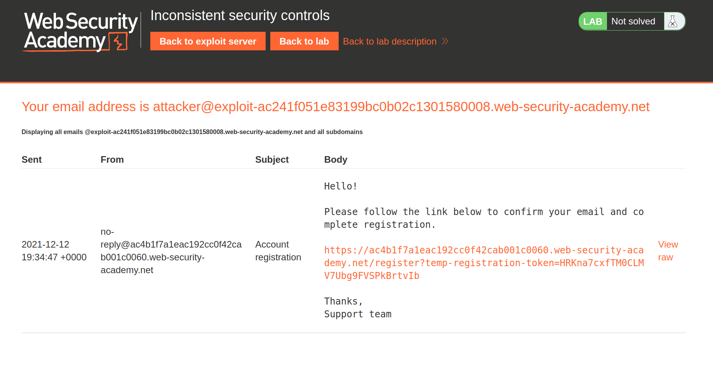
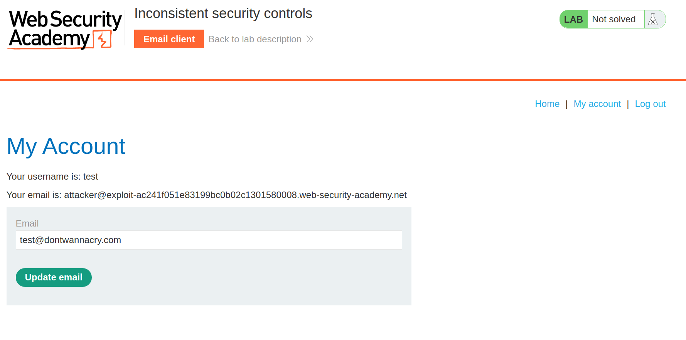
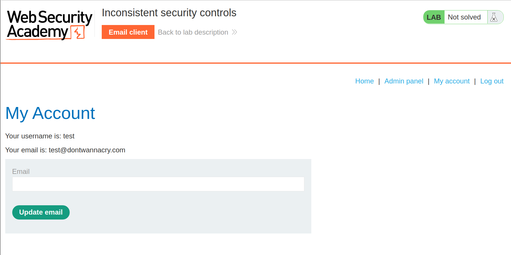
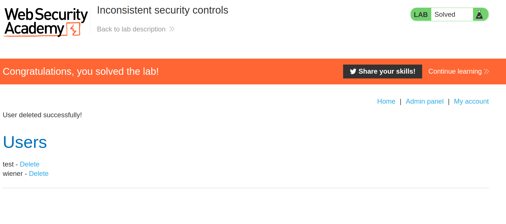

+++
author = "Alux"
title = "Portswigger Academy Learning Path: Business Logic Lab 5"
date = "2021-12-12"
description = "Lab: Inconsistent security controls"
tags = [
    "business logic",
    "portswigger",
    "academy",
    "burpsuite",
]
categories = [
    "pentest web",
]
series = ["Portswigger Labs"]
image = "head.png"
+++

# Lab: Inconsistent security controls

En este <cite>laboratorio[^1]</cite>la finalidad es poder explotar una vulnerabilidad de business logic la cual ocurre cuando el sistema no valida lo que puede hacer el usuario creyendo que todo seguira el workflow correcto.

## Reconocimiento

Esta pagina es igual que podamos acceder al panel de admin para poder borrar al usuario carlos pero este usuario debe de contar con un mail del dominio dontwannacryh.com para poder acceder al panel.

Y al registrarnos recibimos el correo para poder habilitar la cuenta y acceder. Todo

## Explotacion

Ahora lo que queda es explotar esto, y al ingresar al sistema hay una funcion de actualizar el correo por lo que si intentamos actualizar funcionaria correctamente.

Cuando ingresamos el nuevo correo ya se nos actualiza y ya podemos acceder al panel de admin sin que nos saque de la sesion o valide que ese es el correo asociada a esa cuenta.

Ahora accedemos y podemos borrar al usuario carlos para resolver el lab.

[^1]: [Laboratorio](https://portswigger.net/web-security/logic-flaws/examples/lab-logic-flaws-inconsistent-security-controls)