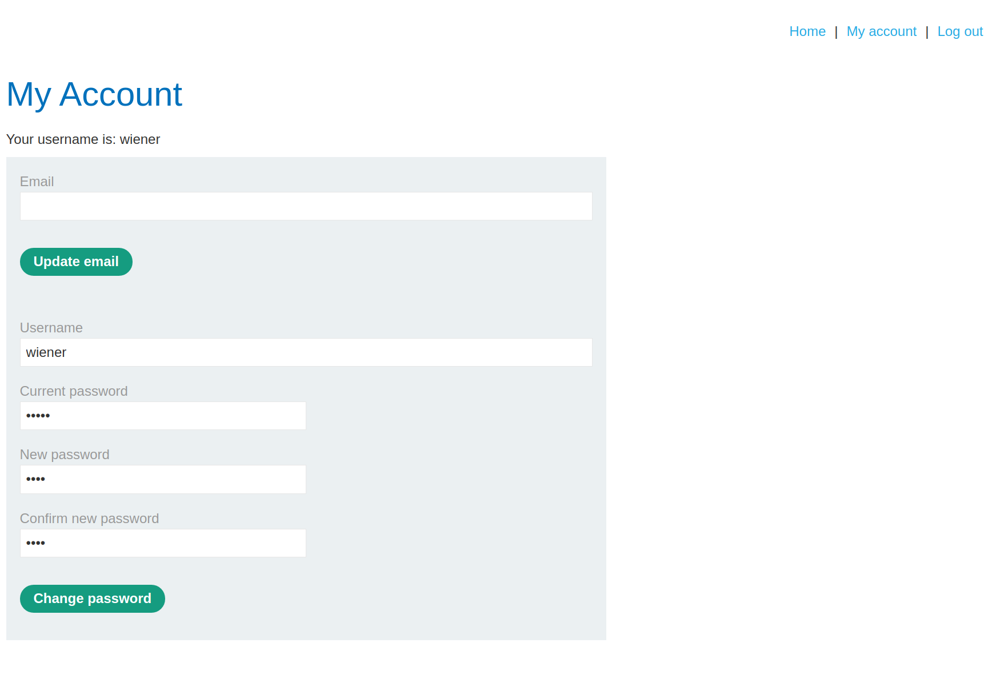
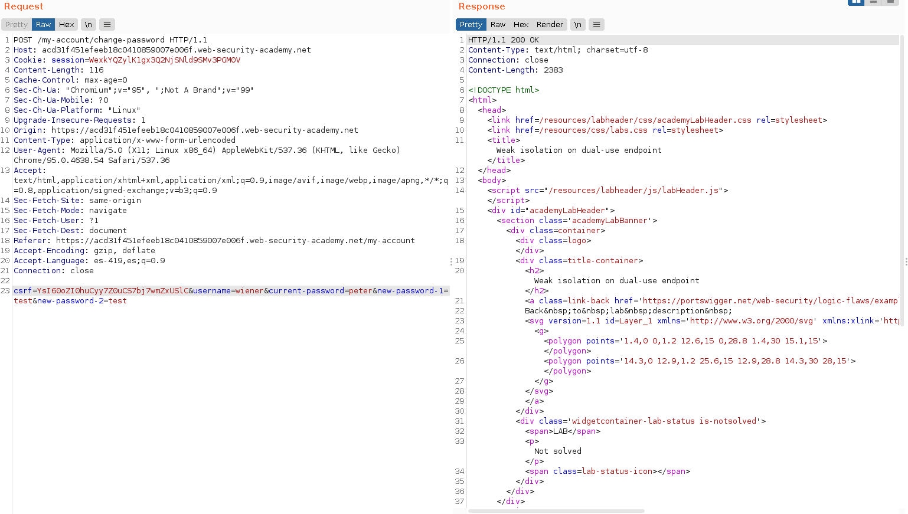
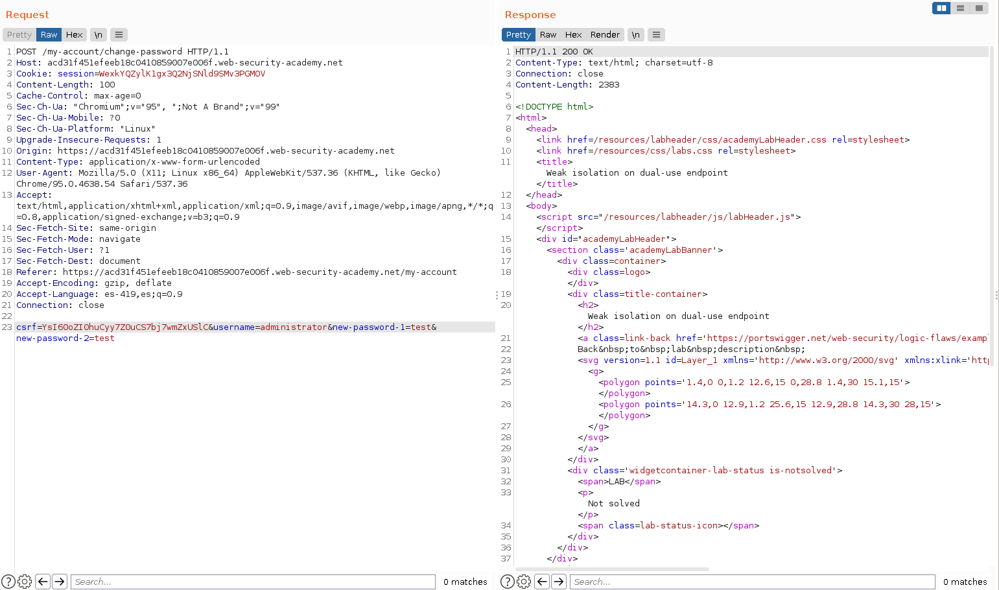
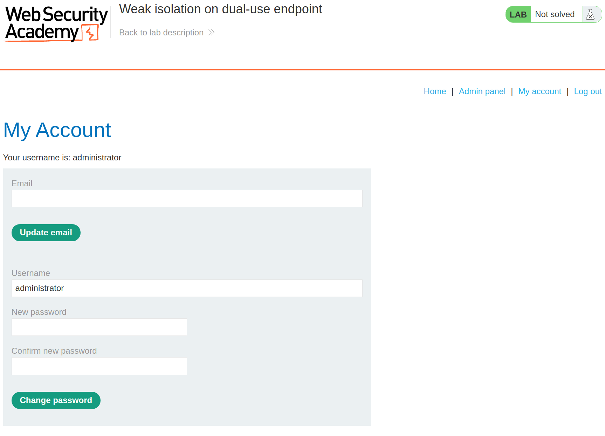
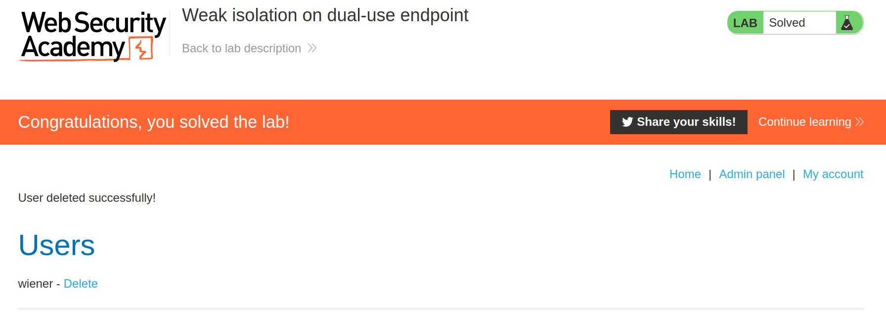

+++
author = "Alux"
title = "Portswigger Academy Learning Path: Business Logic Lab 6"
date = "2021-12-12"
description = "Lab: Weak isolation on dual-use endpoint"
tags = [
    "business logic",
    "portswigger",
    "academy",
    "burpsuite",
]
categories = [
    "pentest web",
]
series = ["Portswigger Labs"]
image = "head.png"
+++

# Lab: Weak isolation on dual-use endpoint

En este <cite>laboratorio[^1]</cite>la finalidad es poder explotar una vulnerabilidad de business logic la cual ocurre cuando el sistema no valida lo que puede hacer el usuario creyendo que todo seguira el workflow correcto.

## Reconocimiento

Contamos con una cuenta con las credenciales de `wiener:peter` para poder acceder, cuando entramos hay una funcion de actualizar datos como contrasena o correo.png. Tratamos de realizar la peticion con los siguientes datos:

Y la peticion es la siguiente:

## Explotacion

Ahora vamos a modificar esa peticion para poder cambiar la contrasena del usuario `administrator` porque el sistema no valida que el usuario sea al que se debe realizar el cambio y tampoco la contrasena actual para colocar la nueva. La peticion realizada es la siguiente:

Ahora tenemos acceso al panel del usuario `administrator`

Y ahora eliminamos al usuario a carlos para resolver el lab.

[^1]: [Laboratorio](https://portswigger.net/web-security/logic-flaws/examples/lab-logic-flaws-weak-isolation-on-dual-use-endpoint)