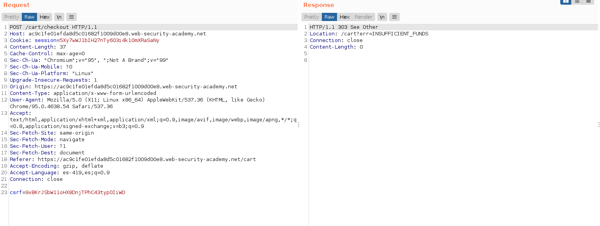
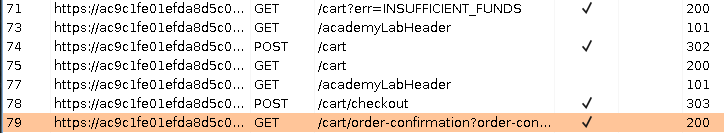
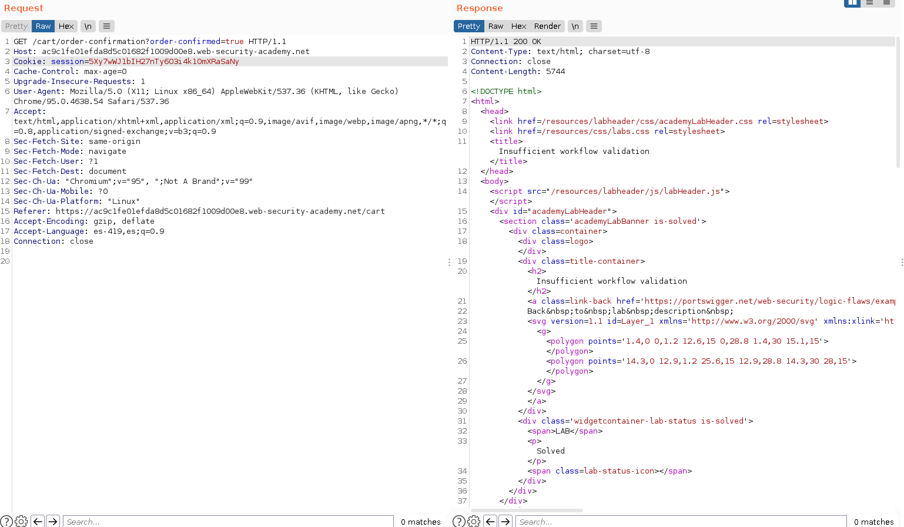
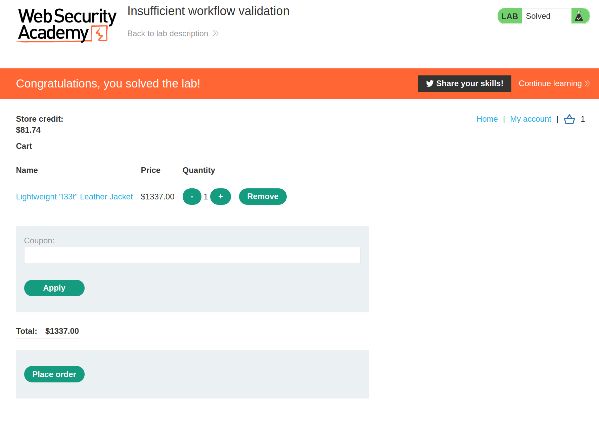

+++
author = "Alux"
title = "Portswigger Academy Learning Path: Business Logic Lab 7"
date = "2021-12-11"
description = "Lab: Insufficient workflow validation"
tags = [
    "business logic",
    "portswigger",
    "academy",
    "burpsuite",
]
categories = [
    "pentest web",
]
series = ["Portswigger Labs"]
image = "head.png"
+++

# Lab: Insufficient workflow validation

En este <cite>laboratorio[^1]</cite>la finalidad es poder explotar una vulnerabilidad de business logic la cual ocurre cuando el sistema no valida lo que puede hacer el usuario creyendo que todo seguira el workflow correcto.

## Reconocimiento

Ingresamos con las credenciales de `wiener:peter` por lo que tendremos un credito de $100 para poder realizar las compras. Cuando intentamos damos `place order` e intentamos realizar la compra nos redirige a una salida de falla

> El sistema rediige a un codigo 303 con Insufficient Funds

## Explotacion

Ahora vamos a comparar cuando si se cuenta con el credito valido para poder realizar la compra y podemos ver en el historial.png

En este caso vemos que hace un get a `/cart/oreder-confirmation` por lo que podemos saltarnos la verificacion del checkout y ver si el sistema no valida eso anteriormente. Realizando el siguiente request agregando el producto que es mayor al valor que tenemos de credito.

No nos salta ni nos redirige nada y nos muestra que se ha realizado la compra correctamente, por lo que hemos resuelto el lab.

[^1]: [Laboratorio](https://portswigger.net/web-security/logic-flaws/examples/lab-logic-flaws-insufficient-workflow-validation)