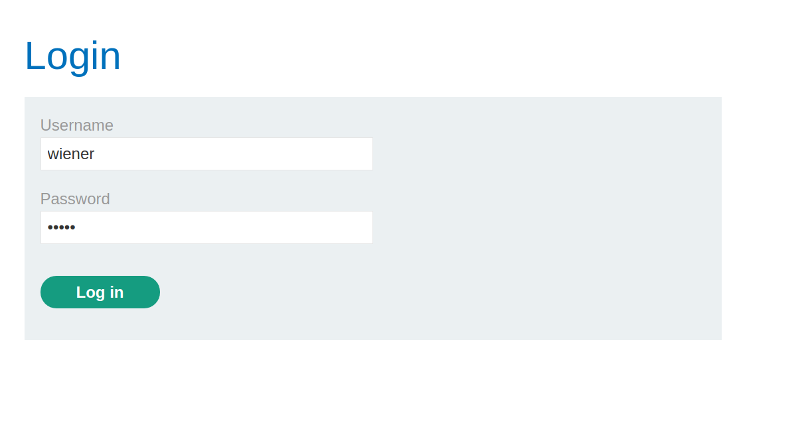
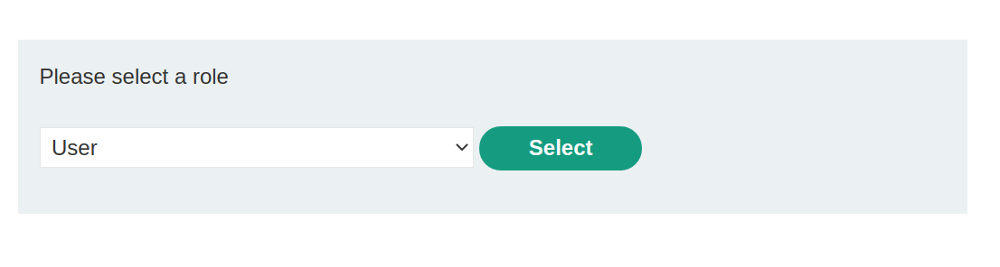
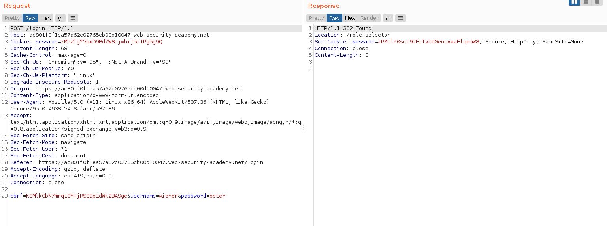
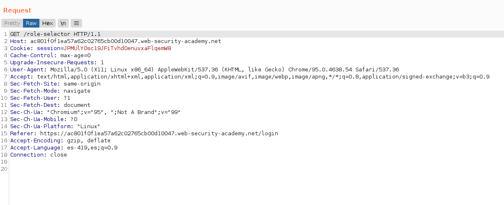
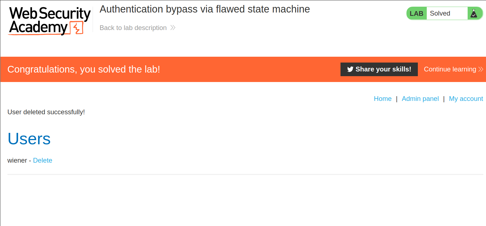

+++
author = "Alux"
title = "Portswigger Academy Learning Path: Business Logic Lab 8"
date = "2021-12-13"
description = "Lab: Authentication bypass via flawed state machine"
tags = [
    "business logic",
    "portswigger",
    "academy",
    "burpsuite",
]
categories = [
    "pentest web",
]
series = ["Portswigger Labs"]
image = "head.png"
+++

# Lab: Authentication bypass via flawed state machine

En este <cite>laboratorio[^1]</cite>la finalidad es poder explotar una vulnerabilidad de business logic la cual ocurre cuando el sistema no valida lo que puede hacer el usuario creyendo que todo seguira el workflow correcto.

## Reconocimiento

Ingresamos con las credenciales de `wiener:peter` para poder acceder al sistema y luego debemos elegir el rol que queremos tener en el sistema.

Al iniciar con las credenciales correctas podemos elegir el rol:

## Explotacion

Ahora vamos a tratar de saltarnos la eleccion de rol para ver si el sistema hace una validacion o provoca un error en el sistema para saber que algo esta mal.

Ahora recibimos la opcion para elegir el rol, en esta ocasion lo que haremos es ignorar la peticion y eliminarla para que no se eliga el rol. Por lo que nos envia

Con esto nos podemos dirigir a la raiz `/` y ver que error pudo generar el sistema, y vemos que nos muestra el admin panel entre las opciones y accedemos y eliminaremos al usuario carlos

[^1]: [Laboratorio](https://portswigger.net/web-security/logic-flaws/examples/lab-logic-flaws-authentication-bypass-via-flawed-state-machine)