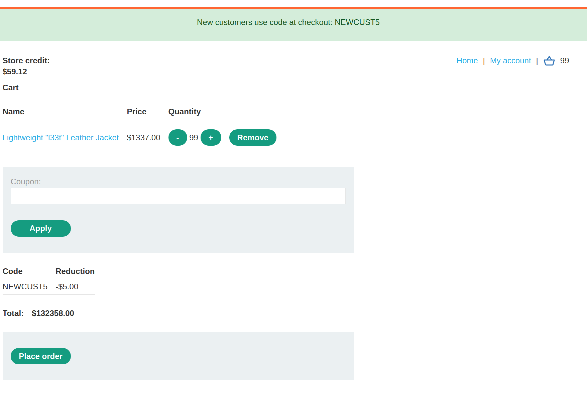
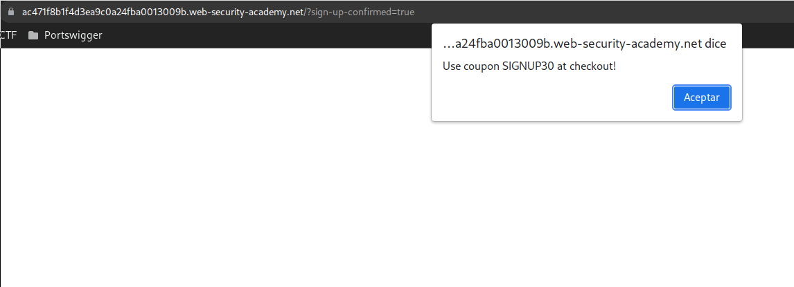
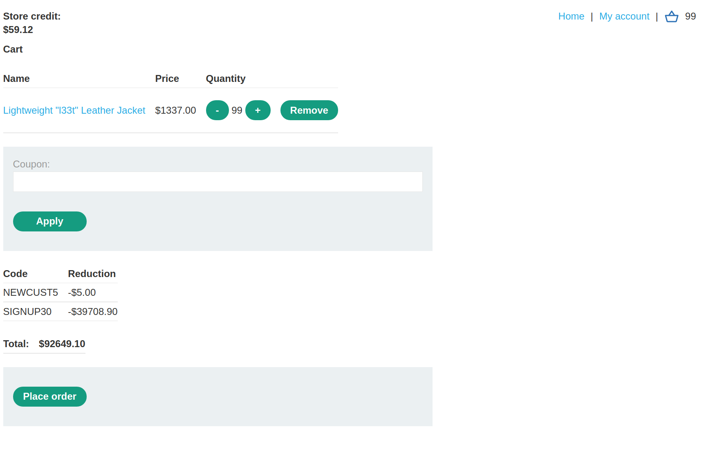
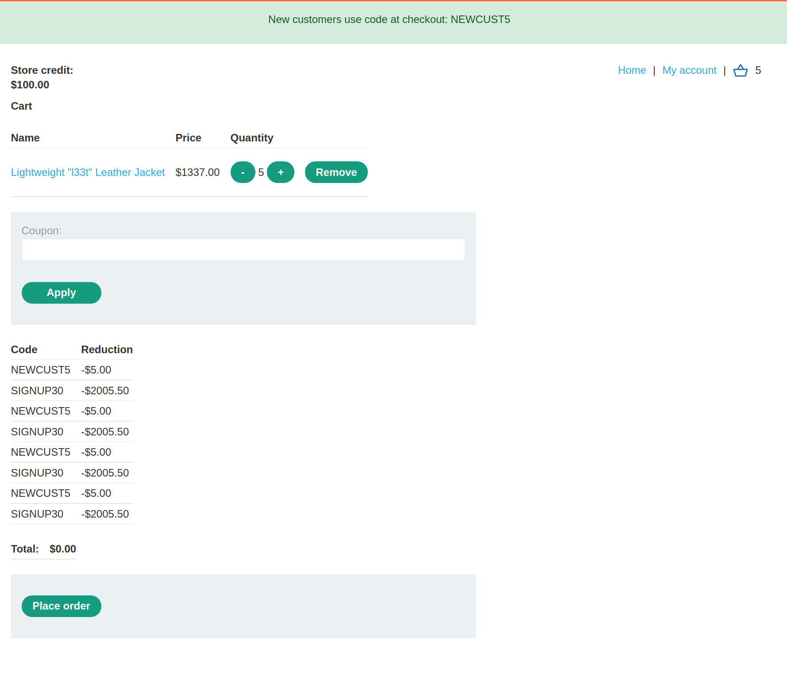
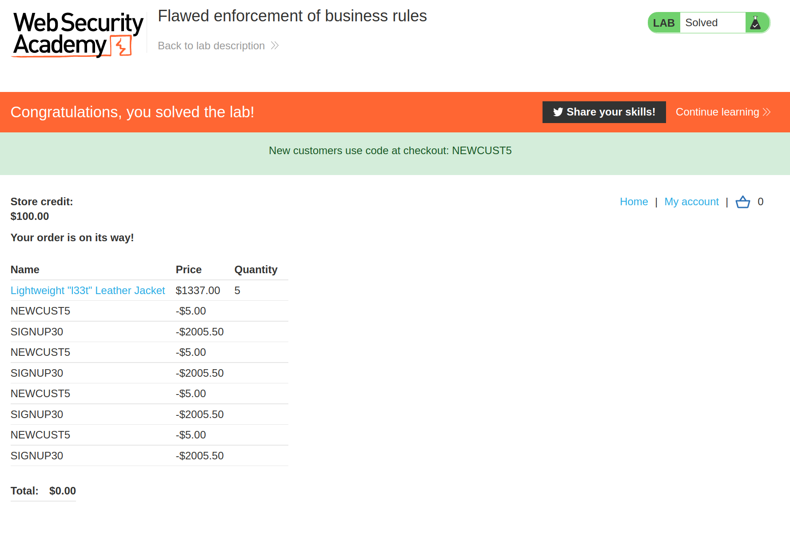

+++
author = "Alux"
title = "Portswigger Academy Learning Path: Business Logic Lab 9"
date = "2021-12-13"
description = "Lab: Flawed enforcement of business rules"
tags = [
    "business logic",
    "portswigger",
    "academy",
    "burpsuite",
]
categories = [
    "pentest web",
]
series = ["Portswigger Labs"]
image = "head.png"
+++

# Lab: Flawed enforcement of business rules

En este <cite>laboratorio[^1]</cite>la finalidad es poder explotar una vulnerabilidad de business logic la cual ocurre cuando el sistema no valida lo que puede hacer el usuario creyendo que todo seguira el workflow correcto.

## Reconocimiento

Lo que debemos poder realizar es comprar una chaqueta, pero tenemos diferentes codigos de descuento para aplicar.

Pero viendo en el pie de pagina podemos ver un formulario de registro para obtener otro codigo

## Explotacion

Ahora lo que debemos hacer es poder comprar con 100 dolares de credito el producto de la chaqueta, para esto si ponemos 1 cupon y luego el otro nos dara un error ya que no permite ingresarlo nuevamente, pero si primero ingresamos uno y luego el otro lo permite la aplicacion que la aplicacion no valida, podemos comprar hasta por 0 dolares.

Al realizar la compra hemos solucionado el lab.

[^1]: [Laboratorio](https://portswigger.net/web-security/logic-flaws/examples/lab-logic-flaws-flawed-enforcement-of-business-rules)