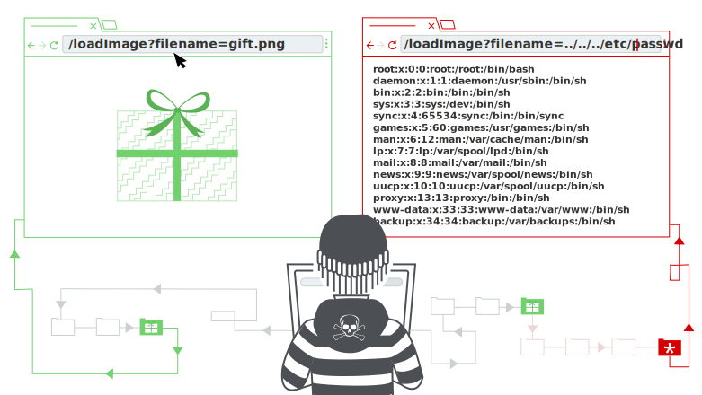
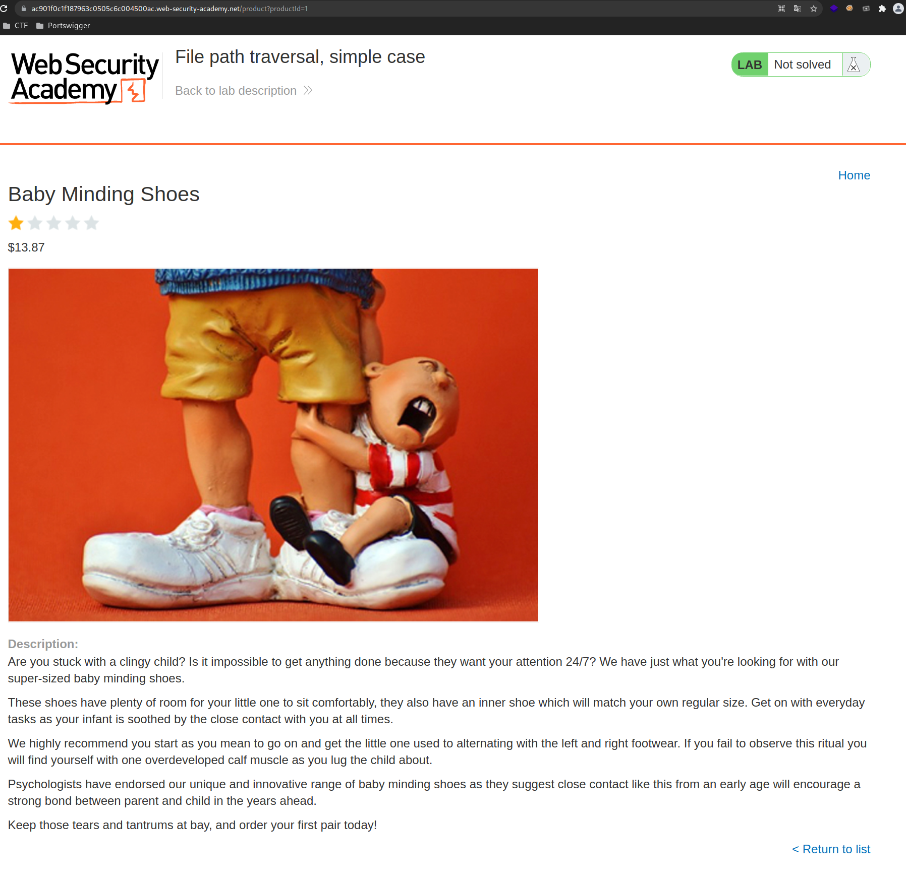
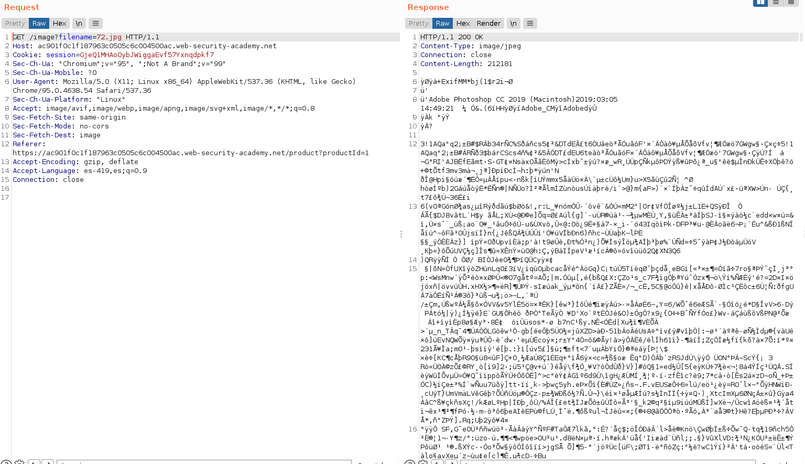
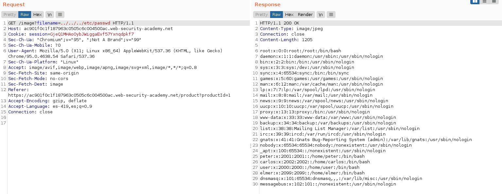

+++
author = "Alux"
title = "Portswigger Academy Learning Path: Directory Traversal Lab 1"
date = "2021-11-28"
description = "Lab: File path traversal, simple case"
tags = [
    "directory traversal",
    "portswigger",
    "academy",
    "burpsuite",
]
categories = [
    "pentest web",
]
series = ["Portswigger Labs"]
image = "head.png"
+++

# Lab: File path traversal, simple case

En este <cite>laboratorio[^1]</cite>la finalidad es poder recuperar el archivo `/etc/passwd` todo esto en una vulnerabilidad la cual es la que desplega las imagenes.

El ataque es el siguiente, en el cual se permite leer otros archivos arbitrarios en el servidor, basandose en un request que pueda hacer una solicitud valida.



## Reconocimiento

La web muestra un post el cual contiene contenido y una imagen.



Hasta ahi todo bien pero viendo burpsuite podemos ver que se hace la peticion para poder recuperar la imagen y mostrarla



Ahora lo que podemos hacer es intentar recuperar el archivo `/etc/passwd` del servidor usando la siguiente solicitud, agregando `../../../` para ir hasta la raiz como es en linux

```
GET /image?filename=../../../etc/passwd
```



Y con esto hemos resuelto el lab


[^1]: [Laboratorio](https://portswigger.net/web-security/file-path-traversal/lab-simple)