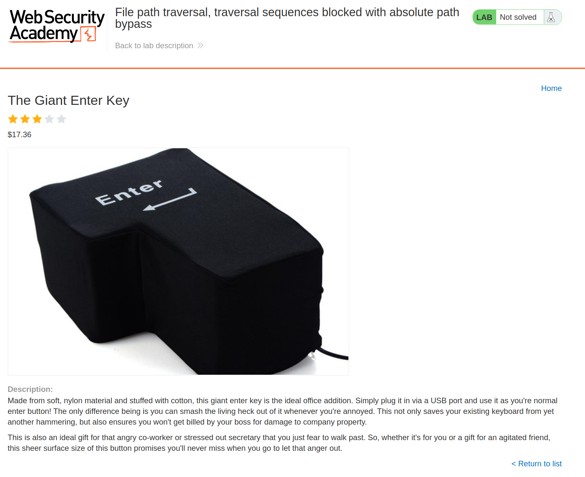
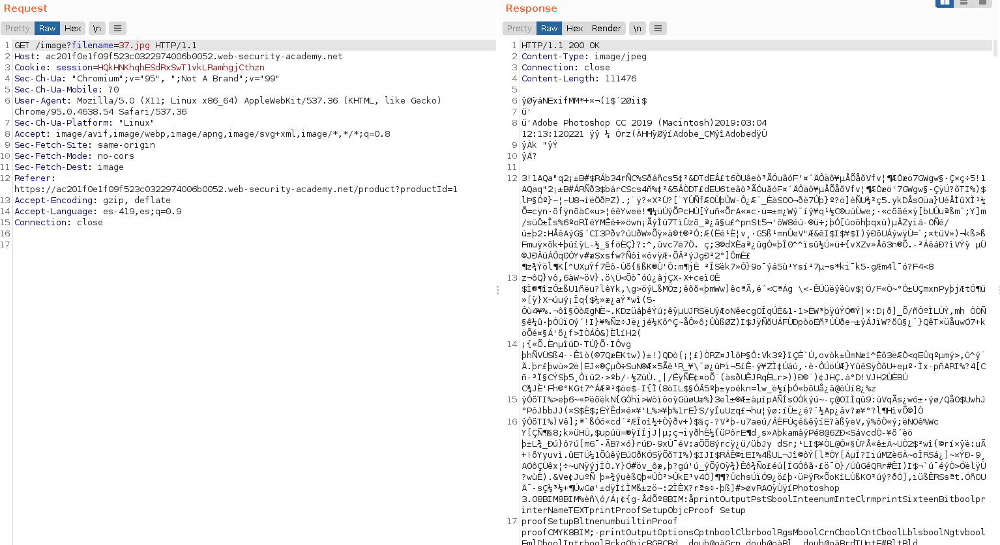
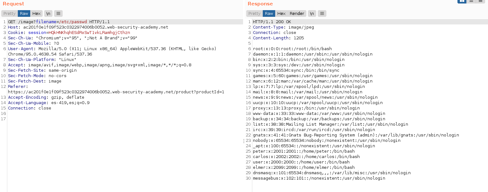

+++
author = "Alux"
title = "Portswigger Academy Learning Path: Directory Traversal Lab 2"
date = "2021-11-28"
description = "Lab: File path traversal, traversal sequences blocked with absolute path bypass"
tags = [
    "directory traversal",
    "portswigger",
    "academy",
    "burpsuite",
]
categories = [
    "pentest web",
]
series = ["Portswigger Labs"]
image = "head.png"
+++

# Lab: File path traversal, traversal sequences blocked with absolute path bypass

En este <cite>laboratorio[^1]</cite>la finalidad es poder recuperar el archivo `/etc/passwd` todo esto en una vulnerabilidad la cual es la que desplega las imagenes.


## Reconocimiento

La web muestra un post el cual contiene contenido y una imagen.



Hasta ahi todo bien pero viendo burpsuite podemos ver que se hace la peticion para poder recuperar la imagen y mostrarla



Ahora lo que podemos hacer es intentar recuperar el archivo `/etc/passwd` del servidor usando la siguiente solicitud pero hay una funcion del sistema que no acepta los valores de inyeccion que se utilizan como `../../../` por lo que si enviamos la solicitud de esa manera no recibiremos nada. Pero igual podemos enviar la ruta absoluta

> La aplicacion bloquea solicitudes de Directory Traversal pero trata el nombre del archivo como relativo a un directorio de trabajo predeterminado

```
GET /image?filename=/etc/passwd
```



Y con esto hemos resuelto el lab


[^1]: [Laboratorio](https://portswigger.net/web-security/file-path-traversal/lab-absolute-path-bypass)