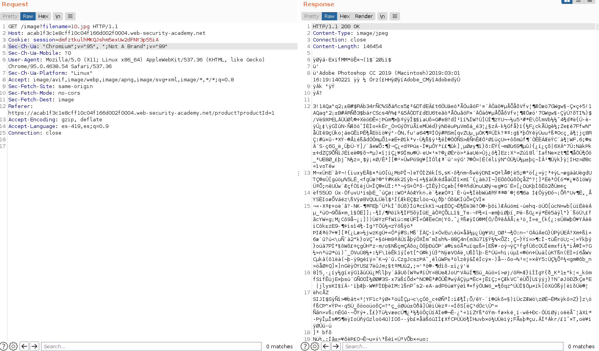
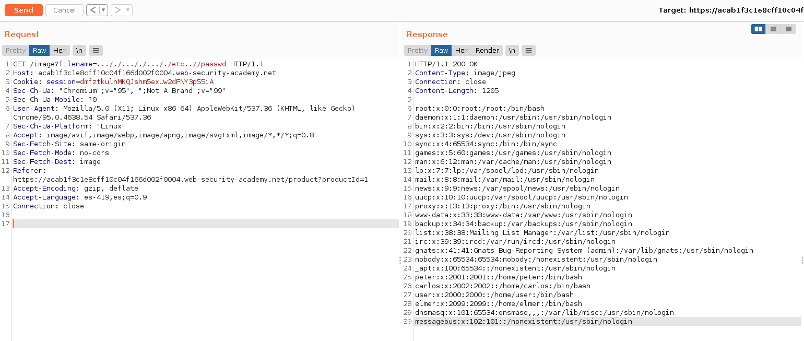
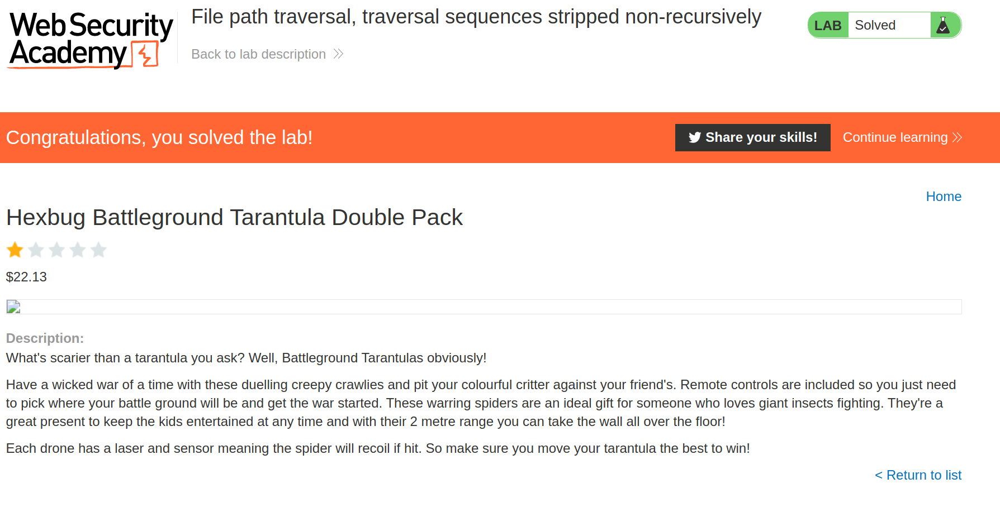

+++
author = "Alux"
title = "Portswigger Academy Learning Path: Directory Traversal Lab 3"
date = "2021-11-28"
description = "Lab: File path traversal, traversal sequences stripped non-recursively"
tags = [
    "directory traversal",
    "portswigger",
    "academy",
    "burpsuite",
]
categories = [
    "pentest web",
]
series = ["Portswigger Labs"]
image = "head.png"
+++

# Lab: File path traversal, traversal sequences stripped non-recursively

En este <cite>laboratorio[^1]</cite>la finalidad es poder recuperar el archivo `/etc/passwd` todo esto en una vulnerabilidad la cual es la que desplega las imagenes.


## Reconocimiento

La web muestra un post el cual contiene contenido y una imagen.


Hasta ahi todo bien pero viendo burpsuite podemos ver que se hace la peticion para poder recuperar la imagen y mostrarla



Lo que sabemos es que el backend eliminara los valores ingresados para realizar directory traversal como `../ o /` en este caso lo que hay que hacer es saltarse esto para que el sistema aun pueda borrar las inyecciones pero nos deje inyectar las nuestras que al final terminen en el mismo proceso.

Caracteres ingresados | Caracteres despues de eliminacion | 
-------------------|---------------| 
../  | Vacio |
 / | Vacio
 ..././ | ../
 ..// | /
 ./ | Vacio

```
GET /image?filename=..././..././..././etc..//passwd HTTP/1.1
```

Y obtenemos el archivo `/etc/passwd`



Y con esto hemos resuelto el lab




[^1]: [Laboratorio](https://portswigger.net/web-security/file-path-traversal/lab-sequences-stripped-non-recursively)