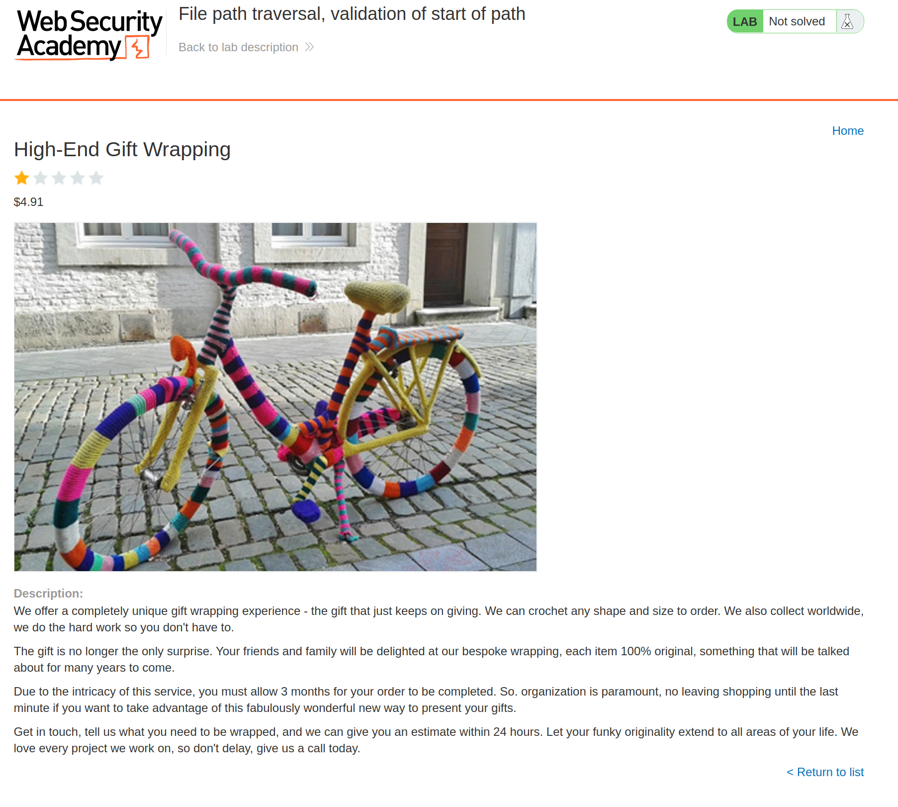
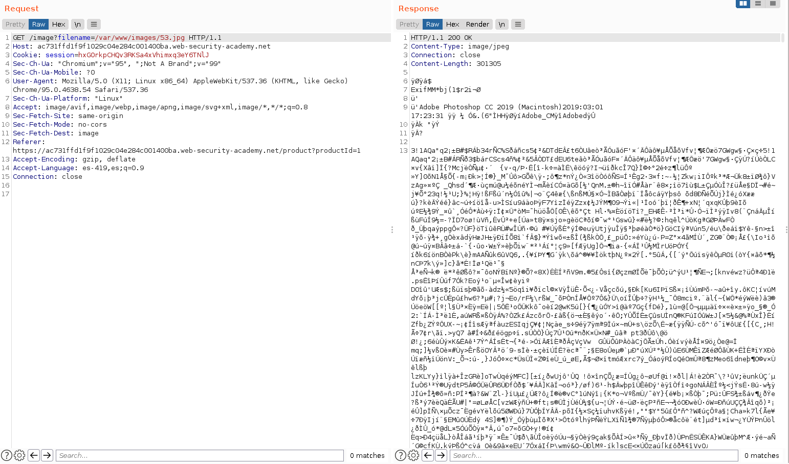
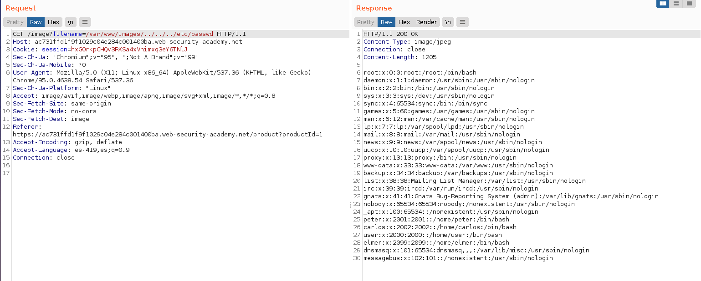
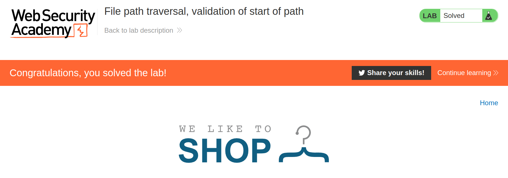

+++
author = "Alux"
title = "Portswigger Academy Learning Path: Directory Traversal Lab 5"
date = "2021-11-28"
description = "Lab: File path traversal, validation of start of path"
tags = [
    "directory traversal",
    "portswigger",
    "academy",
    "burpsuite",
]
categories = [
    "pentest web",
]
series = ["Portswigger Labs"]
image = "head.png"
+++

# Lab: File path traversal, validation of start of path

En este <cite>laboratorio[^1]</cite>la finalidad es poder recuperar el archivo `/etc/passwd` todo esto en una vulnerabilidad la cual es la que desplega las imagenes.


## Reconocimiento

La web muestra un post el cual contiene contenido y una imagen.



Hasta ahi todo bien pero viendo burpsuite podemos ver que se hace la peticion para poder recuperar la imagen y mostrarla



## Explotacion

Lo que sabemos es que el backend pide que se ingrese la ruta absoluta de las imagenes que al ver la peticion es `/var/www/images/` en este caso la solucion es saltarlo ingresando el path al inicio pero se agrega siempre los caracteres para volver al path de raiz en este caso `../../../`.

Y realizamos la peticion:

```
GET /image?filename=/var/www/images/../../../etc/passwd HTTP/1.1
```

Y obtenemos el archivo `/etc/passwd`



Y con esto hemos resuelto el lab




[^1]: [Laboratorio](https://portswigger.net/web-security/file-path-traversal/lab-superfluous-url-decode)