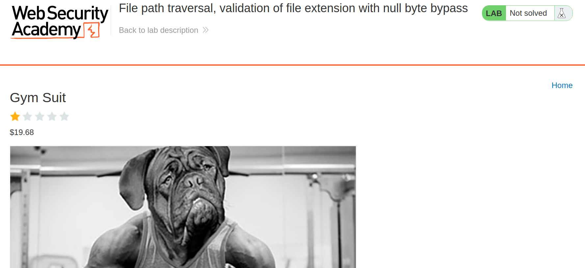
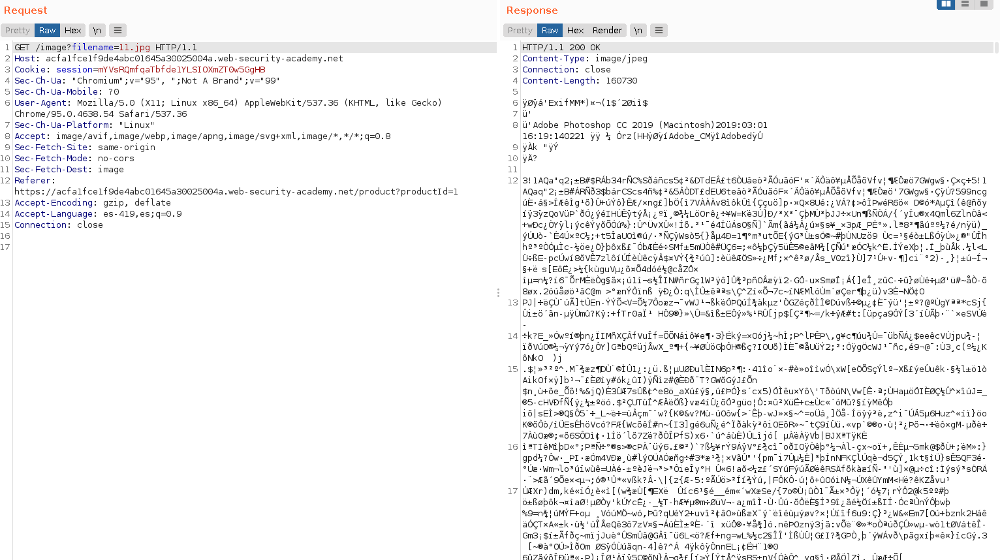
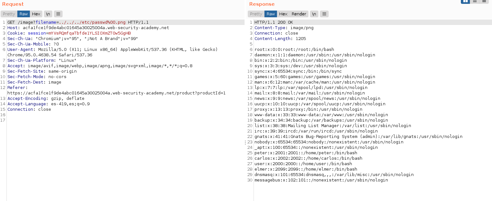

+++
author = "Alux"
title = "Portswigger Academy Learning Path: Directory Traversal Lab 6"
date = "2021-11-28"
description = "Lab: File path traversal, validation of file extension with null byte bypass"
tags = [
    "directory traversal",
    "portswigger",
    "academy",
    "burpsuite",
]
categories = [
    "pentest web",
]
series = ["Portswigger Labs"]
image = "head.png"
+++

# Lab: File path traversal, validation of file extension with null byte bypass

En este <cite>laboratorio[^1]</cite>la finalidad es poder recuperar el archivo `/etc/passwd` todo esto en una vulnerabilidad la cual es la que desplega las imagenes.


## Reconocimiento

La web muestra un post el cual contiene contenido y una imagen.



Hasta ahi todo bien pero viendo burpsuite podemos ver que se hace la peticion para poder recuperar la imagen y mostrarla



## Explotacion

Lo que sabemos es que el backend valida que la aplicacion termine en formato .jpg para poder hacer la solicitud, pero en este caso existe una forma de ya no validar lo que sigue despues del .jpg para evitar que no se muestre `/etc/passwd` y es `%00` que lo que hara es insertar un bit nulo.

Y realizamos la peticion:

```
GET /image?filename=../../../etc/passwd%00.png HTTP/1.1
```

Y obtenemos el archivo `/etc/passwd`



Y con esto hemos resuelto el lab


[^1]: [Laboratorio](https://portswigger.net/web-security/file-path-traversal/lab-validate-file-extension-null-byte-bypass)