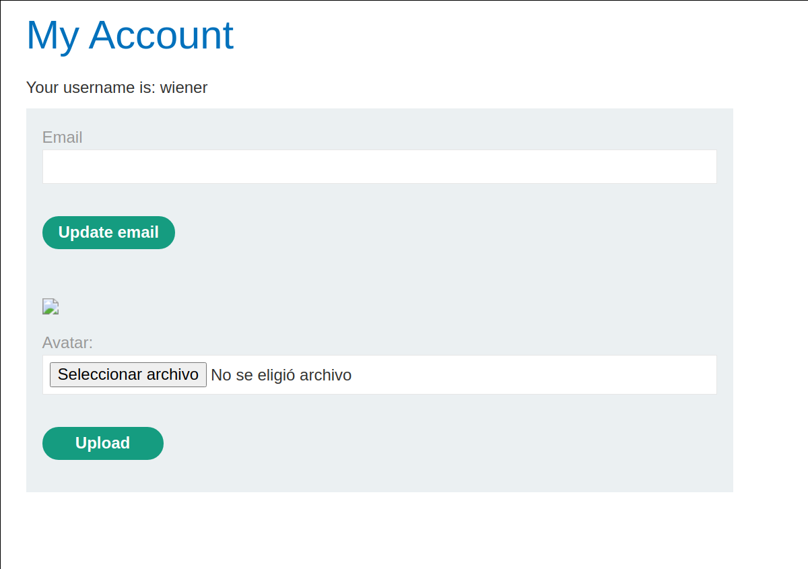
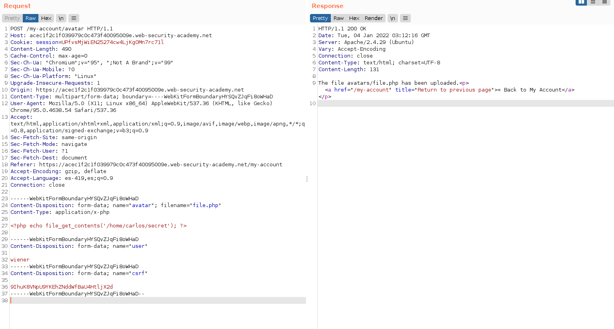
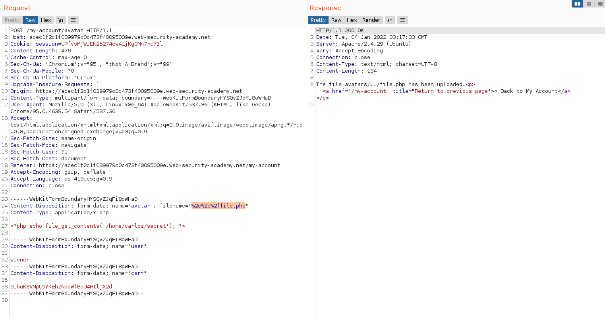
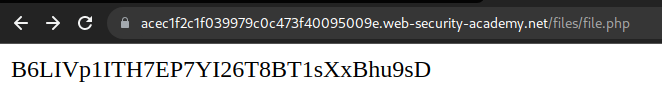

+++
author = "Alux"
title = "Portswigger Academy Learning Path: File Upload Lab 4"
date = "2022-01-03"
description = "Lab: Web shell upload via path traversal"
tags = [
    "file upload",
    "portswigger",
    "academy",
    "burpsuite",
]
categories = [
    "pentest web",
]
series = ["Portswigger Labs"]
image = "head.png"
+++

# Lab: Web shell upload via path traversal

En este <cite>laboratorio[^1]</cite>la finalidad es subir una shell al servidor para luego poder extraer o recuperar informacion de este. En este caso tenemos que leer el archivo `/home/carlos/secret`

## Reconocimiento

Cuando ingresamos con la cuenta de `wiener:peter` tenemos una opcion para subir archivos, en este caso el avatar del usuario, pero al intentar subir una imagen no nos da una opcion para poder elegir imagen u otro.



Todo bien pero el sistema parece que no ejecuta el codigo php desde la carpeta, haciendo que cualquier archivo php solo podamos ver el contenido del `php` como si fuera texto plano.

## Explotacion

Creamos el archivo php con el siguiente codigo

```php
<?php echo file_get_contents('/home/carlos/secret'); ?>
```

Ahora enviamos el archivo, y lo sube sin problemas sin modificar el content-type y se guarda en `avatars/file.php`



El problema es que al querer visualizarlo se nos mostrara el codigo en texto plano por lo que no podremos ejecutar el contenido del php

> El archivo se muestra en texto plano

Ahora lo que haremos es modificar el nombre del archivo para ejecutar un Path Traversal y situar el archivo en otra carpeta a la cual si se ejecutara el php sin problemas, usando codificacion url para `../` a `%2e%2e%2f` seguido del nombre del archivo.



Y ahora si vamos a la ruta podemos ejecutar el codigo php



Y con esto resolvimos el lab, pudiendo subir un archivo php que ejecuta acciones o comandos en el servidor.


[^1]: [Laboratorio](https://portswigger.net/web-security/file-upload/lab-file-upload-web-shell-upload-via-path-traversal)