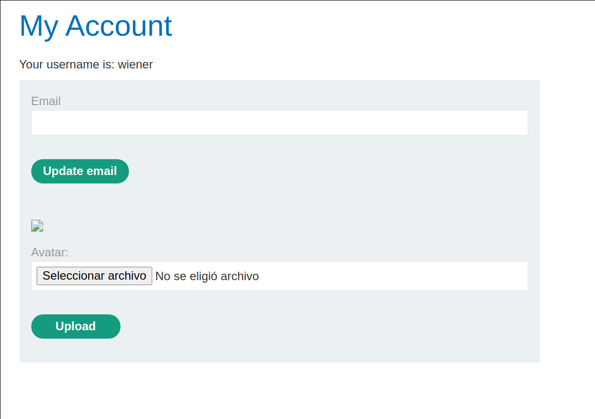

+++
author = "Alux"
title = "Portswigger Academy Learning Path: File Upload Lab 5"
date = "2022-01-03"
description = "Lab: Web shell upload via extension blacklist bypass"
tags = [
    "file upload",
    "portswigger",
    "academy",
    "burpsuite",
]
categories = [
    "pentest web",
]
series = ["Portswigger Labs"]
image = "head.png"
+++

# Lab: Web shell upload via extension blacklist bypass

En este <cite>laboratorio[^1]</cite>la finalidad es subir una shell al servidor para luego poder extraer o recuperar informacion de este. En este caso tenemos que leer el archivo `/home/carlos/secret`

## Reconocimiento

Cuando ingresamos con la cuenta de `wiener:peter` tenemos una opcion para subir archivos, en este caso el avatar del usuario, pero al intentar subir una imagen no nos da una opcion para poder elegir imagen u otro.



Todo bien pero el sistema parece que no ejecuta el codigo php desde la carpeta, haciendo que cualquier archivo php solo podamos ver el contenido del `php` como si fuera texto plano.

## Explotacion

Creamos el archivo php con el siguiente codigo

```php
<?php echo file_get_contents('/home/carlos/secret'); ?>
```

```
.php
.php2
.php3
.php4
.php5
.php6
.php7
.phps
.pht
.phtml
.pl
.reg
.sh
.shtml
```

Ahora enviamos el archivo, y vemos la respuesta que nos da diciendo que no se permite subir archivos de tipo `php`


Ahora lo que haremos en configurar en intruder y modificar si otros tipos de extensiones son aceptados pero sean tomados como php


> Siempre modificar la opcion de Payload Encoding y no codificar el . para evitar que se modifique

Y ahora vemos que hay una opcion que si se logro subir que es el `.phtml`


Con esto vamos a la ruta del archivo y vemos que se ejecuta el codigo php dentro sin problemas


Y con esto resolvimos el lab, pudiendo subir un archivo php que ejecuta acciones o comandos en el servidor.


[^1]: [Laboratorio](https://portswigger.net/web-security/file-upload/lab-file-upload-web-shell-upload-via-extension-blacklist-bypass)